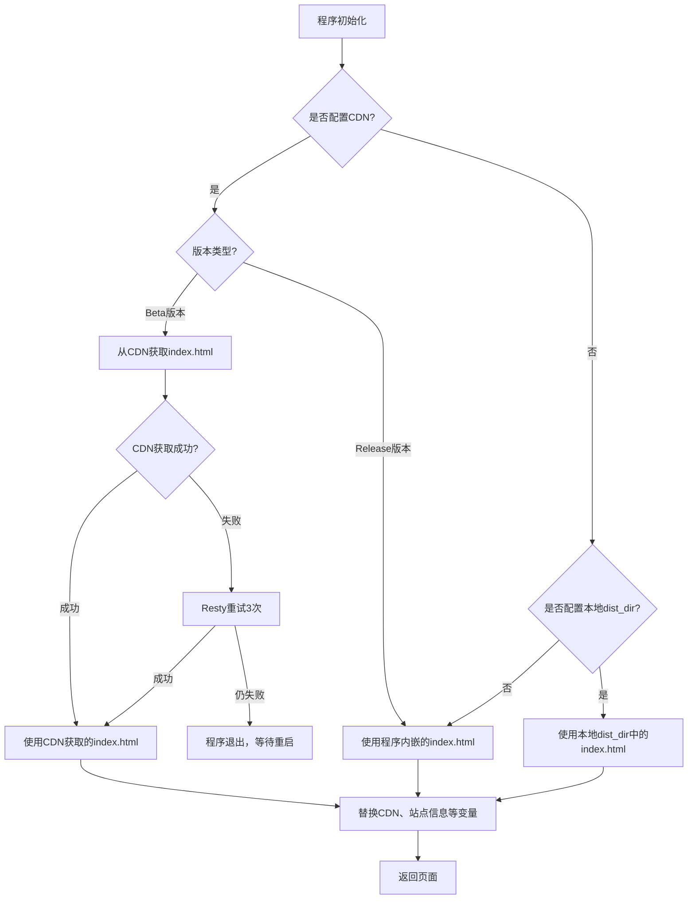

---
categories:
  - configuration
top: 70
---

# 配置文件

### 初始配置

::: tip
`config.json` 内配置文件修改后都需要重启 OpenList 才会生效

- Windows/macOS: `<openlist dir>/data/config.json`
- Linux：一键脚本路径 `/opt/openlist/data/config.json`，手动安装 `<openlist dir>/data/config.json`
- Docker: `<docker container dir>/data/config.json`
- OpenWrt: 如果使用 `luci-app-openlist`，请在网页修改，否则为 `<openlist dir>/data/config.json`
- Other: `<openlist dir>/data/config.json`

:::

```json
{
  "force": false,
  "site_url": "",
  "cdn": "",
  "jwt_secret": "random_generated",
  "token_expires_in": 48,
  "database": {
    "type": "sqlite3",
    "host": "",
    "port": 0,
    "user": "",
    "password": "",
    "name": "",
    "db_file": "data\\data.db",
    "table_prefix": "x_",
    "ssl_mode": "",
    "dsn": ""
  },
  "meilisearch": {
    "host": "http://localhost:7700",
    "api_key": "",
    "index": "openlist"
  },
  "scheme": {
    "address": "0.0.0.0",
    "http_port": 5244,
    "https_port": -1,
    "force_https": false,
    "cert_file": "",
    "key_file": "",
    "unix_file": "",
    "unix_file_perm": "",
    "enable_h2c": false
  },
  "temp_dir": "data\\temp",
  "bleve_dir": "data\\bleve",
  "dist_dir": "",
  "log": {
    "enable": true,
    "name": "data\\log\\log.log",
    "max_size": 50,
    "max_backups": 30,
    "max_age": 28,
    "compress": false,
    "filter": {
      "enable": false,
      "filters": [
        {
          "cidr": "",
          "path": "/ping",
          "method": ""
        },
        {
          "cidr": "",
          "path": "",
          "method": "HEAD"
        },
        {
          "cidr": "",
          "path": "/dav/",
          "method": "PROPFIND"
        }
      ]
    }
  },
  "delayed_start": 0,
  "max_connections": 0,
  "max_concurrency": 64,
  "tls_insecure_skip_verify": true,
  "tasks": {
    "download": {
      "workers": 5,
      "max_retry": 1,
      "task_persistant": false
    },
    "transfer": {
      "workers": 5,
      "max_retry": 2,
      "task_persistant": false
    },
    "upload": {
      "workers": 5,
      "max_retry": 0,
      "task_persistant": false
    },
    "copy": {
      "workers": 5,
      "max_retry": 2,
      "task_persistant": false
    },
    "decompress": {
      "workers": 5,
      "max_retry": 2,
      "task_persistant": false
    },
    "decompress_upload": {
      "workers": 5,
      "max_retry": 2,
      "task_persistant": false
    },
    "allow_retry_canceled": false
  },
  "cors": {
    "allow_origins": ["*"],
    "allow_methods": ["*"],
    "allow_headers": ["*"]
  },
  "s3": {
    "enable": false,
    "port": 5246,
    "ssl": false
  },
  "ftp": {
    "enable": false,
    "listen": ":5221",
    "find_pasv_port_attempts": 50,
    "active_transfer_port_non_20": false,
    "idle_timeout": 900,
    "connection_timeout": 30,
    "disable_active_mode": false,
    "default_transfer_binary": false,
    "enable_active_conn_ip_check": true,
    "enable_pasv_conn_ip_check": true
  },
  "sftp": {
    "enable": false,
    "listen": ":5222"
  },
  "mcp": {
    "enable": false
  },
  "last_launched_version": "OpenList version",
  "proxy_address": ""
}
```

## 字段说明

### force

程序会优先从环境变量中读取配置，设置 `force` 为 `true` 会使程序忽略环境变量强制读取配置文件。

### site_url

你的网站 URL，比如 `https://pan.example.com`，这个地址会在程序中的某些地方使用，如果不设置这个字段，一些功能可能无法正常工作，比如

- 本地存储的缩略图
- 开启 web 代理后的预览
- 开启 web 代理后的下载地址
- 反向代理至二级目录
- ...

URL 链接结尾请勿携带 `/`，参照如下示例，否则也将无法使用上述功能或出现异常

```diff
+ "site_url": "https://openlist.example.com",
- "site_url": "https://openlist.example.com/",
```

### cdn

CDN 地址，如果要使用 CDN，可以设置该字段，`$version` 会被动态替换为 `Openlist-Frontend` 的实际版本。

- <https://www.npmjs.com/package/@openlist-frontend/openlist-frontend>
- <https://github.com/OpenListTeam/Openlist-Frontend>

所以你可以使用任何 npm 或 ~~GitHub~~ CDN 作为路径，结尾不要携带 `/`，例如：

- `https://registry.npmmirror.com/@openlist-frontend/openlist-frontend/$version/files/dist`
- `https://unpkg.com/@openlist-frontend/openlist-frontend@$version/dist`
- `https://cdn.jsdelivr.net/npm/@openlist-frontend/openlist-frontend@$version/dist`
- `https://fastly.jsdelivr.net/npm/@openlist-frontend/openlist-frontend@$version/dist`
- `https://gcore.jsdelivr.net/npm/@openlist-frontend/openlist-frontend@$version/dist`
- `https://jsd.onmicrosoft.cn/npm/@openlist-frontend/openlist-frontend@$version/dist`

- ~~`https://cdn.jsdelivr.net/gh/OpenListTeam/OpenList-Frontend@$version/dist`~~
- ~~`https://jsd.onmicrosoft.cn/gh/OpenListTeam/OpenList-Frontend@$version/dist`~~

::: tip
如果您使用 Lite 版本，请在地址后面添加 `/lite` 目录，如：`https://cdn.jsdelivr.net/npm/@openlist-frontend/openlist-frontend@$version/dist/lite`。
:::

默认情况下，您可以将其设置为空以使用程序内置 dist。

#### Beta 版本使用 CDN

由于前端采用 Vite 构建，生成的 JS 文件使用哈希命名策略。当代码发生变更时，构建后的文件名会改变，这导致不同版本间的 `index.html` 文件无法互相兼容。

OpenList 后端需要将 `index.html` 加载到内存中进行处理，包括插入代码、修改变量等操作。如果仅通过 Pages 部署并修改 API 地址，会导致功能缺失和路由失效。

为解决这个问题，我们为 Beta 版本和自构建版本添加了从 CDN 获取 `index.html` 的功能，这样可以确保 JS 文件和 `index.html` 配套。

- **Release 版本**：静态资源通过 NPM CDN 加载，版本固定，因此无需向 CDN 请求，可直接使用内置的 `index.html`
  - 注意：某些 NPM CDN（如 npmmirror）可能禁止访问 HTML 文件，但 Release 版本不依赖 CDN 的 `index.html`，因此不受影响
- **Beta 版本**：更新频繁，OpenListTeam 不会上传 NPM，不提供 Beta 版本的 CDN

由于目前 OpenList 的 Beta 版本没有可用的 CDN，您需要自行部署：

1. **部署前端构建产物**
   - 将构建产物部署到 CDN 平台（可使用 Cloudflare Pages、EdgeOne Pages 等）
   - 配置必要的 CORS 标头，如下方的 `edgeone.json`

     ```json
     {
       "headers": [
         {
           "source": "/*",
           "headers": [
             {
               "key": "Access-Control-Allow-Origin",
               "value": "*"
             },
             {
               "key": "Access-Control-Allow-Methods",
               "value": "GET, OPTIONS"
             },
             {
               "key": "Access-Control-Allow-Headers",
               "value": "Content-Type"
             }
           ]
         },
         {
           "source": "/**/*.mjs",
           "headers": [
             {
               "key": "Content-Type",
               "value": "application/javascript"
             }
           ]
         }
       ]
     }
     ```

   - 可以使用"复制+覆盖"方式部署，保留旧版本资源文件，确保兼容未重启的版本

2. **配置后端**
   - 在 `config.json` 中添加 CDN 配置
   - 程序启动时会自动从 CDN 获取最新的 `index.html`
3. **版本更新**
   - 需要更新前端时，只需重启后端程序即可

可以参考以下流程图便于理解:



### jwt_secret

用于签署 JWT 令牌的密钥，第一次启动时随机生成。

### token_expires_in

用户登录过期时间，单位：小时

### database

数据库配置，默认是 `sqlite3`，也可以使用 `mysql` 或者 `postgres`。

- 如果不使用 `MySQL` 或者 `postgres`，配置文件数据库选项不用修改

```json
  "database": {
    "type": "sqlite3",  //数据库类型
    "host": "",         //数据库地址
    "port": 0,          //数据库端口号
    "user": "",         //数据库账号
    "password": "",     //数据库密码
    "name": "",         //数据库库名
    "db_file": "data\\data.db",     //数据库位置,sqlite3使用的
    "table_prefix": "x_",           //数据库表名前缀
    "ssl_mode": "",     //来控制SSL握手时的加密选项,参数自行搜索，或者查看下方来自ChatGPT的回答
    "dsn": ""           // https://github.com/alist-org/alist/pull/6031
  },
```

::: details 展开查看 `ssl_mode` 参数选项
如果不知道如何填，那你的服务器应该也并没有开启SSL，留空即可。
在 MySQL 中，`ssl_mode` 参数是用于指定 SSL 连接的验证模式。以下是几种常见的选项：

- `DISABLED`: 禁用 SSL 连接。
- `PREFERRED`: 如果服务器启用了 SSL，则使用 SSL 连接；否则使用普通连接。
- `REQUIRED`: 必须使用 SSL 连接，如果服务器不支持 SSL 连接，则连接失败。
- `VERIFY_CA`: 必须使用 SSL 连接，并验证服务器证书的可信性。
- `VERIFY_IDENTITY`: 必须使用 SSL 连接，并验证服务器证书的可信性和名称是否与连接的主机名匹配。
- `true`：必须使用 SSL 连接，并验证服务器证书的可信性和名称是否与连接的主机名匹配。
- `false`：禁用 SSL 连接（默认）
- `skip-verify`：必须使用 SSL 连接但跳过验证服务器证书
- `preferred`：如果服务器启用了 SSL，则使用 SSL 连接（跳过验证服务器证书）；否则使用普通连接
  MySQL 5.x 和 8.x 也不一样。如果使用服务商提供的免费/收费数据库，服务商会有文档说明。自己部署的数据库那自己肯定知道。
  在 PostgreSQL 中，`ssl_mode` 参数用于指定客户端如何使用 SSL 连接。以下是几种常见的选项：
- `disable`: 禁用 SSL 连接。
- `allow`: 允许使用 SSL 连接，但不需要。
- `prefer`: 如果服务器启用了 SSL，则使用 SSL 连接；否则使用普通连接。
- `require`: 必须使用 SSL 连接，如果服务器不支持 SSL 连接，则连接失败。
- `verify-ca`: 必须使用 SSL 连接，并验证服务器证书的可信性。
- `verify-full`: 必须使用 SSL 连接，并验证服务器证书的可信性和名称是否与连接的主机名匹配。

:::

::: details 已有数据情况下修改数据库注意事项

1. 如果将`sqlite`数据库改为`mysql`数据库优先推荐使用备份再恢复的方法
2. 如果直接将`sqlite`的数据导入到`mysql`可以查看此视频教程：[查看教程](https://www.bilibili.com/video/BV1iV4y1T7kh)
   - 因为直接导入云盘数据库表时`sqlite`的时间和`mysql`的时间填写方式不同会提示报错 [请查看注意事项如何解决](https://www.bilibili.com/video/BV1iV4y1T7kh?t=343.7)

:::

### meilisearch

```json
  "meilisearch": {
    "host": "http://localhost:7700",    // meilisearch主机，默认使用的是本机
    "api_key": "",                      // 如果meilisearch启用认证则必填
    "index": ""                         // meilisearch的index uid
  },
```

- 文档链接：<https://www.meilisearch.com/docs>
- 参考链接：<https://github.com/AlistGo/alist/discussions/6830>

### scheme

协议配置，如果要使用 HTTPS，可以设置该字段。

- 填写示例：记得把证书文件丢到 data 目录里面才会识别到喔~

```json
  "scheme": {
    "address": "0.0.0.0",   // 要监听的 http/https 地址，默认为 0.0.0.0
    "http_port": 5244,      // 监听的 http 端口,默认的 '5244',如果你想禁用 http,将其设置为 '-1'
    "https_port": -1,       // https 端口监听,默认的 '-1',如果你想启用 https,将其设置为非 '-1'
    "force_https": false,   // 是否强制使用 HTTPS 协议,如果设置为 true ,则用户只能通过 HTTPS 访问该网站
    "cert_file": "data\\cert.crt",  // 证书文件路径
    "key_file": "data\\key.key",    // 证书密钥文件路径
    "unix_file": "",        // Unix 监听套接字文件路径,默认的空的,如果你想使用 Unix socket,将其设置为非空
    "unix_file_perm": "",   // Unix 监听套接字文件，设置为合适的权限
    "enable_h2c": false  // 为 openlist 的 http 服务支持 HTTP/2 Cleartext (H2C) 协议。明文的 HTTP/2 协议,开启后支持 nginx 的 grpc_pass - https://github.com/AlistGo/alist/pull/8294
  },
```

### temp_dir

用于存放临时文件的目录。默认情况下，OpenList 使用 `data/temp`。

::: danger
temp_dir 为 OpenList 独占的临时文件夹，为避免程序中断产生垃圾文件会在每次启动时清空，故请不要手动在此文件夹内放置任何内容，也不要在使用 docker 时将此文件夹及其子文件夹映射至正在使用的文件夹。
:::

### bleve_dir

你使用 **`bleve`** 索引时，数据存放的位置

### dist_dir

如果设置此项，优先使用定义的**本地**外部文件夹下的前端文件。

- 支持使用外部文件夹中的前端文件
- 支持使用其它前端文件，后端继续使用原版应用

将前端文件（dist）上传到应用的 `data` 文件夹下，然后填写：

```json
  "dist_dir": "data/dist",
```

### log

日志配置，如果要查看详细日志（或禁用它），可以设置该字段。

```json
  "log": {
    "enable": true,     // 开启日志记录功能，默认为开启状态 true
    "name": "data\\log\\log.log", // 日志文件的路径和名称
    "max_size": 10,     // 单个日志文件的最大大小，单位为 MB。达到指定大小后会自动切分文件
    "max_backups": 5,    // 保留的日志备份数量，超过数量会自动删除旧的备份
    "max_age": 28,     // 日志文件保存的最大天数，超过天数的日志文件会被删除
    "compress": false,   // 是否启用日志文件压缩功能。压缩后可以减小文件大小，但查看时需要解压缩，默认为关闭状态 false
    "filter": {             // 按条件过滤日志功能，默认不开启
      "enable": false,
      "filters": [            // 预设例子
        {
          "cidr": "",
          "path": "/ping",    // 健康检查
          "method": ""
        },
        {
          "cidr": "",
          "path": "",
          "method": "HEAD"    // HEAD 请求
        },
        {                     // WebDav 元数据
          "cidr": "",
          "path": "/dav/",
          "method": "PROPFIND"
        }
      ]
    }
  },
```

过滤器每行为如下对象：

```json
{
  "cidr": "",
  "path": "", // http path，如果 / 开头则是绝对路径，没有 / 开头则是相对路径
  "method": "" // http/webdav 方法，记得大写
}
```

注意查看启动日志以确认加载情况，具体实现详见源代码 `server/middlewares/filtered_logger.go`.

### delayed_start

是否延时启动，一般此功能常用于 OpenList 开机自启动选项。

<!-- markdownlint-disable-next-line MD036 -->

**单位：秒**

因为有时候网络连接的慢，导致 OpenList 启动过快后需要网络连接的驱动无法连接导致无法正常打开。

### max_connections

同时连接的最大数量。默认值为 0，表示无限制。

- 对于性能一般的设备，如 N1（S905D），推荐设置为 10 或 20。
- 使用场景：当启用图片模式时，如果设备的并发能力较差，设备可能会崩溃。

### max_concurrency

限制本地代理的最大并发，默认为64，0为不限制。

### tls_insecure_skip_verify

是否不验证 SSL 证书。

如果在未启用此选项时使用的网站证书存在问题（如未包含中间证书、证书过期或证书伪造等），服务将无法使用。

启用此选项时，请确保在安全的网络环境中运行程序。

### tasks

后台任务线程数量配置。

```json
  "tasks": {
    "download": {
      "workers": 5,
      "max_retry": 1,
      "task_persistant": false
    },
    "transfer": {
      "workers": 5,
      "max_retry": 2,
      "task_persistant": false
    },
    "upload": {
      "workers": 5,
      "max_retry": 0,
      "task_persistant": false
    },
    "copy": {
      "workers": 5,
      "max_retry": 2,
      "task_persistant": false
    },
    "decompress": {
      "workers": 5,
      "max_retry": 2,
      "task_persistant": false
    },
    "decompress_upload": {
      "workers": 5,
      "max_retry": 2,
      "task_persistant": false
    },
    "allow_retry_canceled": false
  },
```

- **workers**：任务线程数量
- **max_retry**：重试次数
  - 0：禁用重试
- **download**：离线下载时的下载任务
- **transfer**：离线下载时上传中转的任务
- **upload**：上传任务
- **copy**：复制任务
- **decompress**：解压
- **decompress_upload**：解压上传
- **task_persistant**：任务持久化，重启 `OpenList` 后任务不会取消
  - **download**：false
  - **transfer**：false
  - **upload**：false
  - **copy**：false
  - **decompress**：false
  - **decompress_upload**：false
- **allow_retry_canceled**：允许用户重试之前取消的任务

---

在后台配置中新增一个 **Transmission** 配置路径：`/@manage/settings/traffic`

- 支持限制 **6 种任务** 的线程数和传输上下行速率
- **<https://github.com/AlistGo/alist/pull/7948>**
  运行原理：如果 `settings/traffic` 没有线程数字段（第一次运行或者刚从旧版本升级），会用config配置文件的值初始化 `settings/traffic`，如果 `settings/traffic` 有值就会忽略config的线程配置信息
- **<https://github.com/AlistGo/alist/pull/7948#issuecomment-2775174617>**
- 总结：新安装或者新升级的版本，会先从配置文件读取数值来初始化 `传输` 配置信息，后续修改线程只需要在后台修改就可以

### cors

**跨源资源共享**配置

```json
  "cors": {
    "allow_origins": [
      "*"
    ],
    "allow_methods": [
      "*"
    ],
    "allow_headers": [
      "*"
    ]
  }
```

- **allow_origins**：允许的源
- **allow_methods**：允许的请求方法
- **allow_headers**：允许的请求头

具体使用方式自行了解进行配置，如果不了解请勿随意修改，使用默认配置就可以。

### S3

```json
  "s3": {
    "enable": false,
    "port": 5246,
    "ssl": false
  }
```

- `enable`：S3功能是否启用，默认未启用
- `port`：端口号
- `SSL`：启用HTTPS证书，默认未启用

功能介绍：[点击查看](../guide/advanced/s3.md)

### ftp

```json
  "ftp": {
    "enable": false,
    "listen": ":5221",
    "find_pasv_port_attempts": 50,
    "active_transfer_port_non_20": false,
    "idle_timeout": 900,
    "connection_timeout": 30,
    "disable_active_mode": false,
    "default_transfer_binary": false,
    "enable_active_conn_ip_check": true,
    "enable_pasv_conn_ip_check": true
  },
```

- `enable`：**ftp** 功能是否启用，默认未启用
- `listen`：端口号
- `find_pasv_port_attempts`：被动传输时因端口冲突而重新寻找端口的最大尝试次数
- `active_transfer_port_non_20`：启用20以外的端口作为主动传输端口
- `idle_timeout`：客户端无请求情况下的最长待机时间（秒）
- `connection_timeout`：连接超时时间
- `disable_active_mode`：禁用主动传输模式
- `default_transfer_binary`：默认以二进制模式传输
- `enable_active_conn_ip_check`：主动传输模式下对数据流TCP连接的客户端进行IP检查
- `enable_pasv_conn_ip_check`：被动传输模式下对数据流TCP连接的客户端进行IP检查

其它说明：[点击查看](../guide/advanced/ftp.md)

### sftp

```json
  "sftp": {
    "enable": false,
    "listen": ":5222"
  }
```

- `enable`：**sftp** 功能是否启用，默认未启用
- `listen`：端口号

其它说明：[点击查看](../guide/advanced/ftp.md)

### mcp

```json
  "mcp": {
    "enable": false
  }
```

- `enable`：**MCP** 功能是否启用，默认未启用

其它说明：[点击查看](../guide/advanced/mcp.md)

### proxy

```json
  "proxy_address": "",
```

支持HTTP代理、HTTPS代理、SOCKS4代理、SOCKS5代理、SOCKS5HOSTNAME代理。

同时兼容IPv4和IPv6。
