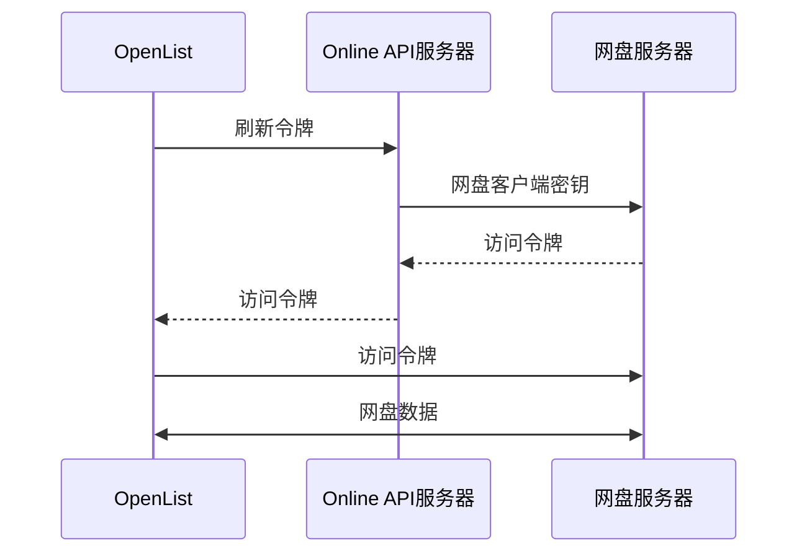

---
categories:
  - ecosystem
  - eco_official
top: 970
---

# OpenList APIPages

## OpenList APIPages 是什么

### [OpenListTeam/OpenList-APIPages](https://github.com/OpenListTeam/OpenList-APIPages)

[OpenListTeam/OpenList-APIPages](https://github.com/OpenListTeam/OpenList-APIPages) 是一个由 [@PIKACHUIM](https://github.com/PIKACHUIM) 牵头，和其他[主要贡献者](https://github.com/OpenListTeam/OpenList-APIPages/graphs/contributors)共同协作完成的工具型网站，前端主要用于实现对网盘客户端的初始授权和刷新令牌，而后端则主要支撑了一个名为“在线API”的功能，可以在保护开发者客户端密钥的前提下，实现对用户令牌的远程刷新功能。

## 为什么需要 OpenList APIPages

网盘背景：

- 大部分国内网盘没有对个人开放官方API调用的权限，或者申请过程繁琐，不利于快速部署。
- 针对申请下来的客户端密钥，根据网盘方的管理要求，不得外泄。
- 用户授权为刷新令牌，需要定期配合客户端密钥向网盘服务器获取刷新后的访问令牌。
- 调用API需要用户最新的访问令牌。

解决方案：

- 由社区中的志愿者提供资质认证，向网盘官方申请API调用权限。
- 利用中转服务器，保护客户端密钥。
- 定期向指定的中转服务器发送刷新令牌，中转服务器利用内置的客户端密钥，刷新访问令牌
- 中转服务器将访问令牌发送回OpenList客户端。
  上述描述的中转服务器，就是在线API服务器/Online API 服务器/APIPages的后端部分功能，其工作原理如下：



APIPages的前端部分同时解决了如下问题：

- 不同网盘的初始授权验证。
- 在保护内置客户端密钥的情况下的授权。
- 自定义客户端密钥下的授权。
- 提供自定义客户端密钥下的的回调地址。
- 其他网盘挂载的实用功能。

## 如何使用 OpenList APIPages

<WorkInProgress />

## 什么时候不需要 OpenList APIPages

:::tip
对于普通用户，我们强烈建议使用由社区提供的API服务器以降低部署难度。

如果在网络部分遇到故障，我们建议您先行解决网络问题。

:::

如果您选择不使用社区提供的服务器，或者自己部署服务器，请对照一下内容进行核实

- 1.完整阅读了对应网盘驱动相关内容的文档。
- 2.完整阅读了对应网盘的提供的开放API开发文档。
- 3.可以阅读并理解项目代码，并有一定的debug能力，能看懂对应的日志及其报错。
- 4.完全理解AGPLv3授予您的权力和我们应该负责的部分。
- 5.可以使用GitHub的基本功能，知道如何**正确的**向我们提交Issue/Pull Request。
- 6.请记住，我们没有任何办法可以解决您遇到的网络问题。

## APIPages 的部署教程

### 一键部署

- EdgeOne Functions 国际站

<a href="https://edgeone.ai/pages/new?project-name=oplist-api&repository-url=https://github.com/OpenListTeam/OpenList-APIPages&build-command=npm%20run%20build-eo&install-command=npm%20install&output-directory=public&root-directory=./&env=MAIN_URLS" target="_blank" class="inline-block hover:scale-105 transition-all duration-200">
  
</a>

部署完成后，请登录[EdgeOne Functions后台](https://console.tencentcloud.com/edgeone/pages)，修改环境变量，请参考[变量说明](#变量说明)部分

- EdgeOne Functions 中国站

<a href="https://console.cloud.tencent.com/edgeone/pages/new?project-name=oplist-api&repository-url=https://github.com/OpenListTeam/OpenList-APIPages&build-command=npm%20run%20build-eo&install-command=npm%20install&output-directory=public&root-directory=./&env=MAIN_URLS" target="_blank" class="inline-block hover:scale-105 transition-all duration-200">
  
</a>

部署完成后，请登录[EdgeOne Functions后台](https://console.cloud.tencent.com/edgeone/pages)，修改环境变量，请参考[变量说明](#变量说明)部分

- Cloudflare Worker 全球站

<a href="https://deploy.workers.cloudflare.com/?url=https://github.com/OpenListTeam/OpenList-APIPages" target="_blank" class="inline-block hover:scale-105 transition-all duration-200">
  
</a>

部署完成后，请登录[Cloudflare Worker后台](https://dash.cloudflare.com/)，修改环境变量，请参考[变量说明](#变量说明)部分

### 容器部署

- 拉取镜像

```
docker pull openlistteam/openlist_api_server
```

或者

```
docker pull ghcr.io/openlistteam/openlist_api_server:latest
```

- 启动项目

```
docker run -d --name oplist-api-server \
  -p 3000:3000 \
  -e OPLIST_MAIN_URLS="api.example.com" \
  -e OPLIST_PROXY_API="gts.example.com" \
  -e OPLIST_ONEDRIVE_UID= `#optional` \
  -e OPLIST_ONEDRIVE_KEY= `#optional` \
  -e OPLIST_ALICLOUD_UID= `#optional` \
  -e OPLIST_ALICLOUD_KEY= `#optional` \
  -e OPLIST_BAIDUYUN_UID= `#optional` \
  -e OPLIST_BAIDUYUN_KEY= `#optional` \
  -e OPLIST_BAIDUYUN_EXT= `#optional` \
  -e OPLIST_CLOUD115_UID= `#optional` \
  -e OPLIST_CLOUD115_KEY= `#optional` \
  -e OPLIST_GOOGLEUI_UID= `#optional` \
  -e OPLIST_GOOGLEUI_KEY= `#optional` \
  -e OPLIST_YANDEXUI_UID= `#optional` \
  -e OPLIST_YANDEXUI_KEY= `#optional` \
  -e OPLIST_DROPBOXS_UID= `#optional` \
  -e OPLIST_DROPBOXS_KEY= `#optional` \
  -e OPLIST_QUARKPAN_UID= `#optional` \
  -e OPLIST_QUARKPAN_KEY= `#optional` \
  openlistteam/openlist_api_server:latest
```

- 可以替换镜像为ghcr:
  ```
  ghcr.io/openlistteam/openlist_api_server:latest
  ```
- **请务必根据下面的环境变量，修改你使用的环境变量**

- 环境变量说明

| 变量名称              | 必要 | 变量类型 | 变量说明                          |
| --------------------- | ---- | -------- | --------------------------------- |
| `OPLIST_MAIN_URLS`    | 是   | string   | 绑定主域名，示例：api.example.com |
| `OPLIST_PROXY_API`    | 否   | string   | 部署在大陆的节点需要指定代理谷歌  |
| `OPLIST_ONEDRIVE_UID` | 否   | string   | OneDrive 客户端ID                 |
| `OPLIST_ONEDRIVE_KEY` | 否   | string   | OneDrive 客户端密钥               |
| `OPLIST_ALICLOUD_UID` | 否   | string   | 阿里云盘开发者AppID               |
| `OPLIST_ALICLOUD_KEY` | 否   | string   | 阿里云盘开发者AppKey              |
| `OPLIST_BAIDUYUN_UID` | 否   | string   | 百度网盘应用UID                   |
| `OPLIST_BAIDUYUN_KEY` | 否   | string   | 百度网盘应用密钥AppKey            |
| `OPLIST_BAIDUYUN_EXT` | 否   | string   | 百度网盘应用SecretKey             |
| `OPLIST_CLOUD115_UID` | 否   | string   | 115网盘应用ID                     |
| `OPLIST_CLOUD115_KEY` | 否   | string   | 115网盘应用密钥                   |
| `OPLIST_GOOGLEUI_UID` | 否   | string   | 谷歌客户端ID                      |
| `OPLIST_GOOGLEUI_KEY` | 否   | string   | 谷歌全局API Key                   |
| `OPLIST_YANDEXUI_UID` | 否   | string   | Yandex应用ID                      |
| `OPLIST_YANDEXUI_KEY` | 否   | string   | Yandex应用密钥                    |
| `OPLIST_DROPBOXS_UID` | 否   | string   | Dropboxx应用ID                    |
| `OPLIST_DROPBOXS_KEY` | 否   | string   | Dropbox应用密钥                   |
| `OPLIST_QUARKPAN_UID` | 否   | string   | 夸克云盘x应用ID                   |
| `OPLIST_QUARKPAN_KEY` | 否   | string   | 夸克云盘应用密钥                  |

### 边缘部署

- 克隆代码

```shell
git clone https://github.com/OpenListTeam/OpenList-APIPages.git
```

- 修改配置 (CloudFlare才需要)

创建并修改`wrangler.jsonc`

```shell
cp wrangler.example.jsonc wrangler.encrypt.jsonc
```

修改变量信息：

- MAIN_URLS：部署回调地址的域名
- 其他参数?：各个网盘的应用信息

```
  "vars": {
    "MAIN_URLS": "api.example.com",
    "PROXY_API": "gts.example.com",
    "onedrive_uid": "*****************************",
    "onedrive_key": "*****************************",
    "alicloud_uid": "*****************************",
    "alicloud_key": "*****************************",
    "baiduyun_uid": "*****************************",
    "baiduyun_key": "*****************************",
    "baiduyun_ext": "*****************************",
    "cloud115_uid": "*****************************",
    "cloud115_key": "*****************************",
    "googleui_uid": "*****************************",
    "googleui_key": "*****************************",
    "yandexui_uid": "*****************************",
    "yandexui_key": "*****************************",
    "dropboxs_uid": "*****************************",
    "dropboxs_key": "*****************************",
    "quarkpan_uid": "*****************************",
    "quarkpan_key": "*****************************"
  },
```

- 测试代码

```shell
npm install

# 以Cloudflare Worker环境运行
npm run dev-cf

# 以Edgeone Functions环境运行
npm run dev-eo

# 以Node Service Work环境运行
npm run dev-js

```

- 部署项目

```shell
# 以Cloudflare Worker环境部署
npm run deploy-cf

# 以Edgeone Functions环境部署
npm run deploy-eo

# 以Node Service Work本地运行
npm build-js && npm deploy-js
```

### 变量说明

| 变量名称       | 必要 | 变量类型 | 变量说明                          |
| -------------- | ---- | -------- | --------------------------------- |
| `MAIN_URLS`    | 是   | string   | 绑定主域名，示例：api.example.com |
| `PROXY_API`    | 否   | string   | 部署在大陆的节点需要指定代理谷歌  |
| `onedrive_uid` | 否   | string   | OneDrive 客户端ID                 |
| `onedrive_key` | 否   | string   | OneDrive 客户端密钥               |
| `alicloud_uid` | 否   | string   | 阿里云盘开发者AppID               |
| `alicloud_key` | 否   | string   | 阿里云盘开发者AppKey              |
| `baiduyun_uid` | 否   | string   | 百度网盘应用ID                    |
| `baiduyun_key` | 否   | string   | 百度网盘应用密钥AppKey            |
| `baiduyun_ext` | 否   | string   | 百度网盘应用密钥SecretKey         |
| `cloud115_uid` | 否   | string   | 115网盘应用ID                     |
| `cloud115_key` | 否   | string   | 115网盘应用密钥                   |
| `googleui_uid` | 否   | string   | 谷歌客户端ID                      |
| `googleui_key` | 否   | string   | 谷歌全局API Key                   |
| `yandexui_uid` | 否   | string   | Yandex应用ID                      |
| `yandexui_key` | 否   | string   | Yandex应用密钥                    |
| `dropboxs_uid` | 否   | string   | Dropboxx应用ID                    |
| `dropboxs_key` | 否   | string   | Dropbox应用密钥                   |
| `quarkpan_uid` | 否   | string   | 夸克云盘x应用ID                   |
| `quarkpan_key` | 否   | string   | 夸克云盘应用密钥                  |

## 社区 APIPages

:::tip
以下服务器由社区志愿者搭建并提供服务，一旦使用将不可避免的将用户授权凭证通过网络形式发送至服务器，本项目根据AGPLv3许可，只保证在源代码层面按“原样”提供，对于部署后的内容，请用户自行甄别。
:::

- 国际站点：[api.oplist.org](https://api.oplist.org/)
- 中国大陆：[api.oplist.org.cn](https://api.oplist.org.cn/)

......

[欢迎提交更多社区服务器](https://github.com/OpenListTeam/OpenList-Docs/pulls)
