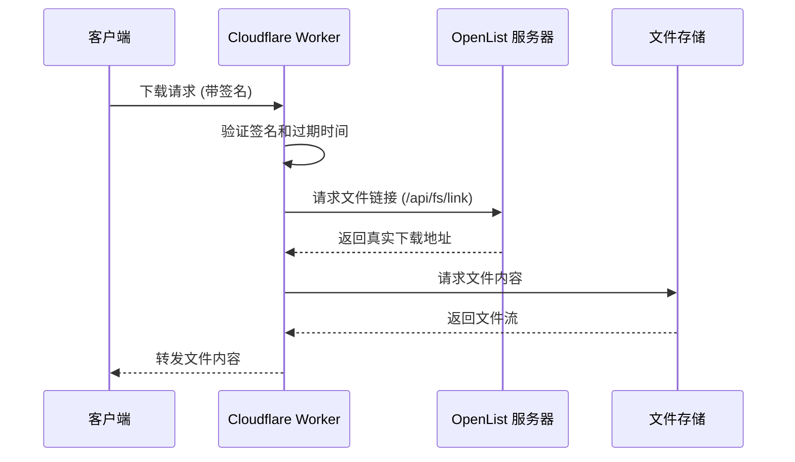

---
categories:
  - ecosystem
  - eco_official
top: 960
---

# OpenList Proxy

## OpenList Proxy 是什么

[**OpenList Proxy**](https://github.com/OpenListTeam/OpenList-Proxy)，是一个用于代理OpenList的**下载流量**的简易实现，通过该工具，可以将部署OpenList的服务器流量和下载所需要的流量隔离开，从而降低对主服务器的流量消耗或加快下载速度。

## 如何使用 OpenList Proxy

:::danger
CloudFlare已明确禁止使用Worker作为代理流量使用，对于在CF-Worker上实现的快速部署，应当时基于**实验性质**的**临时测试**，而非生产环境下使用长期、大流量使用。

OpenList对于使用该Worker造成的任何后果均不负责。

:::

对于OpenList Proxy，我们提供了两种部署方式

- cf-worker
- 二进制文件部署

### ~~科赋锐~~Cloudflare Worker

:::tip
在新版本中引入了基于环境的配置，请在部署完成后按照要求配置好环境变量。

地址末尾不要使用“/”。

:::

- 部署worker简易教程
  在Cloudflare的主页选择“Workers 和 Pages”，然后点击“创建”，选择“从Hello World！开始”
  部署完成后选择“编辑代码”，进入[这里](https://github.com/OpenListTeam/OpenList-Proxy/blob/main/openlist-proxy.js)，将代码替换后再次点击“部署”。

- （可选）配置域名
  到Worker的配置界面，点击“设置”，点击域和路由后的“添加”
  填入配置的子域名
  并在对应的子域名使用CNAME链接至对应的workers.dev域名

- 环境变量配置
  到Worker的配置界面，点击“设置”，选择“变量和机密”后面的“添加”。
  在变量名称中复制如下内容

  ```env
  ADDRESS=https://your-openlist-server.com
  TOKEN=your-api-token-here
  WORKER_ADDRESS=https://your-worker-address
  DISABLE_SIGN=false
  ```

  `ADDRESS`为OpenList的地址，只支持443端口和80端口。
  `WORKER_ADDRESS`为Worker的地址，如果绑定到了自定义域名，请使用自定义的域名。也是在OpenList中需要的代理地址。
  `DISABLE_SIGN`设置为`true`的话，Proxy将不会验证签名，任何知晓文件路径和Proxy地址的人都可以获取到文件，请谨慎开启。
  建议将`TOKEN`设置为密钥类型，在OpenList的设置-->其他的最下面，该密钥长期有效，且相当于拥有OpenList的所有权限。

- 对于CDN的配置建议：`ADDRESS`、`WORKER_ADDRESS`配置保留为源站地址。

### 二进制文件部署

下载[二进制包](https://github.com/OpenListTeam/OpenList-Proxy/releases)后，使用`./openlist-proxy -help`命令自行学习使用。

## OpenList Proxy 的工作原理

OpenList Proxy 通过对 OpenList 的 API 进行代理，来实现对 OpenList 的下载流量的隔离。其工作原理如下：



Proxy 通过验证签名和过期时间，确保请求的合法性。然后，它向 OpenList 服务器请求文件链接，并获取真实的下载地址。接着，Proxy 请求文件存储服务获取文件内容，并将其转发给客户端。

Proxy的签名可以通过`DISABLE_SIGN`环境变量或flag来禁用，如果禁用签名，Proxy将不会验证签名和过期时间，这样任何人都可以通过知道文件路径和Proxy地址来绕过OpenList本身的签名验证（其本身的签名可以在管理界面配置）获取文件。请谨慎开启此功能。
