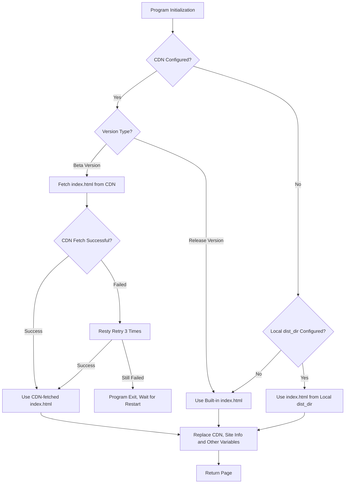

---
categories:
  - configuration
top: 70
---

# Configuration

### Initial config

::: tip
After modifying the configuration file, restart OpenList for changes to take effect

- Windows/macOS: `<openlist dir>/data/config.json`
- Linux: one-click script directory, `/opt/openlist/data/config.json` or `<openlist dir>/data/config.json`
- Docker: `<docker container dir>/data/config.json`
- OpenWrt: modify config on server if using `luci-app-openlist` , otherwise `<openlist dir>/data/config.json`
- Other: `<openlist dir>/data/config.json`

:::

```json
{
  "force": false,
  "site_url": "",
  "cdn": "",
  "jwt_secret": "random_generated",
  "token_expires_in": 48,
  "database": {
    "type": "sqlite3",
    "host": "",
    "port": 0,
    "user": "",
    "password": "",
    "name": "",
    "db_file": "data\\data.db",
    "table_prefix": "x_",
    "ssl_mode": "",
    "dsn": ""
  },
  "meilisearch": {
    "host": "http://localhost:7700",
    "api_key": "",
    "index": "openlist"
  },
  "scheme": {
    "address": "0.0.0.0",
    "http_port": 5244,
    "https_port": -1,
    "force_https": false,
    "cert_file": "",
    "key_file": "",
    "unix_file": "",
    "unix_file_perm": "",
    "enable_h2c": false
  },
  "temp_dir": "data\\temp",
  "bleve_dir": "data\\bleve",
  "dist_dir": "",
  "log": {
    "enable": true,
    "name": "data\\log\\log.log",
    "max_size": 50,
    "max_backups": 30,
    "max_age": 28,
    "compress": false,
    "filter": {
      "enable": false,
      "filters": [
        {
          "cidr": "",
          "path": "/ping",
          "method": ""
        },
        {
          "cidr": "",
          "path": "",
          "method": "HEAD"
        },
        {
          "cidr": "",
          "path": "/dav/",
          "method": "PROPFIND"
        }
      ]
    }
  },
  "delayed_start": 0,
  "max_connections": 0,
  "max_concurrency": 64,
  "tls_insecure_skip_verify": true,
  "tasks": {
    "download": {
      "workers": 5,
      "max_retry": 1,
      "task_persistant": false
    },
    "transfer": {
      "workers": 5,
      "max_retry": 2,
      "task_persistant": false
    },
    "upload": {
      "workers": 5,
      "max_retry": 0,
      "task_persistant": false
    },
    "copy": {
      "workers": 5,
      "max_retry": 2,
      "task_persistant": false
    },
    "decompress": {
      "workers": 5,
      "max_retry": 2,
      "task_persistant": false
    },
    "decompress_upload": {
      "workers": 5,
      "max_retry": 2,
      "task_persistant": false
    },
    "allow_retry_canceled": false
  },
  "cors": {
    "allow_origins": ["*"],
    "allow_methods": ["*"],
    "allow_headers": ["*"]
  },
  "s3": {
    "enable": false,
    "port": 5246,
    "ssl": false
  },
  "ftp": {
    "enable": false,
    "listen": ":5221",
    "find_pasv_port_attempts": 50,
    "active_transfer_port_non_20": false,
    "idle_timeout": 900,
    "connection_timeout": 30,
    "disable_active_mode": false,
    "default_transfer_binary": false,
    "enable_active_conn_ip_check": true,
    "enable_pasv_conn_ip_check": true
  },
  "sftp": {
    "enable": false,
    "listen": ":5222"
  },
  "mcp": {
    "enable": false
  },
  "last_launched_version": "OpenList version",
  "proxy_address": ""
}
```

## Field Explanation

### force

By default OpenList reads the configuration from environment variables, set this field to `true` to force OpenList to read config from the configuration file.

### site_url

The address of your OpenList server, such as `https://pan.example.com`. This address is essential for some features, and thus thry may not work properly if unset:

- thumbnailing `LocalStorage`
- previewing site after setting web proxy
- displaying download address after setting web proxy
- reverse-proxying to site sub directories
- ...

Do not include the slash \(`/`\) at the end of the address. For example:

```diff
+ "site_url": "https://openlist.example.com",
- "site_url": "https://openlist.example.com/",
```

### cdn

The address of the CDN. Included `$version` values will be dynamically replaced by the version of OpenList. Existing dist resources are hosted on both npm and GitHub, which can be found at:

- <https://www.npmjs.com/package/@openlist-frontend/openlist-frontend>
- <https://github.com/OpenListTeam/Openlist-Frontend>

Thus it is possible to use any npm or ~~GitHub~~ CDN path for this field. Do not include the slash `/` at the end of the address. For example:

- `https://registry.npmmirror.com/@openlist-frontend/openlist-frontend/$version/files/dist`
- `https://unpkg.com/@openlist-frontend/openlist-frontend@$version/dist`
- `https://cdn.jsdelivr.net/npm/@openlist-frontend/openlist-frontend@$version/dist`
- `https://fastly.jsdelivr.net/npm/@openlist-frontend/openlist-frontend@$version/dist`
- `https://gcore.jsdelivr.net/npm/@openlist-frontend/openlist-frontend@$version/dist`
- `https://jsd.onmicrosoft.cn/npm/@openlist-frontend/openlist-frontend@$version/dist`

- ~~`https://cdn.jsdelivr.net/gh/OpenListTeam/OpenList-Frontend@$version/dist`~~
- ~~`https://jsd.onmicrosoft.cn/gh/OpenListTeam/OpenList-Frontend@$version/dist`~~

::: tip
If you are using the lite version, please add `/lite` to the end of the URL. For example: `https://cdn.jsdelivr.net/gh/OpenListTeam/OpenList-Frontend@$version/dist/lite`
:::

Keep empty to use dist resources embedded in the program by default.

#### CDN for Beta version

Since the frontend uses Vite for building, the generated JS files use a hash naming strategy. When code changes occur, the built file names change, making `index.html` files from different versions incompatible with each other.

The OpenList backend needs to load `index.html` into memory for processing, including inserting code and modifying variables. If deployed only through Pages with modified API addresses, it would result in missing functionality and routing failures.

To solve this problem, we've added the ability to fetch `index.html` from CDN for Beta versions and self-built versions, ensuring that JS files and `index.html` are properly matched.

- **Release version**: Static resources are loaded through NPM CDN with fixed versions, so there's no need to request from CDN - the built-in `index.html` can be used directly
  - Note: Some NPM CDNs (like npmmirror) may prohibit access to HTML files, but Release versions don't depend on CDN's `index.html`, so they're unaffected
- **Beta version**: Updates frequently, OpenListTeam doesn't upload to NPM, and no CDN is provided for Beta versions

Since Beta versions don't have NPM CDN provided by OpenListTeam, you need to deploy it yourself:

1. **Deploy frontend build artifacts**
   - Deploy build artifacts to a CDN platform (you can use Cloudflare Pages, EdgeOne Pages, etc.)
   - Configure necessary CORS headers, for example of `edgeone.json`:

     ```json
     {
       "headers": [
         {
           "source": "/*",
           "headers": [
             {
               "key": "Access-Control-Allow-Origin",
               "value": "*"
             },
             {
               "key": "Access-Control-Allow-Methods",
               "value": "GET, OPTIONS"
             },
             {
               "key": "Access-Control-Allow-Headers",
               "value": "Content-Type"
             }
           ]
         },
         {
           "source": "/**/*.mjs",
           "headers": [
             {
               "key": "Content-Type",
               "value": "application/javascript"
             }
           ]
         }
       ]
     }
     ```

   - Recommend using "copy + overwrite" deployment method, retaining old version resource files to ensure compatibility for versions not rebooted

2. **Configure backend**
   - Add CDN configuration in `config.json`
   - The program will automatically fetch the latest `index.html` from CDN when starting

3. **Version updates**
   - When you need to update the frontend, simply restart the backend program

Here's a diagram for better understanding:



### jwt_secret

The secret used to sign the JWT token, randomly generated on first run.

### token_expires_in

User login expiration time, in hours.

### database

The database configuration, which is by default `sqlite3`. Available options are `sqlite3`, `mysql` and `postgres`.

- The database options do not need to be modified if using `sqlite3`.

```json
  "database": {
    "type": "sqlite3",  //database type
    "host": "",         //database host
    "port": 0,          //database port
    "user": "",         //database account
    "password": "",     //database password
    "name": "",         //database name
    "db_file": "data\\data.db",     //Database location, used by sqlite3
    "table_prefix": "x_",           //database table name prefix
    "ssl_mode": "",     //To control the encryption options during the SSL handshake, the parameters can be searched by themselves, or check the answer from ChatGPT below
    "dsn": ""           // https://github.com/alist-org/alist/pull/6031
  },
```

::: details Expand to view details of `ssl_mode`
If you don't know how to fill it in, then your server probably doesn't have SSL enabled, so just leave it blank.
In MySQL, the `ssl_mode` parameter is used to specify the authentication mode of the SSL connection. Here are a few common options:

- `DISABLED`: Disable SSL connections.
- `PREFERRED`: Use an SSL connection if server has SSL enabled, and otherwise fallback to a normal connection.
- `REQUIRED`: Force to use SSL connection and fail if the server does not support SSL connection.
- `VERIFY_CA`: Force to use SSL connection and verify the authenticity of the server certificate.
- `VERIFY_IDENTITY`: Force to use an SSL connection and verify the authenticity of the server certificate and that the name matches the connecting hostname.
  Additional, MySQL 5.x and 8.x have differences. If you are using databases provided by service providers, BTFM. If you deployed the database yourself, STFW.
  In PostgreSQL, the `ssl_mode` parameter is used to specify how the client uses SSL connections. Here are a few common options:
- `disable`: Disable SSL connections.
- `allow`: Allow SSL connections.
- `prefer`: Use an SSL connection if server has SSL enabled, and otherwise fallback to a normal connection.
- `require`: Force to use SSL connection and fail if the server does not support SSL connection.
- `verify-ca`: Force to use SSL connection and verify the authenticity of the server certificate.
- `verify-full`: Force to use an SSL connection and verify the authenticity of the server certificate and that the name matches the connecting hostname.

:::

::: details Notes on modifying the database when there is already data

1. If you change the `sqlite` database to `mysql` database, it is first recommended to use the backup and recovery method.
2. If you directly import `sqlite` data into `mysql`, you can view this video tutorial: [View tutorial](https://www.bilibili.com/video/BV1iV4y1T7kh)
   - Because when directly importing the cloud disk database table, the time of `sqlite` and the time of `mysql` are filled in differently, an error will be reported [please check the precautions and how to solve it](https://www.bilibili.com/video/BV1iV4y1T7kh?t=343.7)

:::

### meilisearch

```json
  "meilisearch": {
    "host": "http://localhost:7700",    // meilisearch host, the default is the local machine
    "api_key": "",                      // if meilisearch's authentication is enabled, this is required
    "index": ""                         // meilisearch index uid
  },
```

- Documentation link：<https://www.meilisearch.com/docs>
- Reference Links：<https://github.com/AlistGo/alist/discussions/6830>

### scheme

The configuration of scheme. Set this field if using HTTPS.

- Remember to copy the certificate file to the data directory. Config example:

```json
  "scheme": {
    "address": "0.0.0.0",   // The http/https address to listen on, default `0.0.0.0`
    "http_port": 5244,      // The http port to listen on, default `5244`, if you want to disable http, set it to `-1`
    "https_port": -1,       // The https port to listen on, default `-1`, if you want to enable https, set it to non `-1`
    "force_https": false,   // Whether the HTTPS protocol is forcibly, if it is set to True, the user can only access the website through HTTPS
    "cert_file": "data\\cert.crt",  // Path of cert file
    "key_file": "data\\key.key",    // Path of key file
    "unix_file": "",        // Unix socket file path to listen on, default empty, if you want to use unix socket, set it to non empty
    "unix_file_perm": "",   // Unix socket file permission, set to the appropriate permissions
    "enable_h2c": false  // Support HTTP/2 Cleartext (H2C) protocol for openlist's http service. The cleartext HTTP/2 protocol supports nginx's grpc_pass after it is enabled - https://github.com/AlistGo/alist/pull/8294
  },
```

### temp_dir

The directory to keep temporary files. By default OpenList uses `data/temp`.

::: danger
temp_dir is a temporary folder exclusive to alist. In order to prevent OpenList from generating garbage files when being interrupted, the directory will be cleared every time OpenList starts, so do not store anything in this directory or map this directory & subdirectories to directories in use when using Docker.
:::

### bleve_dir

Where data is stored when using **`bleve`** index.

### dist_dir

If this option is set, the front-end files in the defined **local** external folder will be used as a priority.

- Supports using front-end files from an external folder
- Supports using other front-end files, while the back-end continues to use the original version of the application

Upload the front-end files (dist) to the application's `data` folder, then fill in:

```json
  "dist_dir": "data/dist",
```

### log

The log configuration. Set this field to save detailed logs of disable.

```json
  "log": {
    "enable": true,     // Whether OpenList should store logs
    "name": "data\\log\\log.log", // The path and name of the log file
    "max_size": 10,     // the maximum size of a single log file, in MB. After reaching the specified size, the file will be automatically split.
    "max_backups": 5,    // the number of log backups to keep. Old backups will be deleted automatically when the limit is exceeded.
    "max_age": 28,     // The maximum number of days preserved in the log file, the log file that exceeds the number of days will be deleted
    "compress": false,   // Whether to enable log file compression functions. After compression, the file size can be reduced, but you need to decompress when viewing, and the default is to close the state false
    "filter": {             // skip some logs output, not enable by default
      "enable": false,
      "filters": [            // preset example
        {
          "cidr": "",
          "path": "/ping",    // Health check
          "method": ""
        },
        {
          "cidr": "",
          "path": "",
          "method": "HEAD"    // HEAD request
        },
        {                     // WebDav metadata
          "cidr": "",
          "path": "/dav/",
          "method": "PROPFIND"
        }
      ]
  },
```

Each filter acts as the following object:

```json
{
  "cidr": "",
  "path": "", // http path, If it starts with "/", it is an absolute path; if it does not start with "/", it is a relative path
  "method": "" // HTTP/webdav method, in uppercase
}
```

Take note of the startup log to confirm the load, as detailed in the source code `server/middlewares/filtered_logger.go`.

### delayed_start

Whether to delay OpenList startup.

<!-- markdownlint-disable-next-line MD036 -->

**Time unit: second**

Generally this option is used when OpenList is configured to auto-start. The reason is that sometimes network takes some time to connect, so drivers requiring cannot start correctly after OpenList starts.

### max_connections

The maximum amount of connections at the same time. The default is 0, which is unlimited.

- 10 or 20 is recommended for general devices such as N1(S905D).
- Usage Scenarios: the device will crash if the device is bad at concurrency when picture mode is enabled.

### max_concurrency

Limit the maximum concurrency of local agents. The default value is 64, and 0 means no limit.

### tls_insecure_skip_verify

Whether not to verify the SSL certificate.

If there is a problem with the certificate of the website used when this option is not enabled (such as not including the intermediate certificate, having the certificate expired, or forging the certificate, etc.), the service will not be available.

When this option is enabled, please ensure the program is running in a safe network environment.

### tasks

Configuration for background task threads.

```json
  "tasks": {
    "download": {
      "workers": 5,
      "max_retry": 1,
      "task_persistant": false
    },
    "transfer": {
      "workers": 5,
      "max_retry": 2,
      "task_persistant": false
    },
    "upload": {
      "workers": 5,
      "max_retry": 0,
      "task_persistant": false
    },
    "copy": {
      "workers": 5,
      "max_retry": 2,
      "task_persistant": false
    },
    "decompress": {
      "workers": 5,
      "max_retry": 2,
      "task_persistant": false
    },
    "decompress_upload": {
      "workers": 5,
      "max_retry": 2,
      "task_persistant": false
    },
    "allow_retry_canceled": false
  },
```

- **workers**: Number of task threads.
- **max_retry**: Number of retries.
  - 0: Retries disabled.
- **download**: Download task when downloading offline
- **transfer**: upload transfer task after offline download is completed
- **upload**: upload task
- **copy**: copy the task
- **decompress**：decompress the task
- **decompress_upload**：decompress upload the task
- **task_persistant**：The task is persistent and will not be cancelled after restarting `OpenList`
  - **download**：false
  - **transfer**：false
  - **upload**：false
  - **copy**：false
  - **decompress**：false
  - **decompress_upload**：false
- **allow_retry_canceled**：Allow users to retry previously canceled tasks

---

A new **transmission** configuration path is added to the background configuration: `/@manage/settings/traffic`

- Supports limiting the number of threads and transmission uplink and downlink rates of **6 tasks**
- **<https://github.com/AlistGo/alist/pull/7948>**
  Operation principle: If `settings/traffic` does not have a thread number field (first run or just upgraded from an old version), `settings/traffic` will be initialized with the value of the config configuration file. If `settings/traffic` has a value, the thread configuration information of config will be ignored
- **<https://github.com/AlistGo/alist/pull/7948#issuecomment-2775174617>**
- Summary: For newly installed or upgraded versions, the values will be read from the configuration file to initialize the `traffic` configuration information. Subsequent modifications to the thread only need to be modified in the background.

### cors

Configuration for Cross-Origin Resource Sharing (CORS).

```json
  "cors": {
    "allow_origins": [
      "*"
    ],
    "allow_methods": [
      "*"
    ],
    "allow_headers": [
      "*"
    ]
  }
```

- **allow_origins**: Allowed sources.
- **allow_methods**: Allowed request methods.
- **allow_headers**: Allowed request headers.

Use it to understand it by yourself, and then configure it. If you do n’t know, please do n’t modify it at will. Use the default configuration.

### S3

```json
  "s3": {
    "enable": false,
    "port": 5246,
    "ssl": false
  }
```

- `enable`：Whether the S3 function is enabled, the default is not enabled
- `port`：port
- `SSL`：Enable the HTTPS certificate, not enabled by default

Function introduction: [Click to view](../guide/advanced/s3.md)

### ftp

```json
  "ftp": {
    "enable": false,
    "listen": ":5221",
    "find_pasv_port_attempts": 50,
    "active_transfer_port_non_20": false,
    "idle_timeout": 900,
    "connection_timeout": 30,
    "disable_active_mode": false,
    "default_transfer_binary": false,
    "enable_active_conn_ip_check": true,
    "enable_pasv_conn_ip_check": true
  },
```

- `enable`: Whether the **ftp** function is enabled, not enabled by default
- `listen`: port number
- `find_pasv_port_attempts`: maximum number of attempts to re-find a port due to port conflicts during passive transmission
- `active_transfer_port_non_20`: enable ports other than 20 as active transmission ports
- `idle_timeout`: maximum idle time (seconds) when there is no client request
- `connection_timeout`: connection timeout
- `disable_active_mode`: disable active transmission mode
- `default_transfer_binary`: transfer in binary mode by default
- `enable_active_conn_ip_check`: perform IP check on the client side of the TCP connection of the data stream in active transmission mode
- `enable_pasv_conn_ip_check`: perform IP check on the client side of the TCP connection of the data stream in passive transmission mode

Other instructions: [Click to view](../guide/advanced/ftp.md)

### sftp

```json
  "sftp": {
    "enable": false,
    "listen": ":5222"
  }
```

- `enable`: Whether the **sftp** function is enabled, not enabled by default
- `listen`: port number

Other instructions: [Click to view](../guide/advanced/ftp.md)

### mcp

```json
  "mcp": {
    "enable": false
  }
```

- `enable`: Whether the **MCP** endpoint is enabled, not enabled by default

Other instructions: [Click to view](../guide/advanced/mcp.md)

### proxy

```json
  "proxy_address": "",
```

Supports HTTP proxy, HTTPS proxy, SOCKS4 proxy, SOCKS5 proxy, SOCKS5HOSTNAME proxy.

Both IPv4 and IPv6 are supported.
