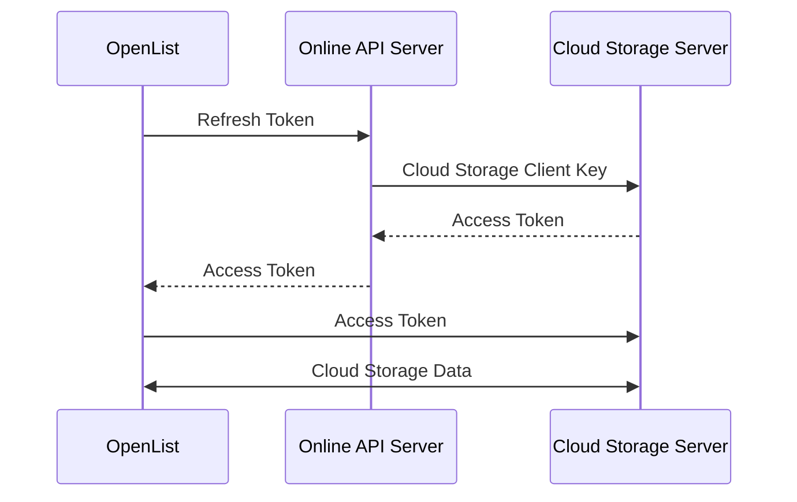

---
categories:
  - ecosystem
  - eco_official
top: 970
---

# OpenList APIPages

## What is OpenList APIPages

### [OpenListTeam/OpenList-APIPages](https://github.com/OpenListTeam/OpenList-APIPages)

[OpenListTeam/OpenList-APIPages](https://github.com/OpenListTeam/OpenList-APIPages) is a utility website led by [@PIKACHUIM](https://github.com/PIKACHUIM) and collaboratively developed with other [main contributors](https://github.com/OpenListTeam/OpenList-APIPages/graphs/contributors). The frontend is primarily used for initial authorization and obtaining refresh tokens of cloud storage clients, while the backend mainly supports a feature called "Online API", which enables remote token refresh functionality while protecting developer client secrets.

## Why OpenList APIPages is needed

Cloud Storage Background:

- Most domestic cloud storage services do not provide official API access to individuals, or the application process is cumbersome, which is not conducive to rapid deployment.
- According to the cloud storage providers' management requirements, the obtained client keys must not be leaked.
- User authorization is in the form of refresh tokens, which need to be periodically combined with client keys to obtain refreshed access tokens from the cloud storage servers.
- API calls require the user's latest access tokens.

Solution:

- Community volunteers provide qualification certification and apply for API access permissions from cloud storage officials.
- Use relay servers to protect client keys.
- Periodically send refresh tokens to designated relay servers, which use built-in client keys to refresh access tokens.
- The relay server sends access tokens back to the OpenList client.

The relay server described above is the backend functionality of the Online API server/APIPages, which works as follows:



The frontend part of APIPages also solves the following problems:

- Initial authorization verification for different cloud storage services.
- Authorization while protecting built-in client keys.
- Authorization with custom client keys.
- Providing callback addresses for custom client keys.
- Other practical functions for cloud storage mounting.

## How to use OpenList APIPages

<WorkInProgress />

## When OpenList APIPages is not needed

:::tip
For ordinary users, we strongly recommend using API servers provided by the community to reduce deployment difficulty.

If you encounter failures in the network section, we recommend that you resolve.

:::

If you choose not to use community-provided servers or deploy your own server, please verify the following content:

- 1. Have completely read the documentation related to the corresponding cloud storage driver.
- 2. Have completely read the open API development documentation provided by the corresponding cloud storage service.
- 3. Can read and understand the project code, have certain debugging capabilities, and can understand the corresponding logs and error messages.
- 4. Fully understand the rights granted to you by AGPLv3 and the parts we should be responsible for.
- 5. Can use basic GitHub functions and know how to **correctly** submit issues/pull requests to us.
- 6. Please remember that we have no way to solve your network problems.

## APIPages Deployment Tutorial

### One-Click Deployment

- EdgeOne Functions International

<a href="https://edgeone.ai/pages/new?project-name=oplist-api&repository-url=https://github.com/OpenListTeam/OpenList-APIPages&build-command=npm%20run%20build-eo&install-command=npm%20install&output-directory=public&root-directory=./&env=MAIN_URLS" target="_blank" class="inline-block hover:scale-105 transition-all duration-200">
  
</a>

After deployment, please log in to the [EdgeOne Functions console](https://console.tencentcloud.com/edgeone/pages) to modify environment variables. Please refer to the [Variable Description](#variable-description) section.

- EdgeOne Functions China

<a href="https://console.cloud.tencent.com/edgeone/pages/new?project-name=oplist-api&repository-url=https://github.com/OpenListTeam/OpenList-APIPages&build-command=npm%20run%20build-eo&install-command=npm%20install&output-directory=public&root-directory=./&env=MAIN_URLS" target="_blank" class="inline-block hover:scale-105 transition-all duration-200">
  
</a>

After deployment, please log in to the [EdgeOne Functions console](https://console.cloud.tencent.com/edgeone/pages) to modify environment variables. Please refer to the [Variable Description](#variable-description) section.

- Cloudflare Workers Global

<a href="https://deploy.workers.cloudflare.com/?url=https://github.com/OpenListTeam/OpenList-APIPages" target="_blank" class="inline-block hover:scale-105 transition-all duration-200">
  
</a>

After deployment, please log in to the [Cloudflare Workers console](https://dash.cloudflare.com/) to modify environment variables. Please refer to the [Variable Description](#variable-description) section.

### Container Deployment

- Pull image

```
docker pull openlistteam/openlist_api_server
```

or

```
docker pull ghcr.io/openlistteam/openlist_api_server:latest
```

- Start project

```
docker run -d --name oplist-api-server \
  -p 3000:3000 \
  -e OPLIST_MAIN_URLS="api.example.com" \
  -e OPLIST_PROXY_API="gts.example.com" \
  -e OPLIST_ONEDRIVE_UID= `#optional` \
  -e OPLIST_ONEDRIVE_KEY= `#optional` \
  -e OPLIST_ALICLOUD_UID= `#optional` \
  -e OPLIST_ALICLOUD_KEY= `#optional` \
  -e OPLIST_BAIDUYUN_UID= `#optional` \
  -e OPLIST_BAIDUYUN_KEY= `#optional` \
  -e OPLIST_BAIDUYUN_EXT= `#optional` \
  -e OPLIST_CLOUD115_UID= `#optional` \
  -e OPLIST_CLOUD115_KEY= `#optional` \
  -e OPLIST_GOOGLEUI_UID= `#optional` \
  -e OPLIST_GOOGLEUI_KEY= `#optional` \
  -e OPLIST_YANDEXUI_UID= `#optional` \
  -e OPLIST_YANDEXUI_KEY= `#optional` \
  -e OPLIST_DROPBOXS_UID= `#optional` \
  -e OPLIST_DROPBOXS_KEY= `#optional` \
  -e OPLIST_QUARKPAN_UID= `#optional` \
  -e OPLIST_QUARKPAN_KEY= `#optional` \
  openlistteam/openlist_api_server:latest
```

- You can replace the image with ghcr:

  ```
  ghcr.io/openlistteam/openlist_api_server:latest
  ```

- **Please make sure to modify your environment variables according to the environment variables below**

- Environment Variable Description

| Variable Name         | Required | Variable Type | Variable Description                                          |
| --------------------- | -------- | ------------- | ------------------------------------------------------------- |
| `OPLIST_MAIN_URLS`    | Yes      | string        | Bind main domain, example: api.example.com                    |
| `OPLIST_PROXY_API`    | No       | string        | Nodes deployed in mainland China need to specify Google proxy |
| `OPLIST_ONEDRIVE_UID` | No       | string        | OneDrive Client ID                                            |
| `OPLIST_ONEDRIVE_KEY` | No       | string        | OneDrive Client Secret                                        |
| `OPLIST_ALICLOUD_UID` | No       | string        | AliCloud Drive Developer AppID                                |
| `OPLIST_ALICLOUD_KEY` | No       | string        | AliCloud Drive Developer AppKey                               |
| `OPLIST_BAIDUYUN_UID` | No       | string        | Baidu NetDisk Application UID                                 |
| `OPLIST_BAIDUYUN_KEY` | No       | string        | Baidu NetDisk Application Secret AppKey                       |
| `OPLIST_BAIDUYUN_EXT` | No       | string        | Baidu NetDisk Application SecretKey                           |
| `OPLIST_CLOUD115_UID` | No       | string        | 115 NetDisk Application ID                                    |
| `OPLIST_CLOUD115_KEY` | No       | string        | 115 NetDisk Application Secret                                |
| `OPLIST_GOOGLEUI_UID` | No       | string        | Google Client ID                                              |
| `OPLIST_GOOGLEUI_KEY` | No       | string        | Google Global API Key                                         |
| `OPLIST_YANDEXUI_UID` | No       | string        | Yandex Application ID                                         |
| `OPLIST_YANDEXUI_KEY` | No       | string        | Yandex Application Secret                                     |
| `OPLIST_DROPBOXS_UID` | No       | string        | Dropbox Application ID                                        |
| `OPLIST_DROPBOXS_KEY` | No       | string        | Dropbox Application Secret                                    |
| `OPLIST_QUARKPAN_UID` | No       | string        | QuarkPan Application ID                                       |
| `OPLIST_QUARKPAN_KEY` | No       | string        | QuarkPan Application Secret                                   |

### Edge Deployment

- Clone code

```shell
git clone https://github.com/OpenListTeam/OpenList-APIPages.git
```

- Modify configuration (CloudFlare only)

Create and modify `wrangler.jsonc`

```shell
cp wrangler.example.jsonc wrangler.encrypt.jsonc
```

Modify variable information:

- MAIN_URLS: Domain name for deployment callback address
- Other parameters: Application information for each cloud storage service

```
  "vars": {
    "MAIN_URLS": "api.example.com",
    "PROXY_API": "gts.example.com",
    "onedrive_uid": "*****************************",
    "onedrive_key": "*****************************",
    "alicloud_uid": "*****************************",
    "alicloud_key": "*****************************",
    "baiduyun_uid": "*****************************",
    "baiduyun_key": "*****************************",
    "baiduyun_ext": "*****************************",
    "cloud115_uid": "*****************************",
    "cloud115_key": "*****************************",
    "googleui_uid": "*****************************",
    "googleui_key": "*****************************",
    "yandexui_uid": "*****************************",
    "yandexui_key": "*****************************",
    "dropboxs_uid": "*****************************",
    "dropboxs_key": "*****************************",
    "quarkpan_uid": "*****************************",
    "quarkpan_key": "*****************************"
  },
```

- Test code

```shell
npm install

# Run in Cloudflare Worker environment
npm run dev-cf

# Run in Edgeone Functions environment
npm run dev-eo

# Run in Node Service Work environment
npm run dev-js

```

- Deploy project

```shell
# Deploy in Cloudflare Worker environment
npm run deploy-cf

# Deploy in Edgeone Functions environment
npm run deploy-eo

# Run locally in Node Service Work
npm build-js && npm deploy-js
```

### Variable Description

| Variable Name  | Required | Variable Type | Variable Description                                          |
| -------------- | -------- | ------------- | ------------------------------------------------------------- |
| `MAIN_URLS`    | Yes      | string        | Bind main domain, example: api.example.com                    |
| `PROXY_API`    | No       | string        | Nodes deployed in mainland China need to specify Google proxy |
| `onedrive_uid` | No       | string        | OneDrive Client ID                                            |
| `onedrive_key` | No       | string        | OneDrive Client Secret                                        |
| `alicloud_uid` | No       | string        | AliCloud Drive Developer AppID                                |
| `alicloud_key` | No       | string        | AliCloud Drive Developer AppKey                               |
| `baiduyun_uid` | No       | string        | Baidu NetDisk Application ID                                  |
| `baiduyun_key` | No       | string        | Baidu NetDisk Application Secret AppKey                       |
| `baiduyun_ext` | No       | string        | Baidu NetDisk Application SecretKey                           |
| `cloud115_uid` | No       | string        | 115 NetDisk Application ID                                    |
| `cloud115_key` | No       | string        | 115 NetDisk Application Secret                                |
| `googleui_uid` | No       | string        | Google Client ID                                              |
| `googleui_key` | No       | string        | Google Global API Key                                         |
| `yandexui_uid` | No       | string        | Yandex Application ID                                         |
| `yandexui_key` | No       | string        | Yandex Application Secret                                     |
| `dropboxs_uid` | No       | string        | Dropbox Application ID                                        |
| `dropboxs_key` | No       | string        | Dropbox Application Secret                                    |
| `quarkpan_uid` | No       | string        | QuarkPan Application ID                                       |
| `quarkpan_key` | No       | string        | QuarkPan Application Secret                                   |

## Community APIPages

:::tip
The following servers are built and provided by community volunteers. Once used, user authorization credentials will inevitably be sent to the servers over the network. This project is licensed under AGPLv3 and only guarantees to provide the source code "as is". Users should verify the deployed content at their own discretion.
:::

- 国际站点：[api.oplist.org](https://api.oplist.org/)
- 中国大陆：[api.oplist.org.cn](https://api.oplist.org.cn/)

......

[Welcome to submit more community servers](https://github.com/OpenListTeam/OpenList-Docs/pulls)
