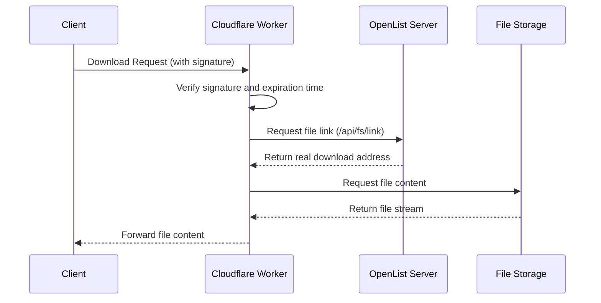

---
categories:
  - ecosystem
  - eco_official
top: 960
---

# OpenList Proxy

## What is OpenList Proxy

[**OpenList Proxy**](https://github.com/OpenListTeam/OpenList-Proxy) is a simple implementation for proxying OpenList's **download traffic**. With this tool, you can isolate the server traffic of the OpenList deployment from the traffic required for downloads, thereby reducing the traffic consumption of the main server or speeding up downloads.

## How to use OpenList Proxy

:::danger
Cloudflare has explicitly prohibited the use of Workers for proxy operations. Quick deployments implemented on CF-Worker should be used for **experimental** and **temporary testing** purposes only, and not for long-term or high-traffic.

OpenList is not responsible for any consequences resulting from the use

:::

For OpenList Proxy, we provide two deployment methods:

- cf-worker
- Binary File Deployment

### Cloudflare Worker

:::tip
In the new version, environment-based configuration has been introduced. Please configure the environment variables as required after deployment.

Do not use "/" at the end of the address.

:::

- Simple Worker Deployment Tutorial On the Cloudflare homepage, select "Workers and Pages",
  then click "Create" and choose "Start from Hello World!".
  After deployment, select "Edit Code", go to here, replace the code, and click "Deploy" again.

- (Optional) Configure Domain Go to the Worker configuration page, click "Settings", then click "Add" next to Domains and Routes. Enter the configured subdomain. Use a CNAME record for the corresponding subdomain to point to the workers.dev domain.

- Configure Environment Variables Go to the Worker configuration page,
  click "Settings", then select "Add" next to Variables and Secrets.
  Copy the following into the variable names:

  ```env
  ADDRESS=https://your-openlist-server.com
  TOKEN=your-api-token-here
  WORKER_ADDRESS=https://your-worker-address
  DISABLE_SIGN=false
  ```

- ADDRESS is the address of your OpenList instance, only ports 443 and 80 are supported.
  WORKER_ADDRESS is the address of the Worker. If you have bound a custom domain, use the custom domain. This is also the proxy address needed in OpenList.
  If DISABLE_SIGN is set to true, Proxy will not verify signatures, and anyone who knows the file path and Proxy address can access the file. Please use with caution.
  It is recommended to set TOKEN as a secret type. In OpenList, go to Settings → Others at the bottom; this token is long-term valid and has full permissions for OpenList.

- CDN Configuration Suggestion: Keep ADDRESS and WORKER_ADDRESS configured as the origin addresses.

### Binary File Deployment

Download the [binary package](https://github.com/OpenListTeam/OpenList-Proxy/releases) and run the command `./openlist-proxy -help` to learn how to use it.

## How OpenList Proxy Works

OpenList Proxy works by proxying the OpenList API to isolate the download traffic of OpenList. Its working principle is as follows:



Proxy verifies the signature and expiration time to ensure the legitimacy of the request. It then requests the file link from the OpenList server to obtain the real download address. After that, Proxy requests the file storage service for the file content and forwards it to the client.

Proxy's signature can be disabled by setting the `DISABLE_SIGN` environment variable or flag. If signature verification is disabled, Proxy will not check the signature and expiration time, allowing anyone who knows the file path and Proxy address to bypass OpenList's own signature verification (which can be configured in the management interface) to access the file. Please use this feature with caution.
