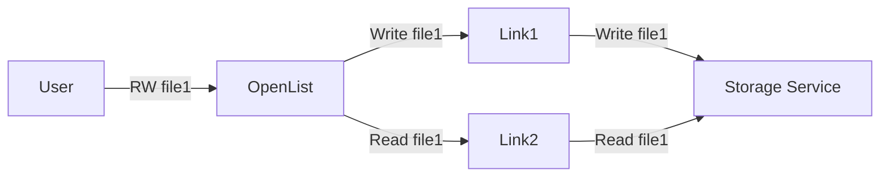
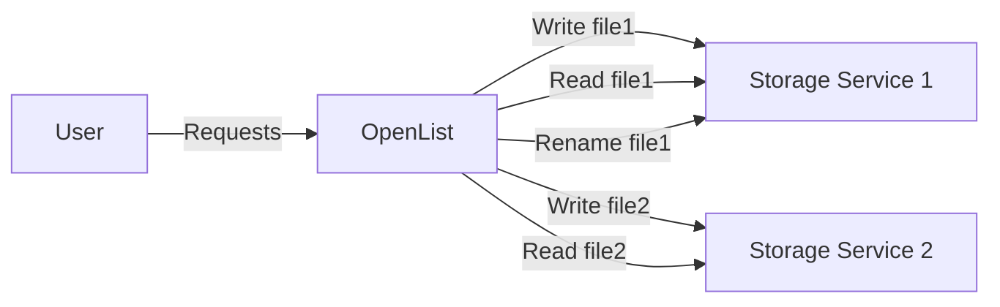
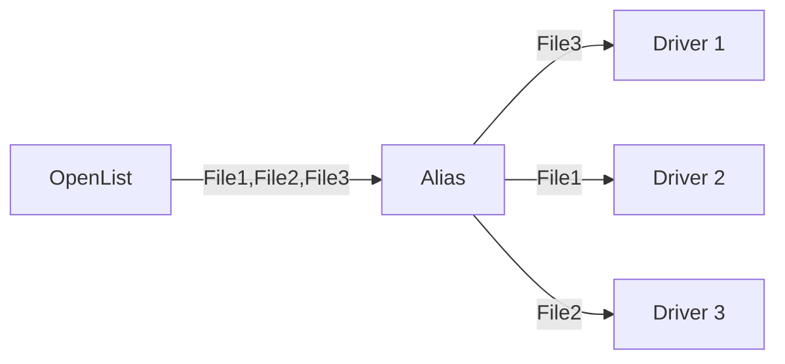
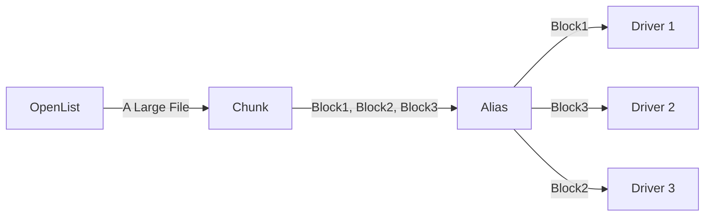
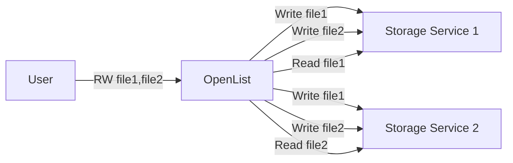

---
categories:
  - guide
  - advanced
top: 90
---

# Load balancing

## Link load balancing

Link load balancing distributes traffic across multiple links to alleviate bandwidth pressure on any single link. This load balancing mechanism is only applicable when traffic arrives at the same storage service via multiple distinct links. The system assumes that the drivers participating in the load balancing can always automatically maintain content consistency and will simply forward all requests in a round-robin manner:

To perform this load balancing mechanism, mount the first driver normally, and then add the remaining load-balancing drivers using a mount path formatted as `first storage mount path + .balance + any additional content`.

E.g:

- Storage 1: `test`
- Storage 2: `test.balance1`
- Storage 3: `test.balance2`
- Storage 4: `test.balance3`
- ...
- Storage n: `test.balancen`

The first is marked with a red box. It is the main mount, which is displayed on the front page. The remaining nine are the first load balancing on the first one.

## Storage load balancing

Storage Load Balancing is used to distribute storage occupancy across multiple storage services, achieving the effect of abstracting multiple storage spaces into one large storage space with a capacity equal to the sum of all individual spaces (similar to RAID 0). The system will assign each uploaded file to a random storage service and forward all read and modification requests for that file to that specific service:

This type of load balancing can be implemented using the putting load balancing feature of the [Alias](/en/guide/drivers/alias) driver, with the following configuration:

- **Reading conflict policy**: **Get the file corresponding to the first conflict path** (The load balancing function of the Rading conflict policy is used to implement the load balancing described in the [Multi-source reading load balancing](/en/guide/advanced/balance#multi-source-reading-load-balancing) section. Based on the principles of the two load balancing schemes, enabling both simultaneously does not achieve a 1+1>=2 effect).
- **Writing conflict policy**: Choose either **Allow full conflict paths** or **Write into all conflict paths** (If the **Write into the first conflict path** policy is used, folder creation operations will only be forwarded to one driver. This will cause that folder and its descendant folders to be unable to continue load balancing as they won't exist on other drivers).
- **Putting conflict policy**: Choose one of **Random load balancing**, **Weighted random load balancing based on remaining space**, or **Strict weighted random load balancing based on remaining space** according to your needs.

The effect achieved with the above configuration:

#### Load balancing by file chunks

Sometimes, the files that need to be load-balanced across storage are relatively large, and performing load balancing on a per-file basis is not granular enough. You can use the [Chunk](/en/guide/drivers/chunk) driver to split files into fixed-size blocks and then apply storage load balancing to these blocks. The specific configuration is as follows:

- **Chunk**: In the remote path, fill in the mount path of the **Alias** driver. Configure other settings as needed.
- **Alias**: Keep the configuration consistent with the description above.

The achieved effect is:

## Multi-source reading load balancing

Multi-source reading load balancing allows copies of a file to be distributed across several different storage services. When a user accesses the file, the system randomly selects one of the copies to return, thereby reducing the uplink bandwidth pressure on any single storage service (similar to RAID 1). The key difference between this load balancing strategy and [Link load balancing](/en/guide/advanced/balance#link-load-balancing) is that since the load-balanced storage services are treated as multiple, independent file systems with no automatic synchronization, OpenList will forward write operations to **all** storage services, rather than to just one of them:

This type of load balancing can be implemented using the reading load balancing feature of the [Alias](/en/guide/drivers/alias) driver, with the following configuration:

- **Reading conflict policy**: Choose either **Load balancing on a per-file basis** or **Load balancing on a per-part basis**.
- **Writing conflict policy**: Choose either **Allow full conflict paths** or **Write into all conflict paths** (If the **Write into the first conflict path** policy is used, folder creation operations will be forwarded to only one driver. This will prevent that folder and its descendant folders from continuing to participate in load balancing, as they won't exist on other drivers).
- **Putting conflict policy**: Choose either **Allow full conflict paths** or **Put into all conflict paths** (The load balancing function of the Putting conflict policy is used to implement the load balancing described in the [Storage Load Balancing](/en/guide/advanced/balance#storage-load-balancing) section. Based on the principles of the two load balancing schemes, enabling both simultaneously does not achieve a 1+1>=2 effect).
