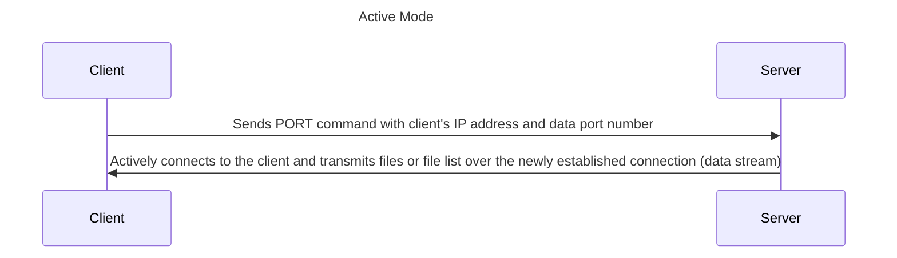
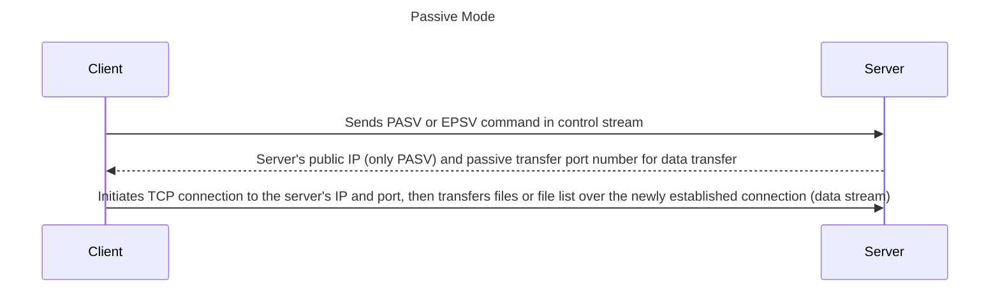
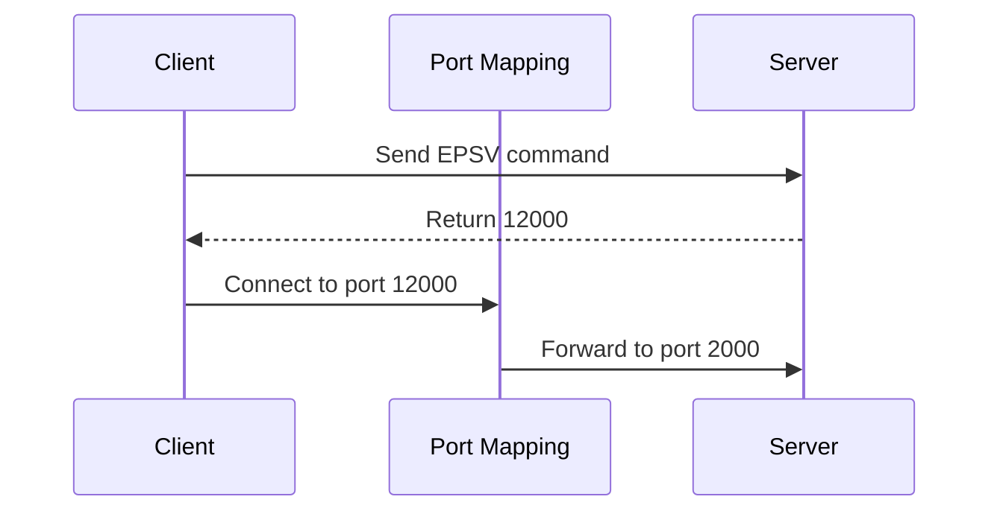
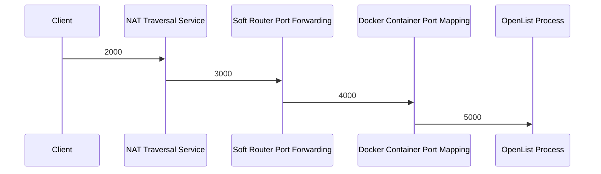

---
categories:
  - guide
  - advanced
top: 30
---

# FTP / SFTP

::: tip
Any adjustments made to FTP-related configurations on the web management page must restart OpenList to take effect.

When using FTP for downloading, only the local proxy will be used.

:::

## FTP Configurations

| Field                       | Meaning                                                                            | Example Value                                             |
| --------------------------- | ---------------------------------------------------------------------------------- | --------------------------------------------------------- |
| enable                      | Whether to enable                                                                  | `true` / `false`                                          |
| listen                      | (Allowed access IP mask): port                                                     | `":5221"` (default) / `"0.0.0.0:21"` / `"127.0.0.1:2121"` |
| find_pasv_port_attempts     | Maximum attempts to find a port due to port conflict in passive transfer           | `50`                                                      |
| active_transfer_port_non_20 | Enable ports other than 20 for active transfer ports                               | `true` / `false`                                          |
| idle_timeout                | Maximum idle time (in seconds) without client requests                             | `900`                                                     |
| connection_timeout          | Connection timeout time                                                            | `30`                                                      |
| disable_active_mode         | Disable active transfer mode                                                       | `true` / `false`                                          |
| default_transfer_binary     | Default transfer in binary mode                                                    | `true` / `false`                                          |
| enable_active_conn_ip_check | Check the IP of the client for data stream TCP connection in active transfer mode  | `true` / `false`                                          |
| enable_pasv_conn_ip_check   | Check the IP of the client for data stream TCP connection in passive transfer mode | `true` / `false`                                          |

## FTP Settings

Before understanding the FTP configuration options, it is important to first understand how the FTP protocol works. The FTP protocol uses **two TCP connections** for communication, which are referred to as the "**control flow**" and the "**data flow**." Port 21 is the default control flow port for the FTP protocol. The FTP server continuously listens on this port, waiting for connections from clients and responding accordingly. **The control flow only transmits client requests and server error messages, without transferring file contents or file listings.** In OpenList, the control flow port is determined by the `listen` parameter in the configuration file, with a default value of 5221. The client must be able to access this port on the server for the protocol to function properly.

The establishment of the data flow can be done in two main ways, known as "active mode" and "passive mode":

In active mode, the client actively listens on a port and sends the port number to the server using the `PORT` command. The server then actively connects to the client and transmits files or a list of files. In this mode, the client must be directly accessible by the server. Therefore, in the context of widespread NAT, this mode generally only works when both the server and client are in the same subnet.

In passive mode, the client first sends the `PASV` or `EPSV` command in the control stream, requesting the server to listen on a new data port. The server then returns the port number of the new listening port to the client in the control stream. After the client establishes a connection with that port, data transfer begins. In this mode, the server does not actively initiate connections to the client, so it only needs to be outside of NAT. However, since the passive transfer port is not predetermined but determined before the connection is initiated, additional configuration is required when there are port mappings between the server and the client, or when only a subset of the server's ports are available for client connections in complex network environments.

- FTP Server Public Network Address

  This is the IP address that the server sends to the client in the `PASV` command. If the server and the client are within the same subnet, the server's internal IP address can be used. Even if the server and the client are on the same machine, `127.0.0.1` can be used. However, if the server and client are not in the same subnet, the server's IP address that is accessible by the client must be specified.

  A domain name can also be specified. In this case, the default DNS will resolve the domain name to an IP address. However, since `PASV` only supports IPv4 addresses, if both an AAAA (IPv6) and an A (IPv4) record exist for the domain, the A record will be used. If only an AAAA record exists without an A record, the result is unknown.

  This field does not affect the `EPSV` command, but leaving this field invalid will cause the FTP server to fail to start. Therefore, if your FTP client only uses the `EPSV` command, you may consider keeping the default value `127.0.0.1`.

- FTP Passive Transfer Port Mapping

  This field consists of a series of "mapping groups" separated by commas (`,`) or newlines. The legal forms for a "mapping group" are as follows:
  1. `<port number>`
  2. `<starting port number>-<ending port number (inclusive)>`
  3. `<response port number>:<listening port number>`
  4. `<starting response port number>-<ending response port number>:<starting listening port number>:<ending listening port number>`

  All port numbers must be between 1024 and 65535 (inclusive), and the starting port number of a range must be less than the ending port number.

  For cases where this field is left blank, the server will choose any port between 1024 and 65535 for passive transfer and will not perform any mapping.
  - Each "mapping group type 1" specifies a single port to be used for passive transfer, and no mapping will be performed for that port.
  - Each "mapping group type 2" specifies a range of ports, and all ports in that range will be used for passive transfer without any mapping.
  - Each "mapping group type 3" specifies a listening port to be used for passive transfer, and when the server selects this port, it will return the "response port number" to the client.
  - "Mapping group type 4" requires that the two ranges before and after the colon `:` have equal lengths. Each "mapping group type 4" forms a one-to-one pairing of port numbers, where each pair is treated as a "mapping group type 3."

  The following are legal formats:
  - `1024`
  - `4001-5000,5001-6000:50001-51000<newline>4000:65535`

  The following are illegal formats:
  - `1023` (less than 1024)
  - `65536` (greater than 65535)
  - `4000, 5000` (space after the comma)
  - `2000 - 3000 : 4000 - 5000` (spaces are illegal)
  - `2000-2001:3000-3002` (unequal length of ranges)

  If the field is invalid, the server will choose any port between 1024 and 65535 for passive transfer without performing any mapping.

  The design of port mapping is intended to address the complexity of external port mapping. For example, if the server is running inside a Docker container and uses port 2000 for passive transfer, but Docker maps port 2000 inside the container to port 12000 on the host machine, you can achieve this mapping using the configuration `12000:2000`.

If there are multiple layers of port mapping between the server and the client, only the port number closest to the client needs to be specified before the `:` symbol, and only the port number closest to the server needs to be specified after the `:` symbol. For example, in the following scenario, you can fill in `2000:5000`:

- FTP Proxy User-Agent Request Header

  Some storage drivers require a User-Agent request header when accessing the FTP server. You can simply use any fake value for this header.

- Force FTP Connection to Use Explicit TLS

  Forces the use of the FTPS protocol, which only encrypts the data stream and not the control stream.
  If the "Enable FTP Implicit TLS" option is enabled, this option will be ignored.

  If no valid TLS private key and certificate are provided, and this option is not enabled, the server will only accept the FTP protocol.

  If valid TLS private key and certificate are provided, but this option is not enabled, the server will accept both the FTP and FTPS protocols.

  If no valid TLS private key and certificate are provided, but this option is enabled, the FTP server will fail to start.

- Enable FTP Implicit TLS

  Uses the FTPS protocol, which encrypts both the data stream and the control stream. This makes it incompatible with FTP and FTPS (explicit) protocols.

  When this option is enabled, the "Force FTP Connection to Use Explicit TLS" option will be ignored.
  If no valid TLS private key and certificate are provided but this option is enabled, the FTP server will fail to start.

- FTP TLS Private Key Path

  The path to the TLS private key file. Leaving it empty or providing an invalid path means TLS will not be enabled.

  Enabling TLS may require the client to access the server using a domain name, though the "FTP Server Public Address" can still be an IP address.

- FTP TLS Certificate Path

  The path to the TLS certificate file. Leaving it empty or providing an invalid path means TLS will not be enabled.

## SFTP Configurations

| Field  | Meaning                        | Example Value                                             |
| ------ | ------------------------------ | --------------------------------------------------------- |
| enable | Whether enabled                | `true` / `false`                                          |
| listen | (Allowed access IP mask)\:port | `":5222"` (default) / `"0.0.0.0:22"` / `"127.0.0.1:2222"` |
