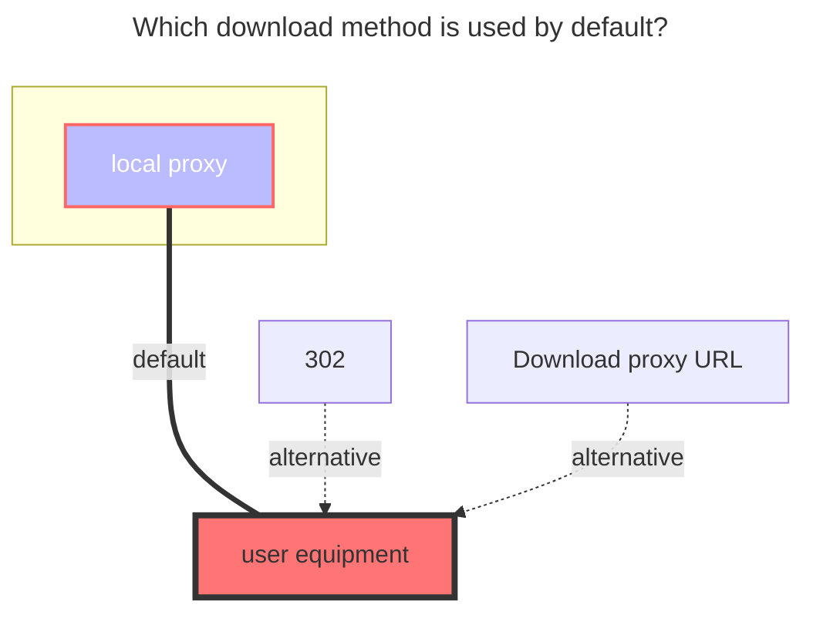

# 123 Open

https://www.123pan.com/developer

<!--@include: @/en/snippets/tos-tip.md-->

## 1. Developer Application

::: warning
This driver uses the [developer authorization mode](https://123yunpan.yuque.com/org-wiki-123yunpan-muaork/cr6ced/hpengmyg32blkbg8), which grants direct management access to the cloud drive associated with the provided public/private key pair, , so you **must use your client id and client secret**.

The acquired token counts as a login device

:::

**Application Method**: Visit the [123 Open Platform Official Website](https://www.123pan.com/developer), read the Developer Agreement, fill in the required fields marked with `*`, and apply for the `client_id` and `client_secret`.Typically, after your application is approved the keys will be sent to your email **remember to check your spam folder, and please keep the keys sent by email safe**.

1. Sign the Developer Agreement

2. Fill out the application materials

3. Wait for the review notification

**Reference Tutorial**: [OpenListTeam/discussions#55](https://github.com/orgs/OpenListTeam/discussions/55)

### 2. Get UID

The method to obtain the "Cloud Drive UID" required during the application process is as follows:

1. **Log in to the 123 Cloud Drive web platform**

   Visit the 123 Cloud Drive official website and log in with your account (phone number).

2. **Go to the "Settings" page**

   After logging in, click on the profile picture or username at the top right, and select "Settings" (or directly visit: <https://www.123pan.com/Setting> ).

3. **Find the "Account ID"**

   In the "Account Settings" or "Security Settings" section, locate the "Account ID," which is your "Cloud Drive UID." Copy it and paste it into the application form.

## 4. Add in OpenList

### RefreshToken

**keep it empty**

### Client ID

Enter your client ID

### Client Secret

Enter your client secret

### Root Folder ID

The default root directory ID is: `0`

Open the official website of 123 Cloud Drive, navigate to the folder you want to set, and then click the number following `homeFilePath` in the URL.

For example, <https://www.123pan.com/?homeFilePath=123456>

API queries can also be used

The `root folder ID` of this folder is `123456`.

### Direct Link

Disabled by default; returns standard download links. When enabled, returns CDN direct links, which require VIP access and will consume direct link traffic quota.

Users must manually enable direct link space: Go to the 123 Cloud Drive official website, right-click a folder under the **root directory**, and select `Enable Direct Link Space (VIP)`.

### Direct Link Private Key

Prerequisite: Enable `Direct Link`.

Leave empty to disable direct link authentication and return permanent direct links.

To prevent your site resources from being maliciously downloaded or stolen, you can configure an "Authentication Key" in 123 Cloud Drive's **Direct Link** → **Basic Function Configuration** → **URL Authentication**, and then set **Authentication Status** to **Enabled**.

After entering the key, the obtained direct links will automatically include authentication parameters.

### Direct Link Valid Duration

Prerequisite: Enable `Direct Link` and configure the `Direct Link Private Key`.

Used to generate the expiration timestamp in the direct link authentication parameters.

## The default download method used

