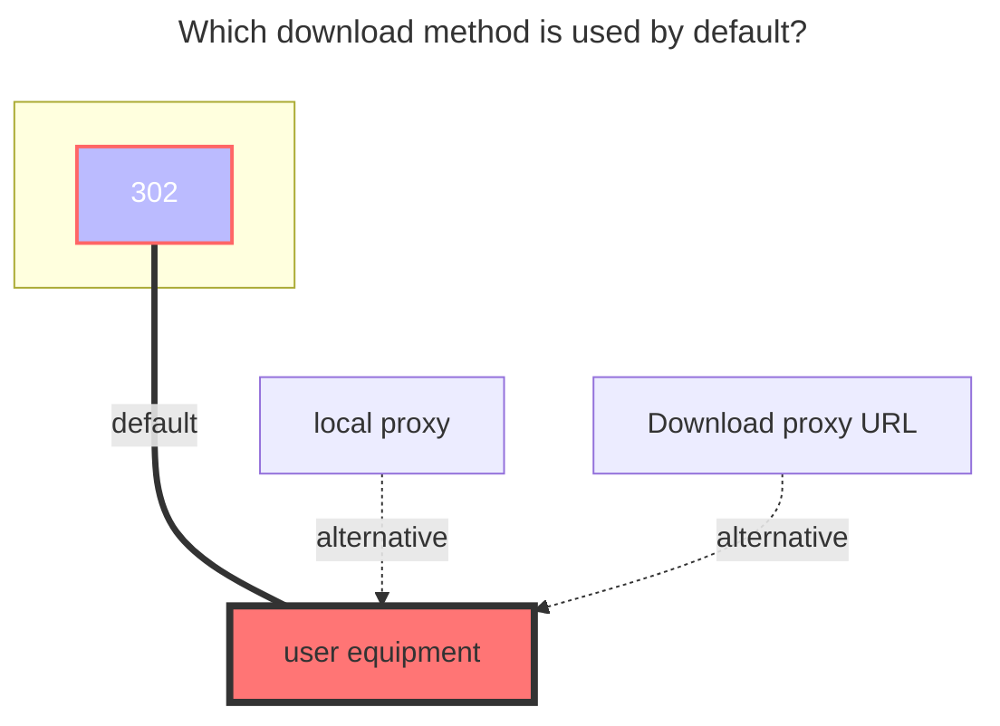

# 139Yun

<!--@include: @/en/snippets/reverse-tip.md-->

Cloud disk address: **<https://yun.139.com/>**

::: warning
The OpenList version must be greater than `v3.41.0` to use this tutorial.
:::

::: tip
Most parameters can be obtained from browser DevTools. See [Search keywords](#search-keywords).
:::

## Quick start

For long-term use, use the new personal cloud with password login fallback. This lets OpenList persist the generated `Authorization` and renew it automatically when possible.

1. Log in to <https://mail.10086.cn/> in your browser.
2. Copy cookies from `mail.10086.cn` and paste them into `MailCookies` as a Cookie Header String, for example `key1=value1; key2=value2`. Do not paste JSON, a table, or one cookie per line.
3. Fill your 139 email/mobile account in `Username`, and fill the corresponding password in `Password`.
4. Add a `139Yun` storage in OpenList and fill:
   - `Type`: `personal_new`
   - `MailCookies`: the cookies copied in step 2
   - `Username`: your account
   - `Password`: your password
   - `Root folder ID`: leave empty or fill `/` for the root directory
5. Leave `Authorization`, `Cloud ID`, and `UserDomainID` empty.
6. Save the storage.

If you only want to mount quickly, you can fill only `Authorization`: log in to <https://yun.139.com/>, find a `hcy/file/list` request in DevTools -> Network, copy the request header `Authorization`, and paste only the content after `Basic `.

If you want to mount a subfolder, enter that folder on the 139Yun website first, then use the current `parentFileId` or `currentCatalogID` as `Root folder ID`.

## Authentication

The driver supports three authentication methods. Use only one method unless you need password login as a fallback.

| Method                  | Fields to fill                        | Notes                                                                                                                                                                                                                                     |
| ----------------------- | ------------------------------------- | ----------------------------------------------------------------------------------------------------------------------------------------------------------------------------------------------------------------------------------------- |
| Password login fallback | `MailCookies`, `Username`, `Password` | Recommended for long-term use. `MailCookies` must be a Cookie Header String, such as `key1=value1; key2=value2`. The driver can generate and persist a new `Authorization`, and can fall back to password login when token refresh fails. |
| Authorization           | `Authorization`                       | Fastest setup. Fill in the value after `Basic `. Do not include `Basic` itself. You may need to update it manually after it expires or refresh fails.                                                                                     |
| Mail cookies fast login | `MailCookies`                         | Use cookies from `mail.10086.cn`. `MailCookies` must be a Cookie Header String and contain valid key-value pairs; `Os_SSo_Sid` and `RMKEY` are used for fast login.                                                                       |

`Username`, `Password`, and `MailCookies` are not required when `Authorization` is valid, even if an old frontend marks them as required.

When using password login fallback, `MailCookies`, `Username`, and `Password` must be filled together.

`MailCookies` should look like the value of an HTTP `Cookie` request header: `key1=value1; key2=value2; key3=value3`.

## Type

OpenList currently supports five 139Yun storage types. `personal_new` is the default.

| Type           | Use for                   | Root folder ID when empty                                           | Cloud ID     | Notes                                                                                        |
| -------------- | ------------------------- | ------------------------------------------------------------------- | ------------ | -------------------------------------------------------------------------------------------- |
| `personal_new` | New personal cloud        | `/`                                                                 | Not required | New API. Uses direct EOS multipart upload.                                                   |
| `family`       | My Family -> Family Files | Automatically tries to save `data.path` without the `root:/` prefix | Required     | Uses Family Cloud APIs. If auto-detection fails, fill the folder ID manually.                |
| `group`        | Shared group              | Uses `Cloud ID`                                                     | Required     | For groups created by others, manually fill the folder ID to avoid first-level folder loops. |
| `personal`     | Old personal cloud        | `root`                                                              | Not required | Legacy personal cloud. Most accounts have been migrated to `personal_new`.                   |
| `share`        | Shared link mount         | Share link ID from `LinkID`                                         | Not required | Mount other users' shared content. Use `LinkID` to specify one or more share links.          |

::: warning
After changing `Type`, clear or update `Root folder ID`, then save the storage again.
:::

## Root folder ID

`Root folder ID` specifies the mounted directory.

- `personal_new`: use `/` for the root. For a subfolder, use the folder ID from `parentFileId` or `currentCatalogID`.
- `family`: leave empty to let OpenList try to read `data.path` automatically. When filling manually, remove the `root:/` or `root:` prefix.
- `group`: leave empty only when mounting your own group root. For a subfolder or a group created by others, fill the folder ID manually.
- `personal`: use `root` for the legacy root.
- `share`: not used. The share link ID from `LinkID` replaces the root folder concept.

Do not add extra `/` around subfolder IDs. For example, use `abc123`, not `/abc123`.

## Cloud ID

`Cloud ID` is required only for `family` and `group`.

- `family`: family cloud ID.
- `group`: group ID.
- `personal_new` and `personal`: leave empty.
- `share`: leave empty.

## User domain ID

`UserDomainID` is the `ud_id` value in cookies. It is optional for mounting and is mainly used to show disk usage in storage details. If it is empty, file listing and downloads can still work, but capacity statistics are unavailable.

## Advanced options

- `Custom upload part size`: upload part size in bytes. `0` means automatic. The driver uses `100 MB` by default and increases it to `512 MB` for files larger than `30 GB`.
- `Report real size`: enabled by default. For old personal, family, and group uploads, it reports the real file size to the upstream API.
- `Use large thumbnail`: disabled by default. Enable it to prefer large image thumbnails when the new personal cloud API returns them.
- `Use old stream upload`: disabled by default. Enable it to use the legacy streaming upload method for family and group cloud types. The new method supports rapid upload (server-side duplicate check) but does not support streaming; the legacy method does not support rapid upload.

## Proxy Range

`Proxy Range` is enabled by default in the driver, but it only takes effect after enabling `Web Proxy` or `WebDAV Native Proxy`.

Enable proxy mode when a player or downloader cannot handle the upstream 302 link correctly, for example when video playback fails, seeking fails, or resumable downloads do not work.

## Search keywords

Use browser DevTools to find the fields below.

| Need                      | Where to search                                     | Field                                                          |
| ------------------------- | --------------------------------------------------- | -------------------------------------------------------------- |
| `Authorization`           | Network request headers on `yun.139.com`            | `Authorization: Basic ...`; copy only the value after `Basic ` |
| New personal folder ID    | `hcy/file/list` request, or browser storage         | `parentFileId` or `currentCatalogID`                           |
| Family Cloud ID           | `queryContentList` request payload                  | `cloudID`                                                      |
| Family folder ID          | `queryContentList` response                         | `data.path`; remove `root:/` or `root:` when filling manually  |
| Group ID                  | `queryGroupContentList` request payload             | `groupID`                                                      |
| Group folder ID           | `queryGroupContentList` request payload or response | `path` or folder ID                                            |
| Legacy personal folder ID | `getDisk` request or response                       | `catalogID`                                                    |
| `UserDomainID`            | Browser cookies                                     | `ud_id`                                                        |
| Share link ID             | Share page URL on `yun.139.com`                     | The path segment after `/share/` in the sharing URL            |

In Firefox, cookies and local storage can be easier to find in DevTools -> Storage.

### Personal new

Choose one of the following methods to find `Authorization` and folder ID.

If you want the folder ID of a subfolder, enter that subfolder first and then inspect the new request or storage value. Otherwise, the old folder ID may still be displayed.

### Personal cloud

### Family cloud

::: details Teaching video
Although the video is for V2, the method for obtaining folder ID and Cloud ID is still similar.

**<https://www.bilibili.com/video/BV1US4y1w79a>**
:::

### OpenList fill in examples

- `Authorization`: fill in only the content after `Basic `.
- New personal folder ID: enter the target folder first, then use the current `currentCatalogID`.

## Share mount

The `share` type allows you to mount shared content from other 139Yun users. You need a valid authorization to access download APIs.

### LinkID format

### LinkID 格式

`LinkID` supports the following formats:

- Single share: directly enter the share link ID
- Password-protected share: `link_id#password`
- Multiple shares: separate multiple entries with commas or new lines. For example: `share_a,share_b,share_c` or `share_a#pass1,share_b`

### Get share link ID

1. Open the share link in your browser, e.g. `https://yun.139.com/w/#/share/xxxxx`
2. The path segment after `/share/` is the share link ID (e.g. `xxxxx`)
3. If the share is password-protected, append `#password` after the link ID

### Configuration

- **Type**: `share`
- **LinkID**: one or more share link IDs (see format above)
- **Authorization** or **MailCookies + Username + Password**: required for authentication (same as other types)
- **Root folder ID**: not used for share type. The share link ID in `LinkID` determines the mounted content.
- **Cloud ID**: leave empty

Notes:

- Upload operations are not supported for the `share` type.
- When mounting multiple shares, the root directory shows each share as a separate folder.
- `${data_path}` resolves to the share root for path-based operations.

## Download method

The default download method is 302 redirection. If a player such as PotPlayer cannot play through 302, switch that mount to proxy mode or mount it through WebDAV with `WebDAV Native Proxy`.

