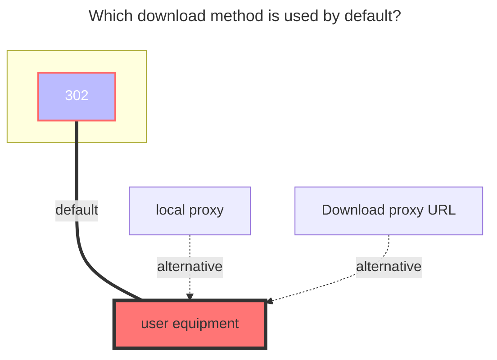

# 189Cloud

<!--@include: @/en/snippets/reverse-tip.md-->

::: tip
The web -side login has been replaced with sliding verification code, **no longer supports OCR or manual input**. If the verification code needs to be used, please use the add `Cookie` to log in

If you encounter "Device ID does not exist, secondary device verification required",Open the 189 Account website at <https://e.dlife.cn/index.do>, log in, and then disable the Device Lock..

:::

## 189CloudTV

Uses the TV interface of 189 Cloud Drive, with the fewest mounting steps.

(Some users have reported throttling issues. If you experience video playback stuttering, black screens, or failure to load, please switch to the 189 Cloud PC client.)

1. When mounting, select 189CloudTV. Leave the login parameters blank. If you are unsure, **just fill in the mount path**.

2. After clicking save, simply return to the storage management page. You can choose to log in by scanning a QR code or click the link to log in (for link login, if you are unsure, it is recommended to **right-click the link and open it in a new window**).

   

3. After entering, select SMS login. Once logged in, return to the storage management page. Disable and re-enable the storage to use it normally (you may need to refresh the page).

   

## Personal Cloud

### Username

the phone number used to log in

### Password

password for login

### Root folder ID

The string at the end of the official website url, such as:

- https://cloud.189.cn/web/main/file/folder/-11 -> `-11`
- https://cloud.189.cn/web/main/file/folder/71398114617385472 -> `71398114617385472`

  

### Family transfer

Give 189 Cloud adds Personal's `Family Transfer option`, which is convenient for users without VIP, and a large number of family cloud spaces upload.

- Note: The old upload interface family cloud will still limit the upload quantity, so `Rapid upload` and ` Old Upload` will not take effect

## Family Cloud

(189 Cloud PC Driver Only) Use a computer browser, open the developer tool (F12), switch the emulation device and select the mobile device

Open https://h5.cloud.189.cn/main.html#/family, enter the folder you want to mount, you can see the request in the network, and then find the required parameters:

### OpenList fill in examples：

#### 189 Cloud

Fill in the account1and password2,Then click one request in the request, just bring `Cookies`3, click on one at will Then fill in,Cookie expires time is unknown

#### 189 CloudPC

Video reference: **https://www.bilibili.com/video/BV16A4y197De**

## suggestion

It is recommended to use the 189 Cloud PC first, [**Notes click to view.**](../../faq/howto.md#when-adding-a-189-cloud-storage-the-device-id-does-not-exist-and-a-secondary-device-verification-is-required)

### The default download method used

