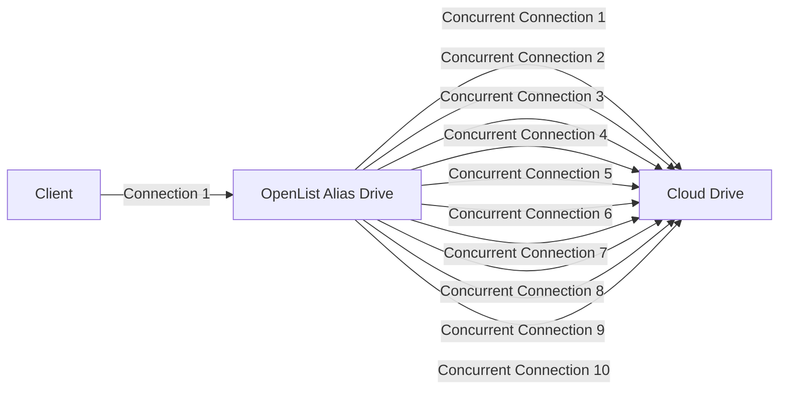

**Alias** is a feature that allows multiple different cloud drives or storage paths to be merged into a unified directory. By combining paths, content from different cloud drives or folders can be displayed in the same interface, simplifying access and management.

For example: Cloud Drive Account 1 and Cloud Drive Account 2 both contain a folder named `Movies`, but the contents of these folders may not be identical.

- **Previously (Virtual Path)**:

  You could only mount them to two different paths separately, like:
  - `CloudDrive1/Movies`, `CloudDrive2/Movies`
  - `Movies/CloudDrive1`, `Movies/CloudDrive2`

- **Now (Alias)**:

  An aggregated folder (Movies) is provided, which can contain content from both Cloud Drive 1 and Cloud Drive 2 simultaneously.

Folders with the same name will be automatically merged into one. The contents of the folder are the sum of the contents of all folders with the same name. Regarding how this driver handles files with the same name, please refer to the [Path conflict policies](/en/guide/drivers/alias#path-conflict-policies) section later.

For Example:


In the diagram, we can see that two different folders are merged into one. Files and folders with the same name are also combined, and unique ones are displayed separately.

Example explanations:

- **Example 1**: `riluo.jpg` is unique to Cloud Drive 1, so it is shown separately.
- **Example 2**: Both folders contain a `video` folder, but the contents of these folders will be merged. Subfolders also follow the **same-name merging** display rule. Both folders contain two videos, but one of them has the same name. After merging according to the **same-name merging** rule, three video files will be displayed in total.

## Paths filling method

There are two ways to fill in:

1. The first one is that you can only fill in the path of the subfolder and the folder with the same name must be used at the end. It is not recommended to use :x:
   - Paths filling example:
   ```
   /file1/locala
   /file2/localb
   ```
2. The second is to directly mount the root folder path, using the `renaming` method, it is strongly recommended to use :heavy_check_mark:
   - Paths filling example:

   ```
   #Example 1 Directly write the root folder
   merge: /file1
   merge: /file2

   #Example 2 Mount different path folders for merging
   merge: /file1/localtest233
   merge: /file2/videos/TV series
   merge: /file3 2/TV/Domestic TV Series/Station XX
   ```

According to the second method, we can `merge` and display different folders, which is convenient and quick.

## Path conflict policies

The three configuration items—**Reading conflict policy**, **Writing conflict policy**, and **Putting conflict policy**—determine how the Alias handles files or folders with the same name and identical paths in the backend drivers. Their values and corresponding behaviors are as follows:

### Reading conflict policy

Determines the behavior for handling files with the same name when downloading, copying (as source files), and extracting (as source files) (excluding moving).

- Get the file corresponding to the first conflict path: Select the file from the first available path (from top to bottom in the Paths) where the file exists.

- Load balancing on a per-file basis: Randomly select one file from the available duplicates.

- Load balancing on a per-part basis:
  - During 302 downloads, copying, or extracting, it falls back to the **Load balancing on a per-file basis** strategy.
  - When using local proxy downloads, each transmitted chunk is randomly assigned to one of the duplicate files. This requires the backend driver to support Range requests. For details on setting the chunk size, refer to the section [Download concurrency, Download part size](/en/guide/drivers/alias#download-concurrency-download-part-size).
  - This policy achieves the actual effect as shown in the figure. It is important to note that this diagram is only intended to conveniently demonstrate the operation of this policy. The statement that "participating load-balanced files with the same name have different contents" is **not** a correct usage of this driver. OpenList does not guarantee stable or correct results under such circumstances, nor will it address any issues arising from this usage scenario. Furthermore, the actual minimum size for file splitting is 1 KiB, not 1 byte, so the effect depicted in the diagram will not occur in the stable version.

    

::: tip
When a copy operation involves multiple source paths and target paths, the Alias will first attempt to pair source and target paths that belong to the same drive. Only for target paths that cannot be matched in this way will the method specified by the **Reading conflict policy** be used to select a source path.

For example, when copying:

- `DriverA/source/file.txt`
- `DriverB/source/file.txt`

to:

- `DriverB/target/`
- `DriverA/target/`
- `DriverC/target/`

The Alias driver will perform the following operations:

1.  Copy `DriverA/source/file.txt` to `DriverA/target/`, since both are located in Driver A.
2.  Copy `DriverB/source/file.txt` to `DriverB/target/`, since both are located in Driver B.
3.  For `DriverC/target/`, which has no matching source in the same driver, select `file.txt` from either Driver A or Driver B according to the **Reading conflict policy**, and copy it to `DriverC/target/` via an upload operation (creating a copy task).

:::

::: tip
The move operation involves a matching process similar to that of the copy operation. For target paths that cannot be matched with a source path from the same driver, the Alias will randomly select from the still-unmatched source paths to create a pairing (**one-to-one correspondence**). If the number of source paths exceeds the number of target paths, the unmatched source paths will be deleted. If the number of source paths is less than the number of target paths, the move operation will fail. The matching behavior for the move operation is not affected by the **Reading conflict policy**.

For example, in the case described for the copy operation, since there is no source path corresponding to `DriverC/target/`, the move operation will fail.

As another example, when moving:

- `DriverA/source/file.txt`
- `DriverB/source/file.txt`
- `DriverD/source/file.txt`
- `DriverE/source/file.txt`
- `DriverG/source/file.txt`

to:

- `DriverA/target/`
- `DriverB/target/`
- `DriverC/target/`
- `DriverF/target/`

The Alias will perform the following operations:

1.  Move `DriverA/source/file.txt` to `DriverA/target/`.
2.  Move `DriverB/source/file.txt` to `DriverB/target/`.
3.  Randomly select one file from Driver D, E, or G, and move it to `DriverC/target/` (by creating a move task, which is essentially an upload followed by deletion). Let's assume E is selected.
4.  Randomly select one file from the remaining unmatched drivers (D or G), and move it to `DriverF/target/`. Let's assume G is selected.
5.  Delete `DriverD/source/file.txt`.

:::

### Writing conflict policy

Determines the behavior for renaming or deleting files/folders with the same name, as well as creating folders within identically named folders.

- **Disable writing**: Prohibits rename, delete, and folder creation operations.
- **Write into the first conflict path**: Operates on the driver containing the target path that appears first (top to bottom) in the configured path list.
- **Allow unique path**: Executes the operation only if the target path is unique (exists in only one backend path). Otherwise, the operation is prohibited.
- **Allow full conflict paths**: Executes the operation only if the target path exists in **all** configured backend paths, applying the operation across all of them. Otherwise, the operation is prohibited.
- **Allow unique path and full conflict paths**: Allows the operation when the target path is either unique or exists in all configured backend paths.
- **Write into all conflict paths**: Forwards the operation to all backend paths where the target path exists.

::: tip
If the above explanation is unclear, you can refer to the following example.

- In Driver A, the file exists: `file1.txt`
- In Driver B, the files exist: `file1.txt`, `file2.txt`, `file3.txt`
- In Driver C, the files exist: `file1.txt`, `file3.txt`

Configured backend paths:

```
test:DriverA
test:DriverB
test:DriverC
```

Then:

- Since the sub-path `/file1.txt` is valid in all configured paths (`DriverA/`, `DriverB/`, `DriverC/`), `/file1.txt` is referred to as a **full conflict path**.
- Since the sub-path `/file2.txt` is valid only under the single backend path `DriverB/`, `/file2.txt` is referred to as a **non-conflict path** or **unique path**.
- Since the sub-path `/file3.txt` exists under both `DriverB/` and `DriverC/`, and the number of backend paths where it exists is neither 1 nor the maximum (3), `/file3.txt` is neither a non-conflict path nor a full conflict path.

When renaming any file to `file4.txt`, the corresponding files in the following drivers will be renamed:

| Writing conflict policy                   | file1.txt                    | file2.txt | file3.txt          |
| ----------------------------------------- | ---------------------------- | --------- | ------------------ |
| Disable writing                           | Fails                        | Fails     | Fails              |
| Write into the first conflict path        | Driver A                     | Driver B  | Driver B           |
| Allow unique path                         | Fails                        | Driver B  | Fails              |
| Allow full conflict paths                 | Driver A, Driver B, Driver C | Fails     | Fails              |
| Allow unique path and full conflict paths | Driver A, Driver B, Driver C | Driver B  | Fails              |
| Write into all conflict paths             | Driver A, Driver B, Driver C | Driver B  | Driver B, Driver C |

:::

### Putting conflict policy

Determines the behavior for uploading to, copying to, moving to, or extracting to folders with the same name.

- **Disable putting**, **Put into the first conflict path**, **Allow unique path**, **Allow full conflict paths**, **Allow unique path and full conflict paths**, **Put into all conflict paths**: These options function identically to their counterparts in the **Writing conflict policy**.
- **Random load balancing**: Randomly selects one valid path for the upload.
- **Weighted random load balancing based on remaining space**: Retrieves the remaining free space of all valid paths, skips paths that fail to report free space or have insufficient space for the file being uploaded, and then randomly selects from the remaining valid paths, weighting the choice by their remaining capacity. If none of the valid paths that successfully reported free space have enough capacity for the file, **a random selection is made from among the valid paths that failed to report capacity**.
- **Strict weighted random load balancing based on remaining space**: Retrieves the remaining free space of all valid paths, skips paths that fail to report free space or have insufficient space for the file being uploaded, and then randomly selects from the remaining valid paths, weighting the choice by their remaining capacity. If none of the valid paths that successfully reported free space have enough capacity for the file, **an error message is returned directly**.

::: tip
The load balancing mechanisms within the **Reading conflict policy** and the **Putting conflict policy** are two largely unrelated features. Informally speaking, the load balancing in the **Reading conflict policy** is analogous to RAID 1, while the load balancing in the **Putting conflict policy** is analogous to RAID 0. For specific use cases of each, please refer to [Advanced / Load balancing](/en/guide/advanced/balance).

If you've understood the above, you'll realize that enabling both **Reading Load Balancing** and **Putting Load Balancing** won't make load balancing more balanced. In fact, this configuration produces effects that are hardly any different from enabling only **Putting Load Balancing**.

:::

::: tip
The legacy version of the Alias used three Boolean configuration items—**Writable**, **Protect same name**, and **Parallel write**—to implement path conflict policy functionality. The correspondence between the legacy configuration and the new configuration is as follows:

- In the legacy configuration, the **Reading conflict policy** was always set to **Get the file corresponding to the first conflict path**.
- In the legacy configuration, when **Writable** was disabled, both the **Writing conflict policy** and the **Putting conflict policy** were set to **Disabled**.
- When **Writable** was enabled, the **Writing conflict policy** and the **Putting conflict policy** were both determined as follows:
  |                            | Parallel write disabled                | Parallel write enabled                    |
  | -------------------------- | -------------------------------------- | ----------------------------------------- |
  | Protect same name enabled  | Allow unique path                      | Allow unique path and full conflict paths |
  | Protect same name disabled | Write/Put into the first conflict path | Write/Put into all conflict paths         |

:::

## File consistency check

When enabled, the driver will filter out paths where the **size or hash value** differs from other copies during the process of collecting valid paths. This is a safety measure, and whether it is enabled has relatively minor impact. It is recommended to enable this option when using the **Load balancing on a per-part basis** reading policy.

Regardless of whether this option is enabled, the Alias does not actively calculate file hashes. Instead, it performs a best-effort match using the hash values returned by the backend drivers.

Different types of hash values returned by backend drivers will not lead to misjudgment. For example, if Driver 1 returns the MD5 of a file and Driver 2 returns the SHA1 of the file, even with this option enabled, the Alias will not consider either path from Driver 1 or Driver 2 invalid simply because the file's MD5 and SHA1 are not equal.

## The download method to use

When adding **`alias`**, `Web Proxy` and `Webdav Policy` are not modified by default. The storage path filled in the Paths path can be `302`, `Local Proxy`, `Download Proxy URL`, three modes Mixed Playback Mixed Playback is possible.

If you checked `Web Proxy`, the storage filled in by the Paths path, if there is a 302 mode playback, it will be played in transit (local proxy mode) at that time, and it will become a proxy mode. If the Webdav policy is also changed, it will also change.

Of course, it is up to you to choose whether to change the mode.

### What if you don’t know how the cloud disks you added are different?

1. You can go to the bottom of the corresponding document to view the document, there is a flow chart description
   - If there is a 302, the 302 method is used by default. If there are only local proxy and download proxy URLs, the default is to use the local proxy, provided that you have not manually selected
2. You can check when adding storage, select the corresponding storage to view, for example, let’s check the methods of Alibaba Cloud and 115 respectively
   - As you can see from the figure below, Alibaba Cloud Disk has the option of `web proxy`, and `webdav policy` defaults to 302. It can be judged that Alibaba Cloud Disk uses the 302 method by default
   - As you can see from the figure below, the 115 network disk does not have the option of `web proxy`, and the `webdav strategy` defaults to the local proxy. It can be judged that the 115 network disk uses the local proxy mode by default
     

## Proxy Range

You need to enable `Web Proxy` or` Webdav Native Proxy` to take effect. Currently only applicable to：`alias`、`139Yun`、`OpenList V3`.

- The `139Yun` driver, when this option is enabled, can resolve issues that occur when a proxy is enabled but the download link does not return the correct HTTP status code, such as problems with video playback or lack of support for resume downloads.
- The `Alias` driver is added to meet specific use cases, for example, when `139Yun` uses a 302 redirect. By enabling the `Alias` proxy, downloads can use `139Yun` with the 302 redirect, while video playback can use the proxy-enabled `Alias`, reducing unnecessary load.
- The `OpenList` driver is added to support server-side OpenList mounting with `139Yun` using a 302 redirect. Locally, OpenList can be mounted via the proxy-enabled `OpenList` to access the server's OpenList for video playback, etc., to avoid consuming server bandwidth. This also allows for data-free video streaming on mobile networks.

## Download concurrency, Download part size

**Storage Settings:**

- Alias (Alias) Drive
- Local Proxy
- Path: / Cloud Drive Mount Path
- Download Concurrency: 10
- Download Chunk Size: 1024

**Effect:**

- Client → OpenList Alias Drive: Uses 1 connection
- OpenList Alias Drive → Cloud Drive: Supports 10 concurrent connections, with actual concurrency limited by the cloud drive.



- Single-threaded speed is slower, but it supports concurrency: Using the alias drive allows concurrent downloads, significantly improving speed.
- Video watching and download acceleration: The experience is enhanced by increasing concurrency.
- Copying from alias drive to other drives: File transfer is also accelerated in this case.

**Friendly Reminder:** Please do not abuse this feature. Excessive use may cause abnormal activity on the cloud drive account, and you will bear the consequences.

**Configuration Options:**

- max_concurrency: Sets the maximum concurrency for the local proxy. The default is 64, and setting it to 0 means no limit on concurrency.

## Other instructions

If you are using `Windows`, the following situation will occur, and folders with different capitalization will also be regenerated.

For example, Local 1 and Local 2 have a lowercase v for `video` respectively, and the folder OneDrive has an uppercase V `Video` folder.

Then a lowercase video folder will be generated, which contains only `local 1, local 2` files merged by two folders.

At the same time, the uppercase `Video` will gather the files of the three folders.

This is because Windows is case-insensitive, video and Video will be considered as the same folder, you will not have this problem if you switch to Linux or Mac.
