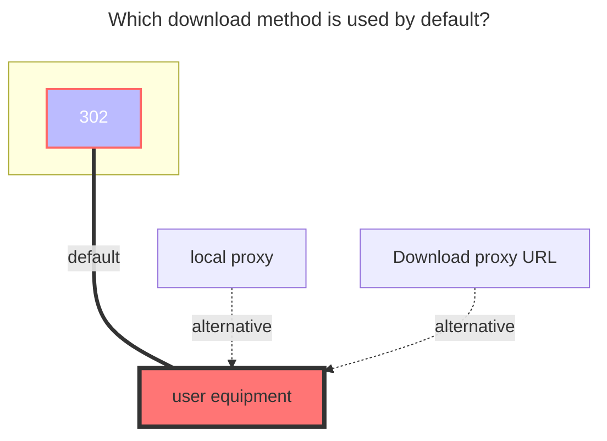

# AutoIndex

The AutoIndex driver is used to mount directory index pages built into HTTP servers, such as the [Nginx Source Index](https://nginx.org/download/) and [Redis Releases](https://download.redis.io/releases/).

This driver essentially scrapes page information directly and requires manually specifying XPaths, making it suitable for scraping pages that are not directory index pages as well.

## Setup Instructions

- **URL:** The website address. If no scheme is included, `https://` will be automatically added. To mount a subpath, append it directly to the end of the URL. For example, <https://archive.apache.org/dist/tomcat/> can be used to mount the subpath `tomcat/` under <https://archive.apache.org/dist/>. Required.
- **Entry XPath:** An XPath expression used to match each entry node in the file list. The result of this expression must be a **node-set**, where each node corresponds to a file entry. Required.
- **Filename XPath:** Within the context of each node matched by **Entry XPath**, this XPath expression is used to extract the filename. The result can be a node, node-set, or string. If the result is a node or node-set, the innerText of the first node will be used as the filename. Required.
- **Modification time XPath:** Within the context of each node matched by **Entry XPath**, this XPath expression is used to extract the file modification time. The result can be a node, node-set, or string. If the result is a node or node-set, the innerText of the first node will be used as the modification time string. Optional. If left blank, no node is matched, or the date format is unrecognizable, the current time will be used by default.
- **File size XPath:** Within the context of each node matched by **Entry XPath**, this XPath expression is used to extract the file size. The result can be a node, node-set, number, or string. If the result is a node or node-set, the innerText of the first node will be parsed as the file size. Optional. If left blank, no node is matched, or the content cannot be recognized as a valid size, the driver will return a file size of 0.
- **Ignore filenames:** Used to filter out entries that should not be crawled (e.g., list headers, parent directory links). Enter the filenames to ignore (without the trailing `/`).
- **Modification date format:** Enter a time string matching the format displayed on the page (refer to the Go time template: `Mon Jan 2 15:04:05 -0700 MST 2006`, see also: [Go Time Formatting Documentation](https://golang.org/pkg/time/#pkg-constants)).

## Reference Configuration

The following configurations can be used to mount the auto-index pages of some HTTP servers. Since the style of auto-index pages may change with updates to the HTTP server version, the configurations provided below are for reference only and are not guaranteed to work across all versions. You are welcome to supplement available configurations for other HTTP servers in the comments.

#### Nginx (Tested on 1.29.0)

- Entry XPath: `//pre/a`
- Filename XPath: `.`
- Modification time XPath: `substring(normalize-space(./following-sibling::text()[1]),1,17)`
- File size XPath: `substring(normalize-space(./following-sibling::text()[1]),19)`
- Modification date format: `02-Jan-2006 15:04`

#### Apache httpd (Tested on 2.4.18)

- Entry XPath: `//table/tbody/tr[position() > 2]`
- Filename XPath: `./td[2]/a`
- Modification time XPath: `./td[3]`
- File size XPath: `./td[4]`
- Modification date format: `2006-01-02 15:04`

#### Caddy (Tested on v2.10.2)

- Entry XPath: `//table/tbody/tr`
- Filename XPath: `./td[2]/a/span`
- Modification time XPath: `./td[4]/time`
- File size XPath: `./td[3]/div/div[2]`
- Modification date format: `01/02/2006 03:04:05 PM -07:00`

#### Python SimpleHTTP (Tested on 3.11.5-0.6)

- Entry XPath: `//ul/li`
- Filename XPath: `./a`
- Modification time XPath: leave blank
- File size XPath: leave blank
- Modification date format: leave blank

## The default download method used

