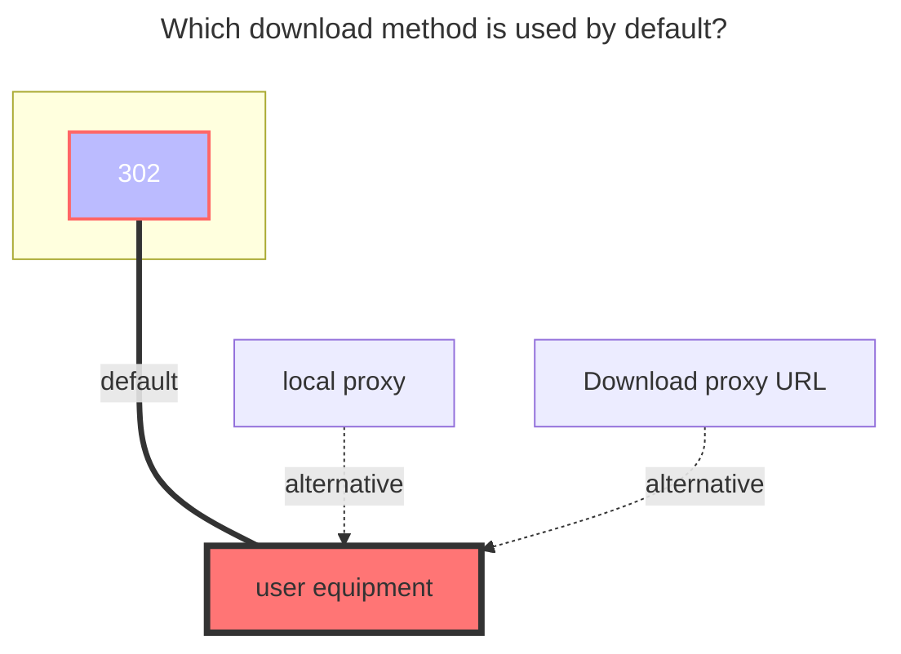

# Baidu Photo

<!--@include: @/en/snippets/reverse-tip.md-->

## Cookie

Log in to [Baidu Photo](https://photo.baidu.com), open F12, and find any request containing the `Cookie` value. Copy it.

## Album ID

**When left blank, all albums in the root directory are displayed by default.**

If you want to mount a single album, fill in the following:

- The **Album ID** should be: {album_id}|{tid}
  Example: `4021858707431029901|316519298447849660`
  - **{album_id}**: After entering the album you want to mount, check the top URL for the ID after `/album`. This is the **{album_id}**.
    - Example: [https://photo.baidu.com/photo/web/album/4021858707431029901](https://photo.baidu.com/photo/web/album/4021858707431029901)
    - **4021858707431029901** is the **{album_id}**

  - **{tid}**: Access [this link](https://photo.baidu.com/youai/album/v1/list?limit=1000) to obtain the **{tid}**
    - Once on the page, press `Ctrl+F` and search for the ID above. A few lines below you’ll find the corresponding **{tid}**.

## Display Type

Choose according to your needs.

## Delete Source Files

By default, it only removes the album, not permanently deletes the files. If you enable this option, the files will be permanently deleted after removal. Be cautious when enabling this.

## The default download method used

