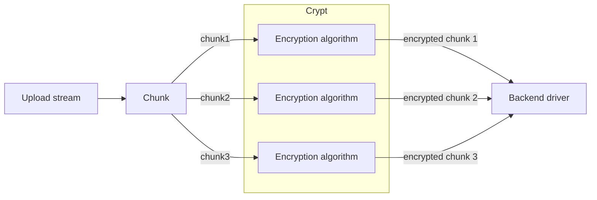
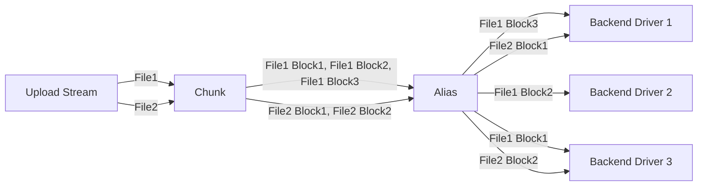
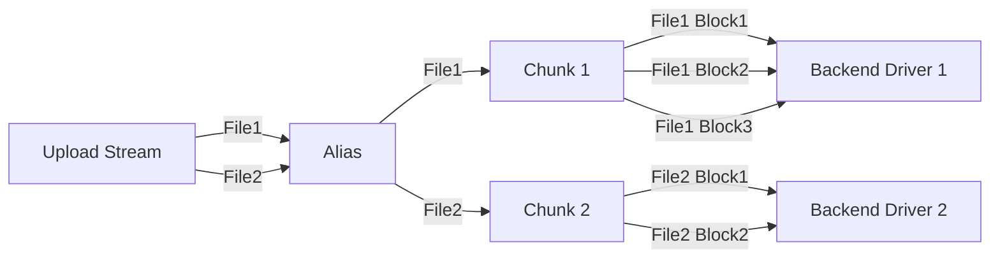

# Chunk

The Chunk is used to split large files into multiple file chunks. Each chunk is stored as an independent file on the backend driver.

The size of each file chunk can be manually configured by the user. Except for the last chunk of each file—which is smaller than the configured size—all other chunks are always equal to the specified size.

A chunked file is stored as a folder on the backend driver, containing all its chunks.

## Setup Instructions

- **Remote path:** The real storage path of the chunked files. This path must be the root path or a subpath of another driver.
- **Part size:** Maximum chunk size / Size of chunks except the last, in bytes.
- **Chunk large file only:** Whether to only chunk files larger than Part size.
  - When disabled:
    
  - When enabled:
    
- **Chunk prefix:** The prefix for the names of chunk folders stored on the backend driver, representing a chunked file. This is used to identify whether a folder is a regular folder or a chunked file storing folder, and therefore cannot be empty.
- **Custom ext:** Custom suffix for chunk names, used to bypass limitations of certain drivers.
  - When left empty:
  - When setting to `.jpg`:

::: warning TIP
Once the driver is created, Custom ext should not be modified again, otherwise previously uploaded chunked files will become unrecognizable.

If modification is necessary, you must manually change the suffix of all chunks on the backend driver afterward.
:::

- **Store hash:** Whether to store the hashes of chunked files in the chunk folder as well.
  This feature does not actively compute hashes; it only stores the hashes that the file already carries when uploading.
- **Num list workers:** When handling `List` requests, if a folder contains chunk folders, it is necessary to further list those chunk folders to retrieve information such as file size and hash value. Using multiple threads can speed up this process. A higher number of threads consumes more CPU and bandwidth resources but also increases speed. It is recommended to be disabled (set to 1) when the backend driver has API rate limiting.

## Use in combination with Crypt

If you need to both chunk and encrypt files, it is recommended to **encrypt first, then chunk**. Specifically, set Remote path of the [Crypt](/en/guide/drivers/crypt) driver to the mount path of the **Chunk** driver, and set Remote path of the **Chunk** driver to the actual storage path of the files.

- Best practice:

- Bad practice:

**Reason**: The bad practice involves storing a series of encryption metadata in each file chunk, which consumes more space. It also fails to guarantee that the chunks adhere to the user-specified maximum size, thereby undermining the purpose of file chunking.

To perform emergency recovery on an encrypted file chunked according to the best practice, you simply need to concatenate all the chunks in order and then proceed with recovery.

## Use in combination with Alias

If you need to store chunked files across multiple load-balanced drivers, you can combine this with the [Alias](/en/guide/drivers/alias) driver. For details, refer to [Load Balancing / Load balancing by file chunks](/en/guide/advanced/balance#load-balancing-by-file-chunks).

It's important to note that, unlike the approach used with Crypt, when combining with Alias, the process should be **chunk first, then load balance**. This means setting the Remote path of the **Chunk** driver to the mount path of the **Alias** driver, and setting the paths within the **Alias** driver to the actual file storage paths.

- Best Practice:

- Bad Practice:

