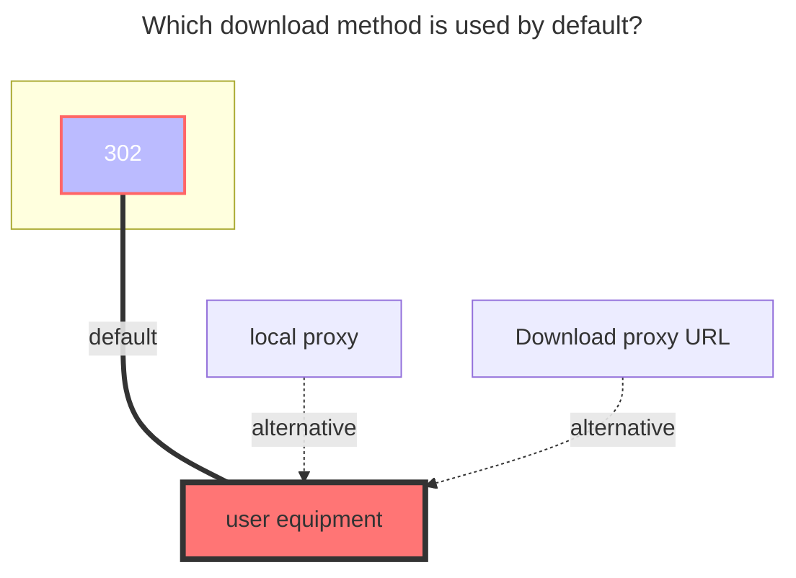

# CloudFlare-ImgBed

<!--@include: @/en/snippets/tos-tip.md-->

## Disclaimer

::: warning
This driver only provides an interface to interact with the CloudFlare-ImgBed backend and is not responsible for the availability and stability of the image hosting program itself or its storage channels.
Users are solely responsible for determining and configuring the storage channels used (e.g., Cloudflare R2, HuggingFace, S3, Telegram) and must strictly comply with the Terms of Service and acceptable use policies of the relevant platforms and service providers. Do not use this driver for any illegal activities, rights infringement, or abuse of platform resources (e.g., excessive consumption of free quotas, illegal storage/distribution of copyrighted content).
All consequences arising from improper configuration, violation of platform policies, or service abuse (including but not limited to account suspension, data loss, service interruption, etc.) shall be borne by the user. OpenList and its developers shall not be held liable.
:::

## 1. Preparation

Before configuring this driver, you need to deploy your own CloudFlare-ImgBed backend.
Project address: [MarSeventh/CloudFlare-ImgBed](https://github.com/MarSeventh/CloudFlare-ImgBed)
After deployment, log in to the backend dashboard (`https://your-domain/dashboard`), and ensure that at least one storage channel (e.g., HuggingFace, Cloudflare R2, S3, Telegram) is configured in the system settings.

## 2. Add in OpenList

### Mount Path

Enter the path you want to mount to, for example `/imgbed`.

### Root Folder Path

Default is `/`, can be left empty.

### Address

Enter the address of your deployed image hosting service, e.g., `https://img.example.com`. No need to add `/` at the end.

### Token

Enter the API Token generated in the backend system settings.

### Small Channel Name

Typically used for uploading files smaller than 20MB. Enter the channel name configured in your backend (e.g., `my cfr2`, `my telegram`).

### Large Channel Name

Used for uploading files larger than 20MB. It is recommended to configure a channel that supports large files (e.g., `huggingface`). If left blank, large files will fall back to the small channel for upload.

### Large Channel Type

Select the corresponding type based on your large file channel:

- `huggingface`: Uses HuggingFace LFS direct upload (supports instant upload and chunking)
- `telegram` / `cfr2` / `s3` / `discord`: Uses the backend chunked upload API

### Upload Thread

Concurrent thread count for HuggingFace chunked direct upload, default is `3`, max is `32`. Can be increased if network conditions are good.

## The default download method used

