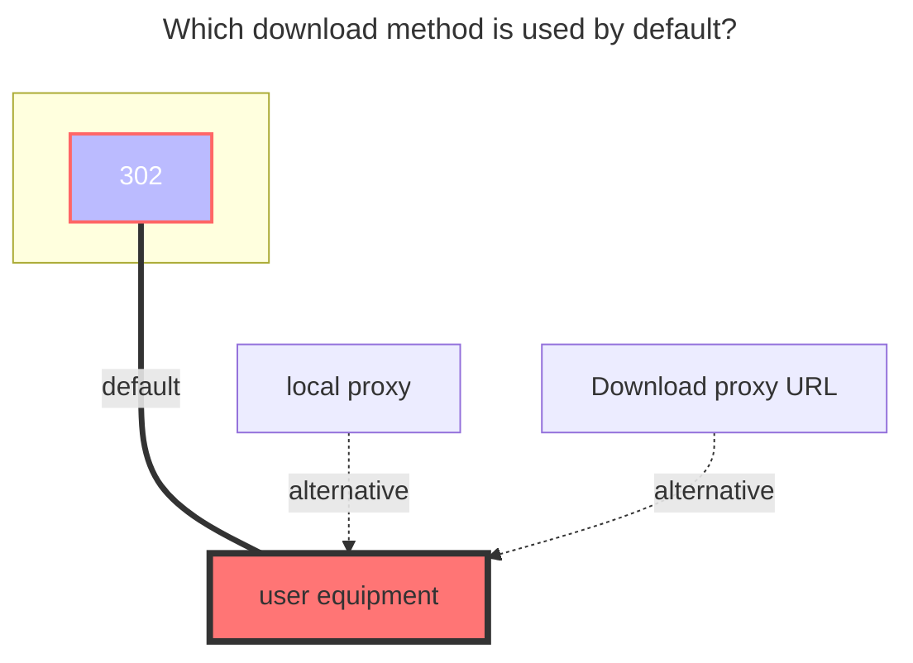

---
categories:
  - guide
  - drivers
top: 397
---

# CNB Releases

https://cnb.cool/

## Known issues

CNB releases are not a standard file system and have some unresolved issues. Please do not submit feedback for these.

1. An empty repository needs to be initialized first.
2. Subdirectories are not supported under Tag / Release directories.
3. The OpenAPI upload returns `expires_in_sec` as only 10 seconds. Uploading large files may time out; after time out, the upload continues but returns `invalid token`. Therefore, a local timeout mechanism is added to automatically stop uploading when the set time is reached, avoiding failed uploads and wasted bandwidth.
4. `Move`, `Copy`, and `Rename` operations are not supported.
5. Only when `UseTagName` is disabled, renaming can be done by modifying the Release name.

## Parameters

### Repo

Only one repository can be specified. To reuse a token, please use the [Reference](common.md#reference) feature.

### Token

Access token. No need to include `Bearer`. Supports the [Reference](common.md#reference) feature.

How to obtain: After logging in, go to `Personal Settings` - [Access Token](https://cnb.cool/profile/token) -> `Add Access Token`.

For listing, grant the `repo-code:r` permission. For modifications, grant the `repo-code:rw` permission.

### UseTagName

Use the original Tag name instead of the Release name.

By default, this is disabled and the Release name is used, which supports renaming. Tag names cannot be changed once created. When creating a new folder for the first time, a Tag with the folder name will be published. Renaming an existing Release will modify the Release name.

## The default download method used

