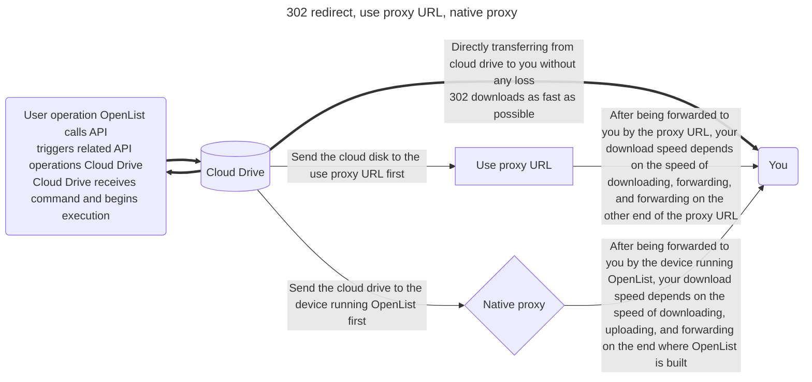

# Common

## Mount Path

The unique identifier for the mount point, the name displayed externally, and the location where it should be mounted. If you want to mount it to the root directory, please enter `/`.


::: danger
You cannot use duplicate mount path names, otherwise, the following error will occur:

```json
Failed to create storage in database: UNIQUE constraint failed: x_storages.mount_path
```

Solution: Use [aliases](./alias.md) to aggregate multiple mount points.
:::

::: danger
The mount path name is a required field and cannot be left empty, or the following error will occur:

```json
Key: 'Storage.MountPath' Error: Field validation for 'MountPath' failed on the 'required' tag
```

Solution: If you want to mount to the root directory, please enter `/`.
:::

## Order

When mounting multiple drives, this is used for sorting. The smaller the number, the further to the front. Negative numbers can also be used.

## Remark

You can add notes for easier management.

### Reference

Reference authentication, tokens, etc., from the **"Mounted Storage"** to enable sharing the same token between multiple cloud drives.

Currently, the following cloud drives are supported:

- 139Yun
- AliyundriveOpen
- 189CloudPC
- 123PanShare（ref 123Pan）
- Cloudreve V3 / V4

**How to use**: In the storage settings, set the first line of **Remark** to: **ref:/mount_path**

**Important**: `ref:/` should be in lowercase letters and symbols.


## Enable signing

Sign and encrypt files (no password required), only valid for this driver, if other signatures are not enabled and `signature all` and `meta-information encryption` are not set, others will not be signed.

Usage scenario: I don't want to enable all signatures, and I don't want to set metadata encryption. I just want to sign and encrypt a certain driver to prevent it from being scanned.

Scope of influence: `Settings-->Global-->Signature All` > `Metainformation Directory Encryption` > `Single Driver Signature`.

## Disable index

Allow users to disable storage indexing.

- For example, if you enable `Ignore Index` in the index options, you no longer need to configure it after enabling `Disable Index`, which is more convenient.

## Cache Expiration

Cache time of directory structure.

## Custom Cache Policies

Cache time for directory paths (in minutes).

You can customize the cache time for specific file paths using pattern matching. The configuration supports wildcard patterns:

- `*` matches a **single** directory level.
- `**` matches **multiple** directory levels.

Example configuration:

```txt
/Series/Completed/*:60
/Series/Updating/*/**:10
/Series/Archived/**:30
```

Explanation:

- `*` matches only a single directory level. Items directly under `/Series/Completed` will be cached for 60 minutes. This does **not** include deeper subdirectories — for example, `/Series/Completed/A/B` will not match this rule.
- `**` matches multiple directory levels. Therefore, the contents of subdirectories under `/Series/Updating` will be cached for 10 minutes. For example, `/Series/Updating/A/B` and `/Series/Updating/C/D` will match.
- The pattern `/Series/Updating/*/**` enforces a “single level followed by multi-level” match. As a result, directories directly under `/Series/Updating` will **not** be matched by this rule.
- All contents under `/Series/Archived` (including any depth of subdirectories) will be cached for 30 minutes.

## Web proxy

Whether the web preview,download and the direct link go through the transfer. If you open this, recommended you set [site_url](../../configuration/configuration.md#site-url) so that OpenList can works fine.

::: tip

- **Web proxy Strategies:** It is a strategy when using the webpage. The default is a local agent. If you fill in the proxy URL and enable the web agent to use the proxy URL
- **Webdav policy Strategies:** It is an option to use the webdav function
  - If there are 302 options default to 302, if there is no 302 option default to the local agent, if you want to use the agent URL, please fill in and manually switch to the proxy URL strategy

The two are different configurations.

:::

## Webdav policy

- **302 redirect:** redirect to the real link
  - Although it does not consume traffic, it is not recommended to share and use it.
- **use proxy URL:** redirect to proxy URL
  - It will consume the traffic of the agent URL
- **native proxy:** return data directly through local transit(best compatibility)
  - The traffic of the construction of OpenList device will consume

### Description of three modes



## Download proxy URL

When the proxy is turned on without filling in this field, the local machine will be used for transfer by default.

### 1. Cloudflare Workers

Here’s the translation:

You can use Cloudflare Workers as a proxy. Simply fill in your Cloudflare Workers address here.

The code to set up Workers can be found at [https://github.com/OpenListTeam/OpenList-Proxy/blob/main/openlist-proxy.js](https://github.com/OpenListTeam/OpenList-Proxy/blob/main/openlist-proxy.js). When using it, you need to replace the following variables:

- `ADDRESS`: Your OpenList address, which must include the protocol header and should not end with a `/`. For example, `https://pan.example.com`.

- `TOKEN`: The [Token](../../configuration/other.md#token) of the admin account, which can be found in the “Other Settings” section of the OpenList admin page.

- `WORKER_ADDRESS`: Your Worker address, which is usually the same as the **Download Proxy URL**.

  :warning: Cloudflare Workers free CDN support is only compatible with **http80** and **https443** ports (whether domestic or international), as tested by group members.

When filling in the **Download Proxy URL** in the OpenList backend configuration, the link should not end with a `/`.

Detailed text tutorial: <https://anwen-anyi.github.io/index/11-durl.html>

### 2. Universal Binary

You can use another machine as a proxy. Download the program from https://github.com/OpenListTeam/OpenList-Proxy/releases and check the usage instructions with `./openlist-proxy -help`.

Detailed text tutorial: <https://anwen-anyi.github.io/index/11-durl.html>

### 3. Developing on your own

You can develop your own proxy program. The general steps are as follows:

- When downloading, it will request `PROXY_URL/path?sign=sign_value`.
- In the proxy program, validate the `sign`. The calculation method for `sign` is:

```js
const to_sign = `${path}:${expireTimeStamp}`
const _sign = safeBase64(hmac_sha256(to_sign, TOKEN))
const sign = `${_sign}:${expireTimeStamp}`
```

`TOKEN` is the [Token](../../configuration/other.md#token) of the administrator account, which can be obtained in the “Other Settings” section of the OpenList management page.

- After validating the signature, request `HOST/api/fs/link` to obtain the file URL and the request headers to include.
- Use the information to make the request and handle the response.

## Sort related

- **Sort by**: Sort by what
- **Sort direction**: Whether the sort direction is ascending or descending

::: info
Some drives use their own sorting method, which may be different.
:::

## Extract folder

- **Extract to front**: put all folders to the front when sorting
- **Extract to back**: put all folders to the back when sorting
