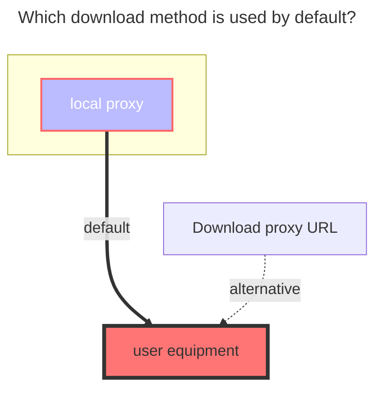

# Crypt

The Crypt driver provides secure encryption for your files and folders, acting as a two-password-protected vault. Only users with the correct password and salt can access the encrypted content.

**Key Features:**

- File and folder encryption with multiple security levels
- Password and salt-based protection
- Compatible with rclone crypt
- Supports various encryption modes for filenames and directories

::: warning Important Security Notice

1. Read this guide thoroughly before using the Crypt driver
2. Test the configuration in a local environment before production deployment
3. **Never modify the configuration after storing encrypted data** - this will make data lost
4. Keep your password and salt values secure - losing them means losing access to your data

Again, please read the documentation carefully; otherwise, any data loss will be at your own risk!
:::

## Setup Instructions

1. **Create Storage Location**

   Create an **empty folder** in your existing mounted drive to store encrypted files.

2. **Configure Remote Path**

   Enter the path of the empty folder in the `Remote path` field of your Crypt driver configuration.

   **Example Configuration:**
   - Original driver path: `/123`
   - New empty folder: `/123/encrypted_storage`
   - Remote path setting: `/123/encrypted_storage`

3. **Upload Files**

   Upload files to the newly created Crypt driver mount point. Only files uploaded through the Crypt driver will be encrypted.

   **File Access:**
   - **Encrypted files**: Located in the remote path, appear scrambled and cannot be opened directly
   - **Decrypted access**: View and access files normally through the Crypt driver mount point

### Basic Configuration Example

For users new to encryption, use the following default configuration:

::: danger Please make sure to read the following important notes carefully to ensure understanding!

**Important Declaration:**

- **Do not modify the configuration! Do not modify the configuration! Do not modify the configuration!** Once the configuration is saved, do not modify it again!!! This is repeated for emphasis!
- **Password** and **Salt** must be remembered! After clicking save, they will be encrypted and cannot be displayed in plain text (the plain text in the image shows the state before saving).

> [**Password Configuration Instructions**](#password)
>
> [**Salt Configuration Instructions**](#salt)

---

- **If you have not yet uploaded files within the Crypt driver**, you can modify the password and configuration. **Otherwise, do not modify!**
- After modifying the configuration, Crypt will attempt to filter illegal files/directories, but illegal data will not be automatically deleted.
  - **Illegal files/directories** refer to encrypted data generated with a different configuration.

:::

::: warning
Regarding encryption combinations, there are 5 options available (actually 6), but it’s important to note that if only folder encryption is enabled without encrypting the file names, the configuration will not take effect (as shown in the first example below).

| Filename Encryption | Directory Encryption | Status     |
| ------------------- | -------------------- | ---------- |
| `Off`               | `Enabled`            | ❌ Invalid |
| `Off`               | `Disabled`           | ✅ Valid   |
| `Standard`          | `Disabled`           | ✅ Valid   |
| `Standard`          | `Enabled`            | ✅ Valid   |
| `Obfuscate`         | `Disabled`           | ✅ Valid   |
| `Obfuscate`         | `Enabled`            | ✅ Valid   |

:::

## Configuration Options

### Filename Encryption

**Default:** `Disabled`

**Available Options:**

| Mode        | Security Level | Description                                                                   |
| ----------- | -------------- | ----------------------------------------------------------------------------- |
| `Off`       | None           | Files keep original names with encrypted suffix (e.g., `file.txt.bin`)        |
| `Standard`  | High           | **Recommended** - Strong encryption with good security                        |
| `Obfuscate` | Low            | Simple obfuscation, supports long filenames but may create special characters |

---

In the image below, the left side shows file **name encryption** and folder **name encryption** enabled, while the right side shows the decrypted Crypt driver where files can be viewed.

- **File name encryption not enabled**: Original name + encrypted suffix, as shown in the top left corner
- **File name encryption enabled**: Fully encrypted file name, content cannot be recognized, as shown in the bottom left corner

### Directory Name Encryption

**Default:** `Disabled`

Directory encryption requires filename encryption to be enabled. When activated, folder names are also encrypted for enhanced security.

**Configuration Combinations:**

| Filename Encryption | Directory Encryption | Status     |
| ------------------- | -------------------- | ---------- |
| `Off`               | `Enabled`            | ❌ Invalid |
| `Off`               | `Disabled`           | ✅ Valid   |
| `Standard`          | `Disabled`           | ✅ Valid   |
| `Standard`          | `Enabled`            | ✅ Valid   |
| `Obfuscate`         | `Disabled`           | ✅ Valid   |
| `Obfuscate`         | `Enabled`            | ✅ Valid   |

### Remote Path

The storage location for encrypted files. Can be any mountable drive supported by OpenList.

### Security Parameters

::: danger
After saving the configuration, both password and salt values are encrypted and cannot be displayed in plain text. Store them securely in a separate location.
:::

#### Password

::: warning
Note that passwords exported using `rclone config` are obfuscated and cannot be used directly. Please prefix the password with `___Obfuscated___` before use. 
For example, if the exported password is `abc123xyz`, it should be entered as `___Obfuscated___abc123xyz` in the Crypt driver.
:::

Primary encryption key. **Must be remembered** - cannot be recovered if lost.

#### Salt

::: warning
Note that salts exported using `rclone config` are obfuscated and cannot be used directly. Please prefix the salt with `___Obfuscated___` before use. 
For example, if the exported salt is `abc123xyz`, it should be entered as `___Obfuscated___abc123xyz` in the Crypt driver.
:::

Secondary encryption key, acts as an additional password layer. **Must be remembered** - cannot be recovered if lost.

If you don't know what is salt, treat it as a second password. Optional but recommended

### Advanced Options

#### Encrypted Suffix

**Default:** `.bin`

Custom suffix for encrypted files (only used when filename encryption is disabled). Must start with a dot (e.g., `.abc`, `.encrypted`).

#### Filename Encoding

**Default:** `base64`

**Warning:** Only modify if you understand the implications. Other encoding options are not thoroughly tested and may cause compatibility issues.

For rclone compatibility, configure this setting in advanced options.

## Advanced Usage

### Rclone Compatibility

The Crypt driver is fully compatible with [rclone crypt](https://rclone.org/crypt).

**Important Notes:**

- OpenList Crypt uses `filename_encoding = base64` by default for better long filename support, configure this setting in advanced options when using with rclone
- Case-insensitive filesystems (e.g., Windows with local storage) may cause issues

## Troubleshooting

### Startup Errors

If Crypt shows errors during OpenList startup, it's likely because Crypt starts before its target path is available.

**Solution:** Set a higher [order number](./common.md#order) for the Crypt driver to delay its initialization.

### Data Access Issues

If you cannot access previously encrypted data:

1. Verify that the password and salt values are correct
2. Ensure the configuration hasn't been modified
3. Check that the remote path is accessible
4. Confirm the filename encoding setting matches your original configuration

## The default download method used

