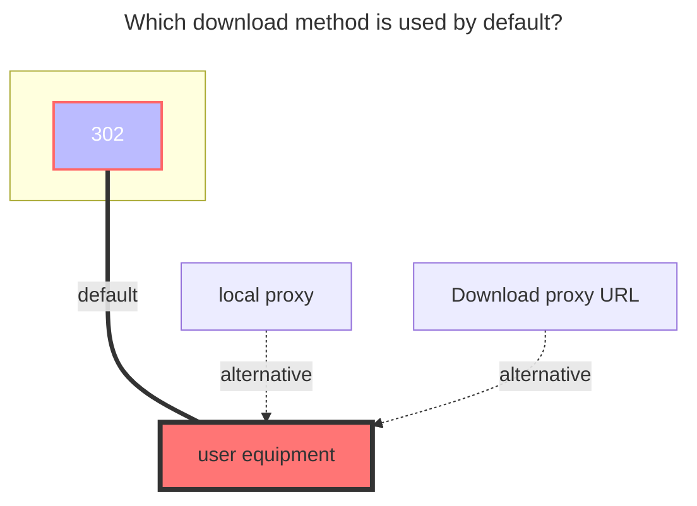

---
categories:
  - guide
  - drivers
top: 587
---

# Degoo

https://degoo.com/

**Authentication methods**:

1. Username + Password
2. Refresh Token
3. Access Token

In normal cases, you can log in with your username + password. If you encounter a 429 error, you can log in using tokens. You can obtain the token from the request body or header in your browser.

## Username

Your user's name.

## Password

Your user's password.

## Refresh Token

Refresh token for automatic token renewal, obtained automatically.

## Access Token

Access token for Degoo API, obtained automatically.

## The default download method used

