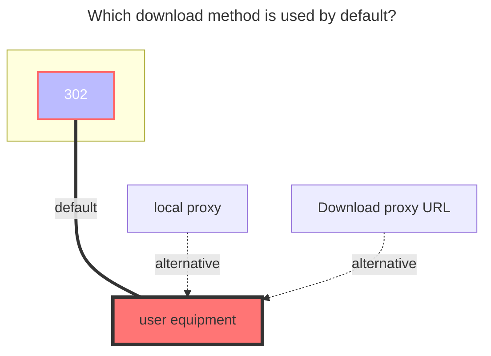

# FebBox

FebBox：https://www.febbox.com

- The upload function is currently unavailable.

## Root folder ID

Root directory ID, default is `0`.

Other directory IDs can be viewed in the top link address bar after entering the folder.

- **https://www.febbox.com/console#/files?parent_id=66889900**

  Then the directory ID is `66889900`

## `Client_id`、`Client_secret`

Generate address：**https://www.febbox.com/open/clients**

- The generated client ID and secret key are filled in in the opposite order to the OpenList, so be careful not to fill them in incorrectly.

  

## User IP

**Optional**, the IP address of the user when downloading, quoting the official description

> IP address, Optional parameter. Supports IPv6 format. After filling in, the best download server suitable for the IP location will be selected. If not filled in, the requested IP will be used.

## The default download method used

