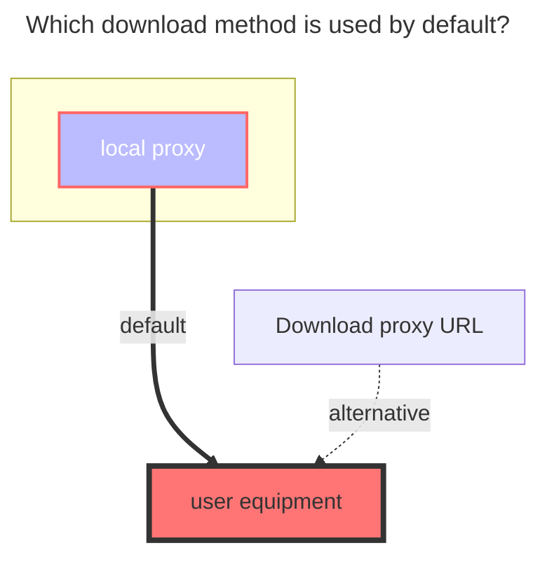

# FTP

### Address

FTP address, need contains port.

### Username

FTP username

### Password

FTP password

### Root folder path

root folder , default `/`, same as local storage.

## Enter directory before listing

Whether to change into the target directory before listing files. Some FTP servers do not support listing files with a path argument directly. Enable this option to first `cd` into the directory and then `ls`, which can resolve such compatibility issues. Default: `false`.

### The default download method used

