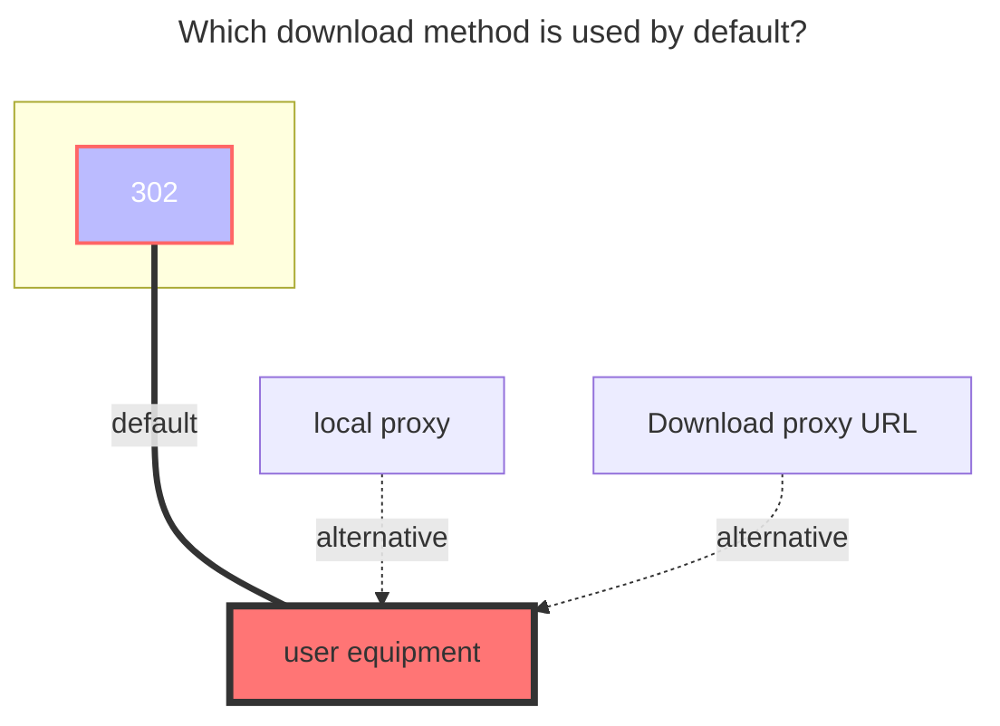

# GitHub Releases

## Overview

GitHub Releases driver allows you to mount GitHub repository releases as a file system, enabling direct access to release assets through a familiar directory structure.

## API Rate Limits

::: warning Rate Limits

- **Unauthenticated requests**: 60 requests per hour
- **Authenticated requests** (with token): 5,000 requests per hour

We recommend using a personal access token to avoid hitting rate limits.
:::

## Repository Configuration

### Basic Usage

**Single Repository Mount**

Mount a single repository to the root directory:

```text
OpenListTeam/OpenList
```

This is equivalent to:

```text
/:OpenListTeam/OpenList
```

### Multiple Repositories

**Mount to Subdirectories**

You can mount multiple repositories to different subdirectories:

```text
/openlist-gh:OpenListTeam/OpenList
/openlist-frontend-gh:OpenListTeam/OpenList-Frontend
```

The leading `/` is optional:

```text
openlist-gh:OpenListTeam/OpenList
openlist-frontend-gh:OpenListTeam/OpenList-Frontend
```

## Configuration Options

### Personal Access Token

**When to use:**

- Required for accessing private repositories
- Recommended to avoid rate limiting issues

**How to get:**

1. Log in to GitHub
2. Visit: https://github.com/settings/tokens
3. Generate a new token with appropriate permissions

### Show All Versions

**Disabled (default):**

```
openlist/
├── openlist-linux-amd64.tar.gz
└── openlist-windows-amd64.zip
```

**Enabled:**

```
openlist/
├── v3.41.0/
│   ├── openlist-linux-amd64.tar.gz
│   └── openlist-windows-amd64.zip
├── v3.40.0/
│   ├── openlist-linux-amd64.tar.gz
│   └── openlist-windows-amd64.zip
└── v3.39.4/
    ├── openlist-linux-amd64.tar.gz
    └── openlist-windows-amd64.zip
```

When enabled, all available release versions are displayed in separate directories.

### Pagination Control (Show All Versions)

When "Show All Versions" is enabled, you can control the number of releases fetched via pagination:

- **`per_page`**: Number of releases per page (default: `30`, max: `100`)
- **`max_page`**: Maximum number of pages to fetch (`0` means unlimited)

These settings help you avoid hitting API rate limits when repositories have a large number of releases.

**Example:**

To fetch at most 2 pages with 50 releases per page (up to 100 releases total):

```text
per_page = 50
max_page = 2
```

::: tip
A single unauthenticated request counts as 1 toward the 60 requests/hour limit. With `per_page=100` and `max_page=1`, fetching releases for a single repository costs only 1 request.
:::

### Show README Files

**Disabled (default):**

```
openlist/
├── openlist-linux-amd64.tar.gz
└── openlist-windows-amd64.zip
```

**Enabled:**

```
openlist/
├── v3.41.0/
│   ├── openlist-linux-amd64.tar.gz
│   └── openlist-windows-amd64.zip
├── v3.40.0/
│   ├── openlist-linux-amd64.tar.gz
│   └── openlist-windows-amd64.zip
├── LICENSE
├── README.md
└── README_cn.md
```

::: tip
When enabled, README and LICENSE files from the repository are displayed alongside releases. However, folder size and modification time information will not be shown.
:::

## GitHub Proxy Settings

Use GitHub proxy services to accelerate downloads in regions with limited GitHub access.

**Configuration:**
Replace the GitHub domain with a proxy service URL:

```text
https://gh-proxy.com/https://github.com
```

**Available Proxy Services:**

| Service     | URL                                       |
| ----------- | ----------------------------------------- |
| GH-Proxy    | `https://gh-proxy.com/https://github.com` |
| GHProxy.net | `https://ghproxy.net/https://github.com`  |
| GHFast      | `https://ghfast.top/https://github.com`   |

Example:

```
Before: https://github.com/owner/repo/releases/download/v1.0/file.zip
After:  https://ghproxy.net/https://github.com/owner/repo/releases/download/v1.0/file.zip
```

::: warning
Proxy services are third-party and may have varying availability and performance.
:::

## The default download method used


