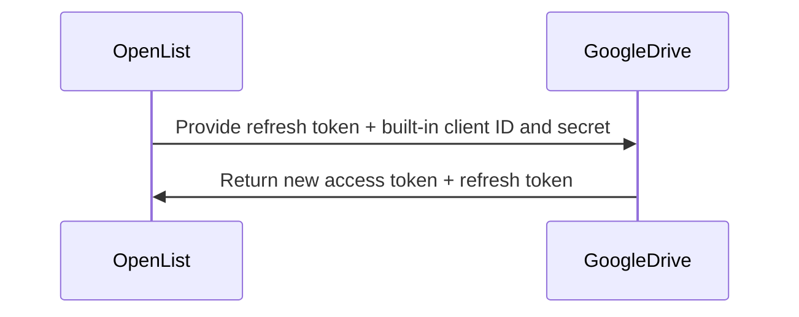
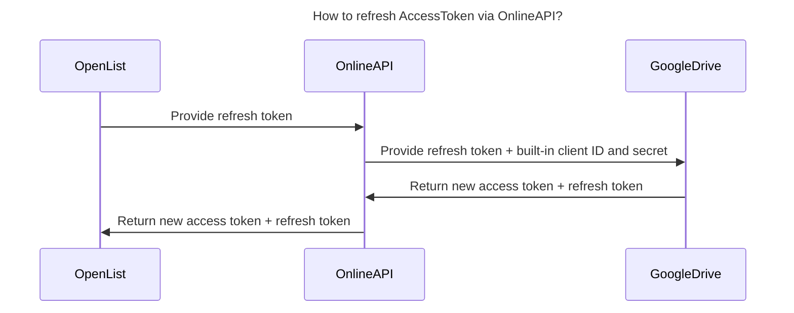
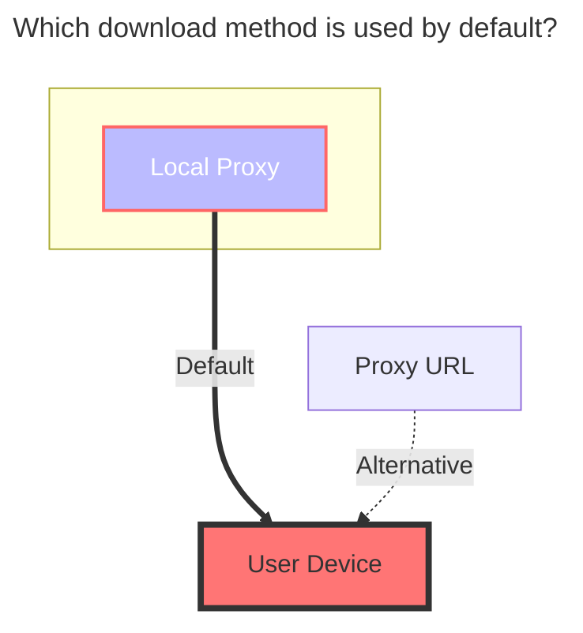

# Google Drive

Official website: https://drive.google.com/

- Supports Team Drive (Enter the Team Drive directory ID for the Root Folder ID)

## 1. Prerequisites

1. The machine on which the OpenList service is deployed must be able to connect to Google Drive.

2. The Google Drive API service must be enabled. For details on how to enable it, please refer to [Enabling the Google Drive API](#_2-1-enable-google-drive-api).

   > For detailed steps, see [Google Workspace > Google Drive > Quick Start Guide](https://developers.google.com/workspace/drive/api/quickstart/js).

## 2. Preparation

### 2.1. Enable Google Drive API

1. On the [Guide Page](https://developers.google.com/workspace/drive/api/quickstart/js), locate the `Enable the API` button and click to proceed to the quick activation interface. Follow the instructions and confirm the settings to complete the activation process.

2. You can also visit the [Google Drive API Management Interface](https://console.cloud.google.com/apis/library/drive.googleapis.com). Find the `Enable` button at the top and click it; wait for the activation to complete.

3. `Quotas and System Limits Management`(optional): Switch to the `Quotas and System Limits` tab and set appropriate quotas and limits based on your usage and requirements.

### 2.2. Creating an OAuth Client (Optional; not required if using OpenList, a public welfare server, or a self-built server)

1. On the [Credentials Page](https://console.cloud.google.com/apis/credentials?hl=en), click the `Create Credentials` dropdown menu and select and click `OAuth client ID`.
   > If prompted with `To create an OAuth client ID, you must first configure the consent screen`, click the `Configure consent screen` button, and complete the creation of the `Brand Information` on the subsequent page, selecting `External` for the `Audience`. After completion, return to the Credentials page to continue creating the OAuth client ID.
   > 
2. In the pop-up window, select `Web Application` and enter the name of your application type.
3. For the `Authorized redirect URIs`, enter `https://api.oplist.org/googleui/callback`. If you are using a self-built service or a non-profit organization, please enter the corresponding domain name, for example, `https://your-domain.com/googleui/callback`.
4. Click the `Create` button to complete the creation of the OAuth client. Note: Make sure to copy and save the `Client ID` and `Client Secret`; you will need them later on.

   

5. Add yourself as a test user: On the left side, find the `Audience` menu and click to enter it. Then, locate `Test Users` and click the `+ Add users` button. Enter your Google account email address and click `Save`.

   

6. After completing the testing, you can publish your application: On the left side, find the `Audience` menu and click to enter it. Then, locate `Publication Status` and click the `Publish app` button. Confirm the publication to complete the application release process.

   

### 2.3. Get `Access Token` and `Refresh Token`

1. Open the [OpenList Google Authorization Page](https://api.oplist.org/). **⚠️ If you are using a public or self-hosted server, please proceed with that server.**

2. In the dropdown menu on the page, select `GoogleDrive Login`.

   
   

3. If you created an OAuth Client ID in the previous steps, please enter the Client ID and Client Secrets in the input fields below.

   
   

   Otherwise, check the box ☑️ to use the API provided by OpenList. **⚠️ If you are using a public or self-hosted server, the built-in Client ID and Client Secrets of that server will be used.**

   
   

4. Click the `Get Authorization` button. The system will redirect you to the Google Authorization page. Log in to your Google account and authorize OpenList to access your Google Drive.

   

5. If a message appears stating `This app has not been verified by Google`, click `Advanced` and then click `Go to oplist.org (insecure)` to continue. (If you are using a public or self-hosted server, the domain name here should match the actual domain name of the service; please verify this carefully.)

   

6. Pay attention to the permission information on the authorization page (within the red box in the image below). Make sure that the permission granted is only for accessing your Google Drive files. If you find that the permission includes access to something other than just your Google Drive files in the public service, please report an issue at [OpenListTeam/OpenList-Docs/issues](https://github.com/OpenListTeam/OpenList-Docs/issues).

   

7. After authorization is successful, the system will provide you with a `Refresh Token` and an `Access Token`. Please copy and save these tokens, as they will be used in subsequent configurations.

   
   

## 3. Add Google Drive in OpenList

### 3.1. Configuration

#### 3.1.1. Root Folder ID

Similar to Aliyun Drive, it is the last string of the official website URL, such as:

### 3.2. Start Adding

1. Open the management interface of OpenList and click on `Storage` in the left menu.

2. On the Storage List page, click the `Add Storage` button in the top right corner.

3. Select `Google Drive` as the drive.

   
   

4. Enter the mount path, for example: `google-drive`.

5. In the `Root Folder ID` field, enter the root folder ID obtained earlier; if you are using the root directory, enter `root`.

6. In the `Refresh Token` field, enter the refresh token obtained earlier (if not available, refer to [Preparing for Integration](#_2-preparation).

7. If you are using the OAuth client ID and key provided by OpenList (or a public welfare server/self-built server), follow steps 7.1 and 7.2:

   7.1. Check the `Use online API` option to indicate that you want to use the online API provided by OpenList.

   7.2. Enter `https://api.oplist.org/googleui/renewapi` as the API URL; if it’s a public welfare server/self-built server, enter the corresponding server address.

   
   

8. If you are using your own OAuth client ID and key, follow steps 8.1 and 8.2:

   8.1. Uncheck the `Use online API` option to indicate that you are using your own OAuth client ID and key.

   8.2. Enter your OAuth client ID in the `Client id` field and your OAuth Client secrets in the `Client secret` field.

   
   

9. Click the `Add` button to complete the addition of Google Drive.

## 4. About `Use online api` option

### 4.1. AccessToken refresh method with own keys

### 4.2. AccessToken refresh method without own keys

## 5. The default download method used

