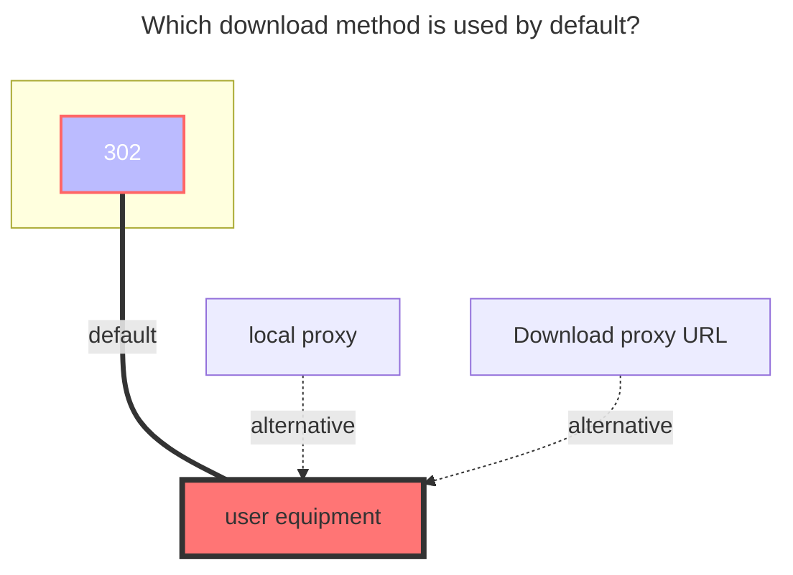

# halalcloud

- `6盘（halalcloud）` Official website：[https://2dland.cn](https://2dland.cn/)
  - Cloud Login：https://drive.2dland.cn
- Official announcement, document address：https://2dland.yuque.com/r/organizations/homepage

## Root folder file_id

Top address bar path，Root folder file_id is:`/`
Subfolder: `/A folder/C folder/C folder`

## Fill in the example

On the HalalCloud (6 盘) website, go to `User Center` and navigate to `Authorization Management`. Enter your HalalCloud account password to verify your identity.

Create a new authorization (you can name it anything you like). Click `Confirm`, then copy and save the `Client ID` and `Client Secret`.

In the OpenList admin panel, go to `Storage` and add a new driver. Select `HalalCloudOpen`, and enter the `Client ID` and `Client Secret` obtained from the previous step.

## Other parameters

- `Upload thread`: Upload threads (Default: 3, Range: 1-32)

- `Host`: (Provided by default, no input required)

- `WebDAV Policy`: Default is `302 Redirect`. Switch to `Local Proxy` if you encounter any issues.

### The default download method used

