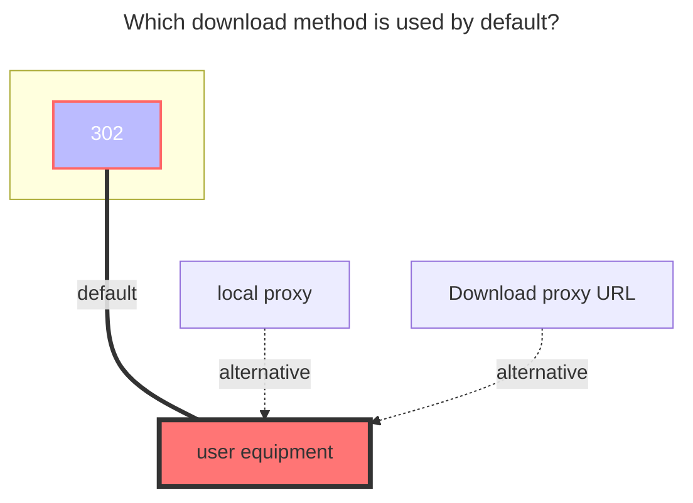

# iLanZou

**https://ilanzou.com**

<!--@include: @/en/snippets/reverse-tip.md-->

## Root folder ID

root folder ID the default is `0`，Other directory ID View the figure below obtaining method

## username、password

Just fill in your own NewLanzou Cloud Account Password

## Known issues

The file size returned by iLanZou is in Kilo Bytes, not Bytes. Therefore, you cannot accurately determine if a file has been modified based on its size. Please pay attention to the configuration of your sync software.

## The default download method used

