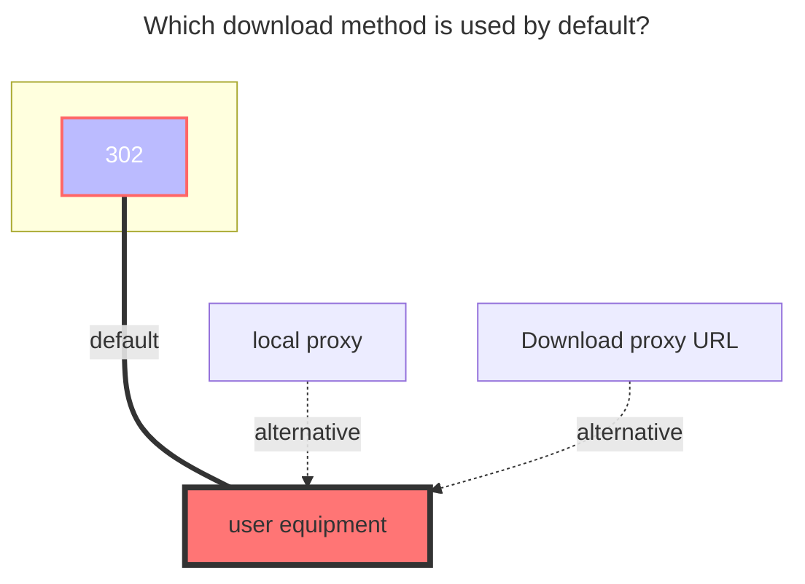

# KodBox

Use this driver to mount a KodBox netdisk space to OpenList.

## Root folder path

Suppose you have a network disk space named `My Files`. If you remount the contents of the network disk space, you need to obtain the path corresponding to `My File`; if you re-display a name in the network disk space for For the directory of `abc`, you must obtain the path corresponding to `My File/abc`, and so on.

Example: How to get the path of KodBox network disk space `My File`, the result path is `{source:5}`

Open the KodBox network disk space in the browser. In the console mode, you can see the path corresponding to the network disk space. Do not leave it blank.

## Address

Your KodBox server address, e.g.

- `https://kodcloud.cc`
- `http://192.168.1.24:8000`

## Username

The email or username used to log in to your KodBox server.

## Password

The password for your email or username.

### The default download method used

