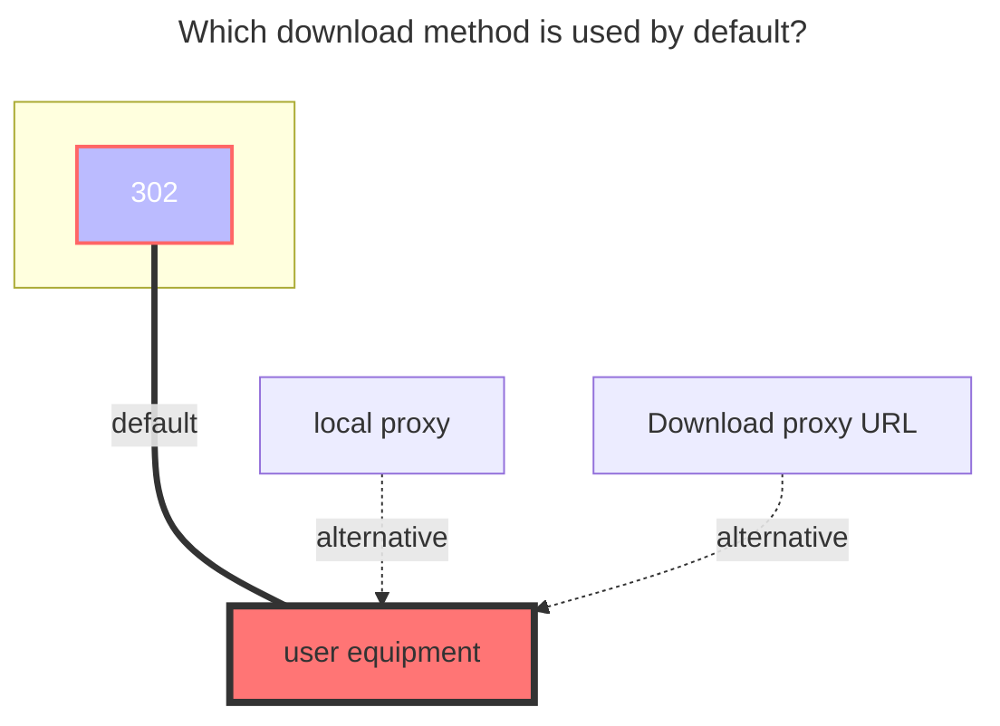

# Lenovo Nas Share

<!--@include: @/en/snippets/reverse-tip.md-->

Need to purchase Lenovo devices **https://pc.lenovo.com.cn**

## Root Folder ID

Root Folder ID: Leave it blank

Subfolder ID: Get as shown in the picture

## Share ID and Share Password

Example of share link: https://siot-share.lenovo.com.cn/s/#/eb.3N93ZbJsaAjerjdm4N Extraction code: `e5eu`

- **Share ID**: Fill in the sharing link and automatically extract the string `eb.3N93ZbJsaAjerjdm4N` at the end of the sharing link
- **Share Password**: The extraction code `e5eu`

## Host Address

The default uses the public network: **https://siot-share.lenovo.com.cn**

(Not recommended) If you are using a local network, you can change it to the internal network address of the Lenovo device: **http://192.168.XX.XX**

## Show Root Folder

If unchecked and `Share ID` is empty, the folder ID of the first-level folder is automatically filled in.
Taking the above picture as an example, the contents of the `OpenList` folder are directly displayed without displaying the `OpenList` folder.

## The default download method used

