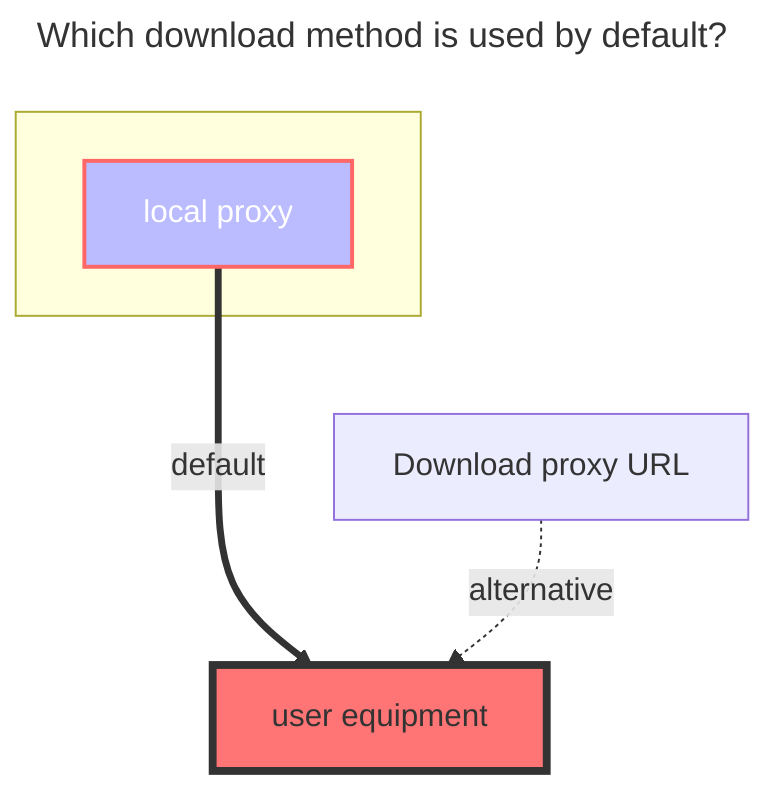

# Local storage

Support mounting the directory of the local machine.

## Root folder path

The path of folder you wanted to mount. For example:

- Linux: `/root`
- Windows: `C:`

## Local storage video thumbnail

You need to use the `ffmpeg` tool to add.

## Local storage PDF thumbnail on macOS

On macOS, the Local storage driver can generate thumbnails from the first page of PDF files using the system Quick Look tool.

To enable this feature:

1. Enable `Thumbnail`.
2. Enable `PDF thumbnail`.
3. It is recommended to configure `Thumb cache folder` to avoid rendering the same PDF repeatedly.

This feature is disabled by default and is only available when OpenList runs on macOS. Rendering is performed on cache misses and may consume additional CPU and memory.

## Recycle bin path

path to recycle bin, delete permanently if empty or keep 'delete permanently'

If you fill in this path, you will move the file into the folder when deleting the local storage file, so that you have a chance to regret it.

The method of filling in the above -mentioned mounting path is different from different system filling methods.

If you don’t know if you fill in it correctly, you can test it yourself first and then use the production environment to use it yourself.

- Linux: `/root`
- Windows: `C:`

## The default download method used

