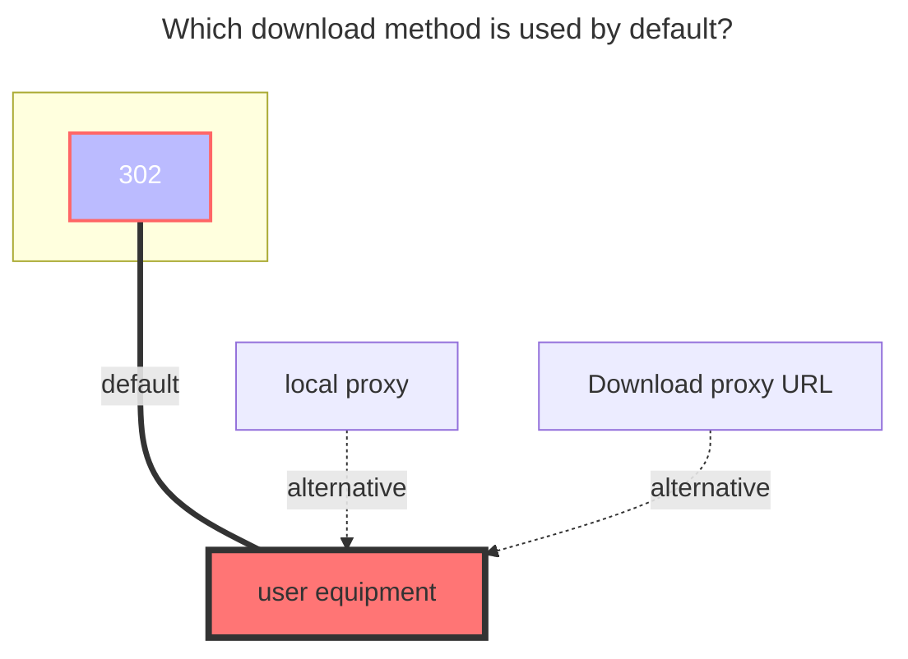

# MoPan

<!--@include: @/en/snippets/reverse-tip.md-->

MoPan address：**https://mopan.sc.189.cn/mopan/#/downloadPc**

- There is no web version, only `Android`, `iOS`, `PC-Win64bit`, `iPad`, and `TV`.

## Sms code

Enter the option of the mobile phone number and password when the first addition, and then enter the `SMS Code` input `send`, and then click Save to send it to you.

## Root folder ID

Do not fill in this option, it will automatically fill into the root directory

- Due to encrypted requests, an appropriate method for obtaining folder IDs has not yet been found

### Tips

1. `root folder ID`,`equipment information`does not need to be filled in, will automatically help you fill
2. If you enter the send in [SMS Code] (#SMS-Code), it is found that it has been saved,Please click Edit to enter the verification code received

### The default download method used

