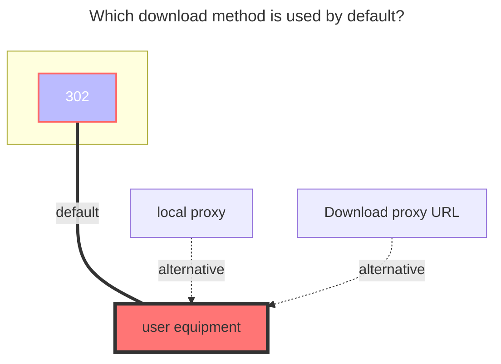
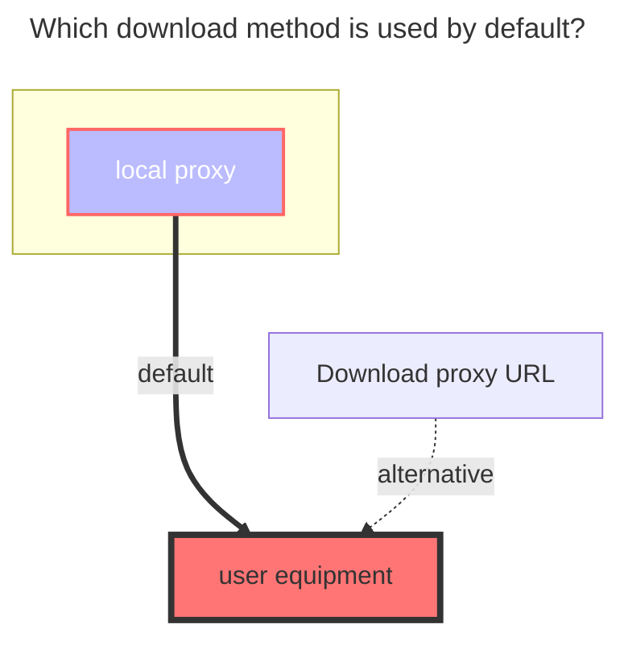

# OneDrive / Share

:::tip

- If you have global administrator permissions for a non-home edition, you can use the [OneDrive APP](onedrive_app.md) driver.
- If your account does not support the API, (for example, the school account has not verified the administrator, or the administrator has disabled the API), then you can also mount it through webdav. For details, see [webdav](webdav.md)

:::

## 1. Mounting using Online API's default application

You do not need to create an application yourself by mounting in this way.

1. Open <https://api.oplist.org> and select the corresponding OneDrive version according to your account.

2. Check "Use parameters provided by OpenList", click "Get Token", then log in to the OneDrive account you want to mount. After authorization, return to the page to get the refresh token.

   

3. Go to the storage management interface of OpenList, select the OneDrive driver, check "Use online API", fill in the refresh token and you can mount it.

   

## 2. Mounting by creating an application manually

The application provided by OpenList API may experience issues such as request rate limits due to a high number of users. In this case, you can manually create an application.

1. Navigate to the corresponding management page based on your account type.
   - OneDrive Global：https://portal.azure.com/#blade/Microsoft_AAD_RegisteredApps/ApplicationsListBlade
   - OneDrive 21vianet：https://portal.azure.cn/#blade/Microsoft_AAD_RegisteredApps/ApplicationsListBlade
   - OneDrive Germany：https://portal.microsoftazure.de/#blade/Microsoft_AAD_RegisteredApps/ApplicationsListBlade
   - OneDrive US GOV：https://portal.azure.us/#blade/Microsoft_AAD_RegisteredApps/ApplicationsListBlade

2. After logging in, select `Register Application`, enter `Name`, and select `Accounts and Individuals in Any Organization Directory` (note that you don't look at the location selection but the text here. Some people may be the middle option, don't select a single Tenant or other options, otherwise it will cause problems when logging in), enter the `Redirect URL` as `https://api.oplist.org/onedrive/callback`, click `Register`, and then you can get the `client_id`.

   

3. After registering the application, select `Certificate and Password`, click `New Client Password`, enter a string of passwords, select the one with the longest time, and click `Add`.

   (Note: The password entered after adding will disappear, please record the value of client_secret)

   

4. Select `API Permissions`, click `MicroSoft Graph`, enter file in the `Select Permissions`, and check `Files.read` (Note: `Files.read` is a read-only minimum permission. The permission in the figure is larger, and the same can be done), click `Update Permission`.

   

5. Fill in the `client_id` and `client_secret` obtained in the previous step into <https://api.oplist.org> page, click `Get Token`.

6. Go to OpenList's add storage page, uncheck "Use online API", and fill in the obtained `client_id`, `client_secret`, `Callback URL`, and `Refresh Token` in OpenList.

## Parameters

### Sharepoint site_id

If you need to mount SharePoint, after completing the above steps, there will be an input field for the site address below the refresh token display. Enter the site address, click to get the `site_id`, and then fill the obtained information into the `site_id` field on the OpenList add storage page. Make sure `Is sharepoint` is enabled.

### Root folder path

The default is `/`, if you need to customize, just fill in the path, starting from the root path, the same as the local path, such as `/test`

### Chunk size

Upload chunk size (MiB). The default is `5`, which means `5 * 1024 * 1024 = 5,242,880` bytes. Make sure to use a size that is a multiple of 320 KiB (`327,680` bytes).

### Custom host

Custom accelerated download link. This is the domain name of your reverse-proxied OneDrive download API (for example, for personal accounts: `my.microsoftpersonalcontent.com`). Only domain replacement is supported here, not path replacement.

::: warning

- Only hostname replacement is supported, not path.
- Be sure to properly isolate and only reverse proxy your own paths, otherwise your Cloudflare account may be banned!

:::

## The default download method used



## 3. OneDrive Share Url

<!--@include: @/en/snippets/reverse-tip.md-->


### Url

The sharing link is the same as the example below and can be mounted. It can be obtained from E3, E5, A1, and A1P.

```html
https://connecthkuhk-my.sharepoint.com/:f:/g/personal/jhyang13_connect_hku_hk/EsEgHtGOWbJImxop6tF15FIBIH-ihrjuDclbrbmwWfY_RA?e=s6fitN
```

If it is OneDrive personal version, it will not work. The link is as follows

```html
https://onedrive.live.com/?cid=64EA5FCC7735E8C6&id=64EA5FCC7735E8C6%2117289
```

### Password

It is the extraction code. If you have it, write it. If you don’t have it, don’t fill it in.

### The default download method used


