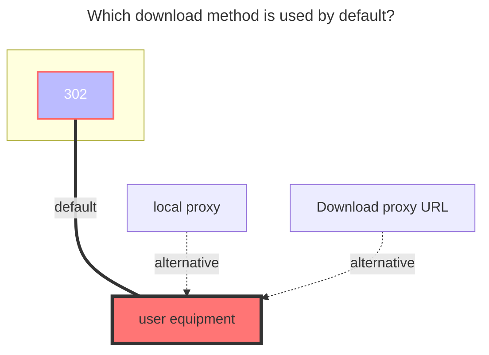

# OpenList

Support mounting OpenList directories running on other servers

## Url

OpenList link you want to mount

## Username

username

When `username&password` is not filled in, `guest` is used for guest access.

## Password

password

## Root folder path

The default root directory for the path to mount to is`/`

## Meta password

The OpenList path you want to mount has a meta information password set. You need to know what the other party's password is set to see the file, otherwise it will be blank after entering

If multiple folders have different password settings, the password you fill in can only enter the folder with this password, and those without this password cannot enter

::: danger
If you first use the `username&password` method for mounting, and then switch to using the `metadata password` method for mounting, you need to manually clear the previously automatically filled `token`, otherwise you will still use the `username&password` method for mounting

:::

## Token

You don’t need to write, it will be automatically filled after filling in `Username & Password` and saving

## Proxy Range

You need to enable `Web Proxy` or `Webdav Native Proxy` to take effect

Mount '139Yun' on the OpenList of the server and go to 302. Then, locally mount the OpenList on the server through the OpenList enabled proxy to play videos,achieving the goal of not using server traffic. The CMCC mobile card can also be streamed free

## Error message

::: danger
If the OpenList you mounted is "not" enabled Allow Mount, you will not be able to To mount, the following error is prompted

```json
Failed init storage: the site does not allow mounted
failed get objs: storage not init: the site does not allow mounted
```

Solution: Use the allowed `username&password` provided by the other party for mounting

:::

::: danger

If the other party does not enable the guest account access permission, an error will be prompted when mounting (as follows)

```json
failed get objs: failed to list objs: request failed,code: 400, message: Key: 'LoginReq.Username' Error:Field validation for 'Username' failed on the 'required' tag
```

Solution: Use the allowed `username&password` provided by the other party for mounting

:::

## The default download method used


