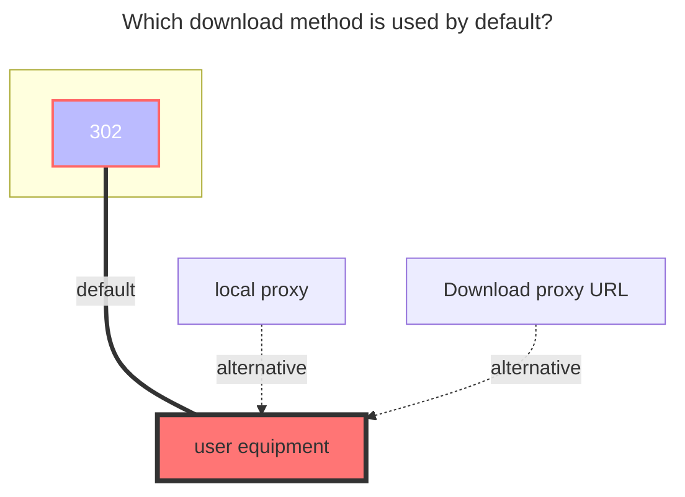

# PikPak / Share

::: danger

1. `Pikpak`：Who makes the request, who can use it
   - For example, if you build an OpenList on the server with IP `1.1.1.1`, but your own IP is `2.2.2.2`, you cannot play or download it.
   - Or enable Proxy policy

2. `PikPak Share`：There is a size limit. After the specified file size is exceeded, only 40%~50% can be played.
   - The specific size of the file is currently unknown

:::

## 1. PikPak

### Username

email or phone?

### Password

password

### Root folder id

Can get with https://mypikpak.com/ , default `root`.

### Platform

It is not necessary to use it under normal circumstances, but you may need to use it when you cannot log in directly with your account and password.

- If you choose `android`, it will simulate the Android client for access. If you want to log in using the `Refresh token`, please perform packet-sniffing on the **official Android app**.

- If you choose `web`, it will simulate the official web version for access. If you want to log in using the `Refresh token`, please use the `Refresh token` obtained from the **web version**.

### Refresh token

After filling in the account and password, select `Oauth2` for `Refresh token method` and then save to automatically fill in the refresh token and device information.

#### Get Refresh Token on Web

After logging into the official website, open the F12 console and navigate to the page shown in the image below (using Chrome as an example):

Find the option that starts with `credentials`. Select it, and observe the information bar below. From there, you can retrieve the `Refresh token`, as shown in the image below:

### Disable media link

The OpenList interface uses the playback interface. When the file resolution is too high or the file size is too large, Pikpak will automatically transcode, which may cause synchronization errors in other applications. Enabling this option will prevent using the playback interface to obtain the address.

According to the official limitations, when the video's bitrate exceeds 40 Mbps or the file size is greater than 50 GB, the system will automatically trigger transcoding. If the video already offers other resolution options, the "original quality" resolution will not be available.

### Offline Download

support calling `Pikpak` offline download function in OpenList

Select `Pikpak` in the lower right corner and select `Pikpak` for offline download options

- Support: `magnet`, `http`, `ed2k` links
- Also supports: X, TikTok, Facebook, TG URL links

- Only Pikpak is supported for offline download. If it is not Pikpak, the following error message will be displayed, Although the offline download prompt was successfully added, an error will be prompted in the background.

  unsupported storage driver for offline download, only Pikpak is supported

  

## 2. PikPak Share

::: warning
It is known that PikPak Share can only see 40%-50%
:::

You only need to fill in **`Username`, `Password`, `Shared ID`** three items, **root folder ID** can be written or not, if not written, the default is the root directory (root directory)

- Root folder ID: If it is a multi-layer directory, which directory do you want to display as the root directory, you can write which root directory.(Refer to the method of obtaining the root folder ID below)
- Sharing password: if there is a password to share, write it, if not, don’t write it

### Get Root Folder ID

**The root directory ID of the current pikpak share can no longer be obtained in the address, you need to check the data returned by the interface**

- Open the F12 console and go to the Network tab
- Refresh the page and search for `detail`, find the last `detail` request
- Select `detail` and find `files` in the Response
- Find the corresponding folder name and check its `id` field content as the root folder ID.(You can confirm the corresponding folder through the `name` field)

### Use transcoding address

Not enabled by default. When enabled, the download address will use the **transcoded address**, and you can get the **complete transcoded file**

- After turning on the `Use transcoding address` option, you cannot use the `OpenList` web version to play the video, but you can **download it normally** or **use a third-party player**

### Batch add PikPak shared mounts

software used：**https://github.com/yzbtdiy/alist_batch**

<BiliBili bvid="BV1Ps4y1U7Zu" ratio="16:9" low-quality no-danmaku />

## Precautions

**Q**: Encountering verification code issues

**A**:

- The method has now been adjusted to use `oauth2` for token refresh.
- The username and password are now only used for login to obtain the `Refresh token` and generate the `DeviceID`.
- When encountering the issue `Your operation is too frequent, please try again later`, please try logging in using **third-party authorization** (such as Google login) on the **official web version** or **official Android app**. Afterward, **obtain the `Refresh token` for mounting** — note the selection of the `Platform` at this time.

---

**Q**: Encountering the following situation: `Failed load storage: failed init storage: Your operation is too frequent, please try again later`

**A**: This means that the access has been too frequent, and the account/IP will be unable to log in for a period of time. Note: After this occurs, **you can log in to the official client normally using third-party authorization**. Also, **using this IP to request any account may trigger the issue again**, so you could try logging in using the `Refresh token` method (though it is not guaranteed to be effective).

---

**Q**: Encountering the `Click Here` prompt

**A**: Please click on it, then open F12 or launch a packet-sniffing tool. Complete the CAPTCHA as shown in the image below, obtain the `captcha_token`, and enter it into the driver's `Captcha token` field. After saving, the driver should work normally — **this applies to cases where login is done with username and password**.

---

---

**Q**: Prompt when adding storage: **Failed init storage: invalid_account_or_password** What should I do, the password I entered is correct

**A**: If the account password is not filled in incorrectly, it may be that you used Google, FB and other third-party quick registration when you registered. Although it seems that the account is a Google mailbox, you cannot log in with the mailbox, but you must use the first Three-party verification, **OpenList** does not support this kind of jumping to third-party verification, **so you need to bind an email address in the account settings and set a login password**, or register a new account

---

**Q**: Prompt when adding mount: **failed get objs: failed to list objs: Sorry, sharing is not available in the current region**

**A**: Because access to PikPak is prohibited in China, just use a proxy for `OpenList`, how to make `OpenList` use a proxy [**One of the reference solutions, this method is limited to Windows build**](https://anwen-anyi.github.io/index/07-wenti.html#_41-alist%E5%A6%82%E4%BD%95-%E4%BD%BF%E7%94%A8-%E5%90%83%E5%88%B0-%E4%BB%A3%E7%90%86-proxy)

## The default download method used

