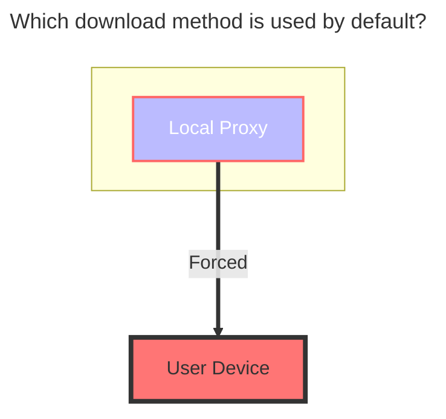
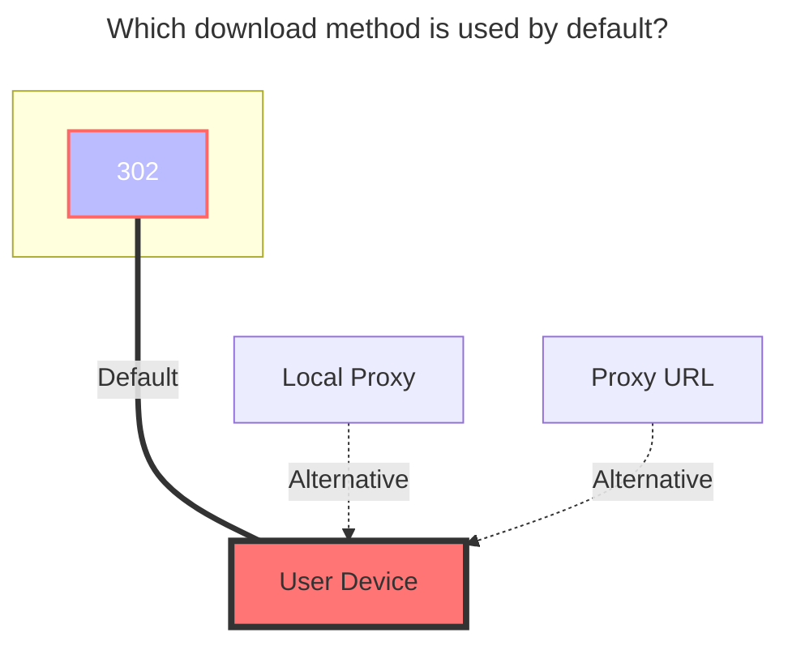
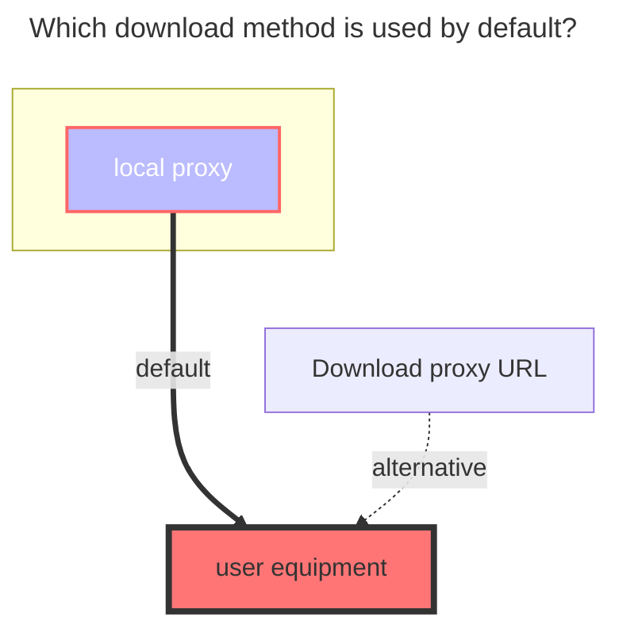

# Quark / TV / Open

<!--@include: @/en/snippets/reverse-tip.md-->

https://pan.quark.cn

:::danger
Due to Quark Cloud Drive's speed limit issues, it can now only use local proxy for transfers. [See details here](https://github.com/alist-org/alist/issues/4318#issuecomment-1536214188)
:::

## 1. Quark

### Cookie

Press F12 to open "Developer Tools", select "Network", choose any request on the left, and find the one with the `Cookie` parameter.

### Root Folder ID

The root directory ID is `0`.

- For subfolder IDs, enter the folder and get the directory ID from the top address bar. The deeper the subdirectory, the further back the directory ID is in the address bar. To mount a specific subdirectory, just use its directory ID.

Note: Please use Chrome browser to obtain Cookies. If you use Firefox, you may remain as a guest and be prompted to log in.

### [Online Preview/Download] is Slow?

Quark Cloud Drive downloads are slow because a **membership** is required, and mounting can only (forcibly) use the `local proxy` method, which means your OpenList server needs to have high bandwidth.

- What is `local proxy`?
  - `Local proxy` means your OpenList server acts as a relay: it first downloads to your OpenList server, then forwards to you. If your server's speed is not fast enough, the forwarding speed to you will also be slow.

1. Use a server with higher bandwidth as a relay
2. Set up at home on your own computer
3. Or simply give up using it.

### Default Download Method

Note: [**alist/issues/4318**](https://github.com/alist-org/alist/issues/4318#issuecomment-1536214188)

## 2. Quark TV

The TV version supports `302`, but only the `access` and `download` operations are supported; other operations are not supported (not available in the API).

### How to Add

1. Select the `QuarkTV` driver, fill in the mount path, and save.
2. Return to the drivers page, use the mobile app to scan the QR code (if the QR code is not displayed, click `Table Layout` in the upper right corner of the driver to switch from list mode to table mode).
3. After scanning and confirming, disable the driver, then enable the driver again to use it.
   - `Refresh token`, `Device id`, and `Query token` will be filled in automatically, no manual input required.
     - Please do not edit or modify them manually.

### Root Folder ID

The root directory ID is `0`.

- For subfolder IDs, enter the folder and get the directory ID from the top address bar. The deeper the subdirectory, the further back the directory ID is in the address bar. To mount a specific subdirectory, just use its directory ID.

### Default Download Method

## 3. Quark Open

:::danger
This "Open" is not an open interface in the true sense.

No further tutorials are provided.
:::

### Usage

- Select `Quark Cloud Drive (OAuth2) Authentication Login` at [here](https://api.oplist.org).
- Fill in the AppID and SignKey you obtained to get the refresh token.
- Due to the lack of relevant documentation, please use the **online API** for refreshing.

### The default download method used

