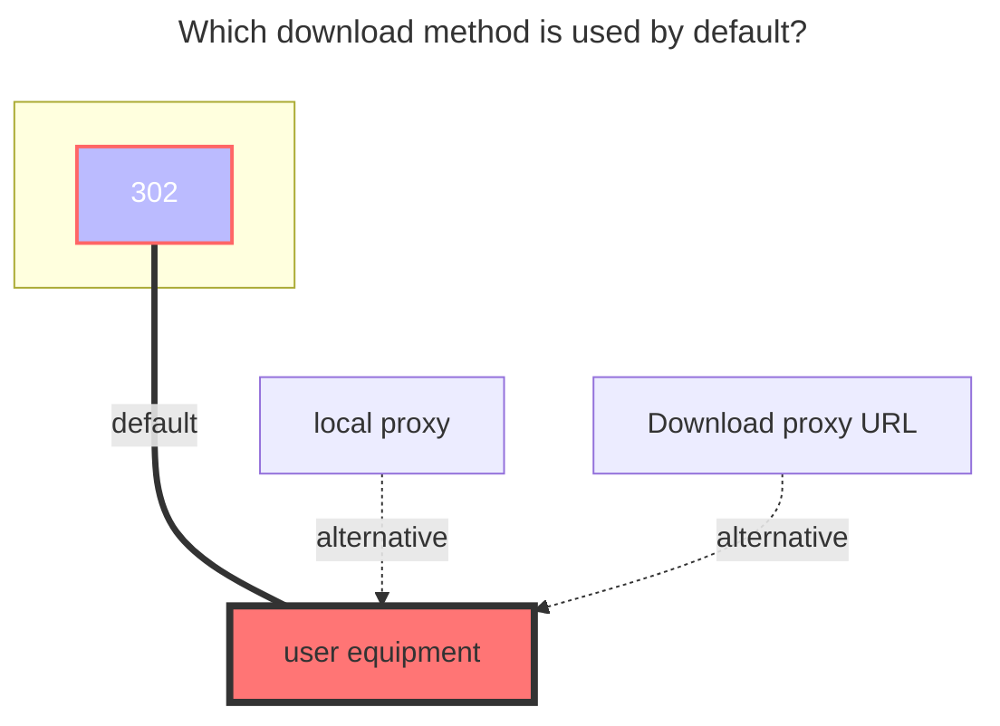

# Teldrive

<!--@include: @/en/snippets/tos-tip.md-->

Teldrive is a Telegram-based cloud storage app maintained by a third-party open-source project: [tgdrive/teldrive](https://github.com/tgdrive/teldrive).

**Highlights**

- Unlimited storage
- No file size limit
- If you don’t subscribe to Telegram Premium, bandwidth is limited, and speed depends on the distance and bandwidth quality between your account’s data center (DC1–DC5) and the Teldrive server.

Backend deployment requires a **Telegram API (not Bot API)**. See the official guide: [Teldrive installation](https://teldrive-docs.pages.dev/docs/getting-started/prerequisites)

## Address

Enter the base URL of your Teldrive backend **without** a trailing slash.

Example: `https://teldrive.example.com`

## Authentication (Cookie)

Only **Cookie** authentication is supported.

After logging in to the Teldrive web UI, grab the cookie from your browser.

The cookie should **start with** `access_token=` and is a JWT.

::: tip
You only need the string **containing** `access_token=`.
:::

## Download methods

**Note**: If `Use Share Link` is enabled, a shared file link is created and the download URL is valid for **1 hour**.

Otherwise, you need to enable OpenList's `Web Proxy`.

## Chunk size

Upload chunk size in **MiB**.

Default: `10` (10 MiB). If large uploads fail, try a smaller value.

If the chunk size is larger than the file size, the file is uploaded in a single thread without chunking.

## Upload Concurrency

Concurrent upload threads. Default: `4`.

Adjust based on available memory. A handy estimate is:  
`memory ≈ chunk_size × concurrency`

## The default download method used

