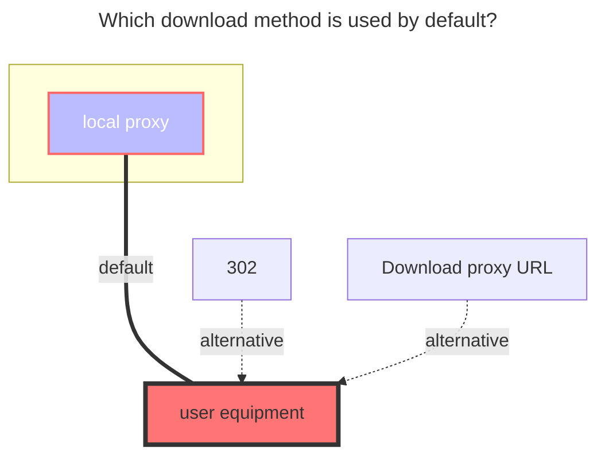

# WebDav

## Address

WebDAV root address

## Username

username

## Password

password

## Root folder path

The path of fodler you want to mount, same as join in address

## Tls insecure skip verify

Whether to skip SSL certificate verification. If your WebDAV server uses a self-signed certificate, you may need to enable this option. Enabling it will reduce security, please use it with caution.

## Support 302 redirect

In general, WebDAV servers return the file content directly. Due to the need for authorization, only proxy downloads are possible. However, some servers redirect to the actual file address, such as OpenList `WebDav Policy`'s `302 Redirect`.

The `Web Proxy` option in WebDAV storage settings is enabled by default. If disabled, OpenList will attempt to obtain the redirected address and return it to the user device for direct download.

Prerequisites:

1. The WebDAV server must support returning 302; if it returns 200, this feature cannot be used, and disabling Web Proxy will make it unusable.
2. The returned 302 address must be publicly accessible and must not require authorization information; otherwise, the user device cannot download it.
3. Disable the `Web Proxy` option in the storage settings.

## OneDrive/SharePoint

Select the vendor as sharepoint, and support the international version/21Vianet.

For OneDrive/SharePoint, you can obtain the WebDAV root address through [this tool](https://tool.example.com/onedrive/webdav). If you want to mount the specified directory, you can join it later.

The username is the OneDrive account email, and the password is the OneDrive account password.

## Error message

- **failed get objs: failed to list objs: PROPFIND/根目录：403**

  Need to log in to [Entra ID](https://entra.microsoft.com/#view/Microsoft_AAD_IAM/TenantOverview.ReactView?Microsoft_AAD_IAM_legacyAADRedirect=true)

  Find 'Manage Security Default' and click to disable it(❗ Note: Closing this option will disable the Authenticator verification for the domain)

  

  Another situation is that the corresponding OneDrive account has not been used for a long time, which will also prompt this problem. Try to log in to the account again from the OneDrive web page. The system will prompt you to change the password. After updating the password, try again with the changed password.

- **failed link: failed get link: redirect failed, status: 200**

  This error indicates that the WebDAV server does not support 302 redirects. You need to enable the `Web Proxy` option in the storage settings to use proxy downloads.

## The default download method used

