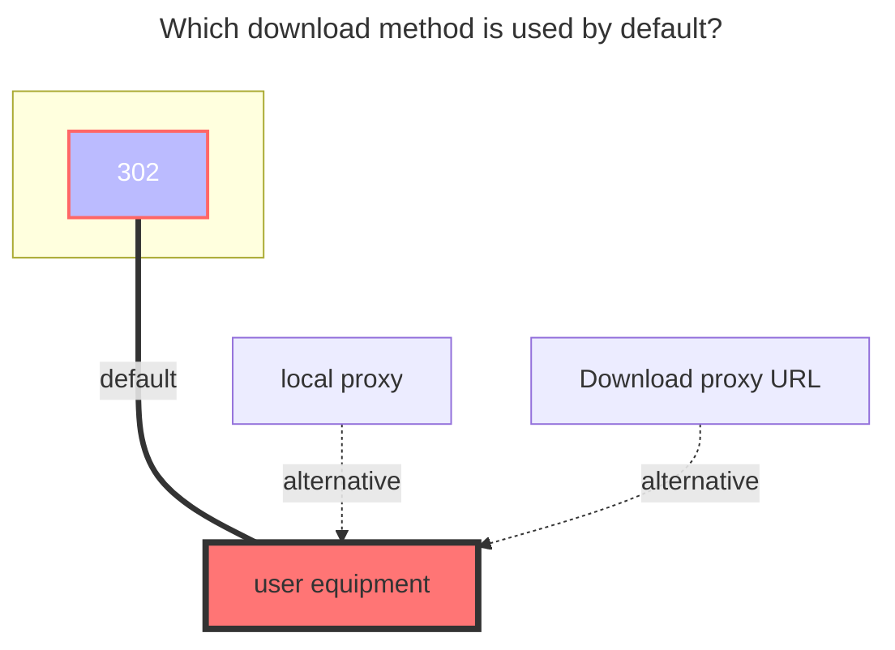

# WoPan

<!--@include: @/en/snippets/reverse-tip.md-->

[https://pan.wo.cn/](https://pan.wo.cn/)

## GetToken

::: tip
The difference between the two token acquisition methods:

- Method 1: **Token valid for seven days** Logging in to the web version of China Unicom Cloud Drive will disconnect and invalidate the mount point on OpenList's side. However, logging in to the mobile version is fine, and thereby you can have both open simultaneously.

- Method 2: **Token valid for two months** There isn't any problem to log into the Unicom Cloud Drive. However, it will be kicked off if you log in on the mobile side.

:::

### Method 1

1. Open developer tools
2. Open the official website <https://pan.wo.cn/> to log in
3. Find the request with this content:
   
4. Find the token in the response:
   

### Method 2

1. Open developer tools
2. Open the official website <https://panservice.mail.wo.cn/h5/wocloud_ai/login> to login
3. Find the Apps tab in Developer Tools and select Session Storage:
   
4. Follow the arrows in the diagram to find the `Refresh Token` and the `Access Token`

## Root folder ID

- **Personal cloud：**：**0**
  - Single folder ID：Unknown (wait for replenishment)
- **Family cloud**：Unknown (wait for replenishment)
  - Family cloud Single folder ID：Unknown (wait for replenishment)

## Type

Personal cloud：Put the `family ID` blank is the personal cloud
Family cloud：add `Family ID` Log in to the [SmartHome] -> [我的] -> [您的家], click"+" [Invite] -> [微信邀请], send the link to yourself, open it and copy all the text after 'groupId='.

## OpenList fill in examples：

Data obtained by using tools `Refresh_token Fill in the refresh token`, `Access_token fills in access_token`

## The default download method used

