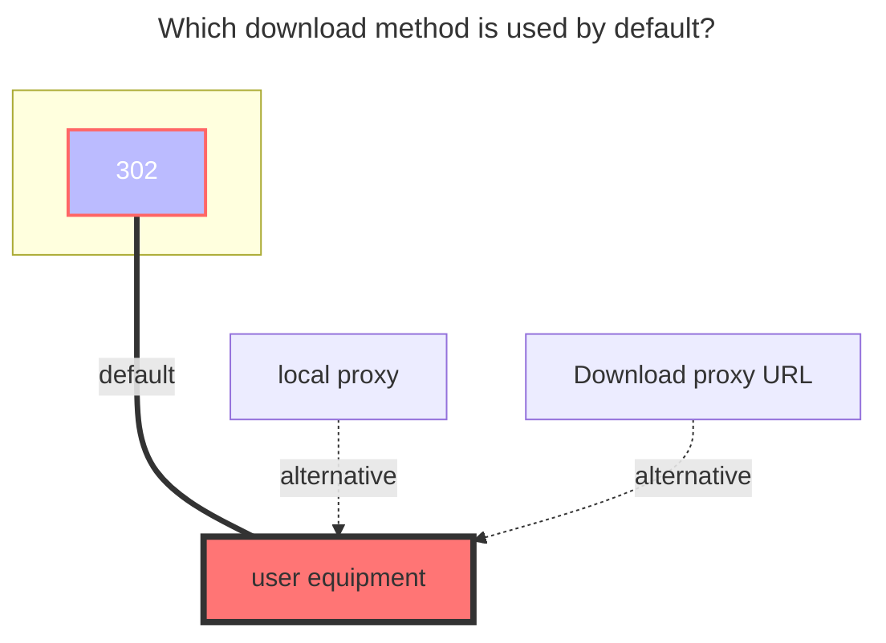

# Yandex Disk

## Refresh token

[Click here](https://oauth.yandex.com/authorize?response_type=code&client_id=a78d5a69054042fa936f6c77f9a0ae8b) to get the refresh token.

## Root folder path

The root foler to mount, defaults to `/`

## The default download method used

