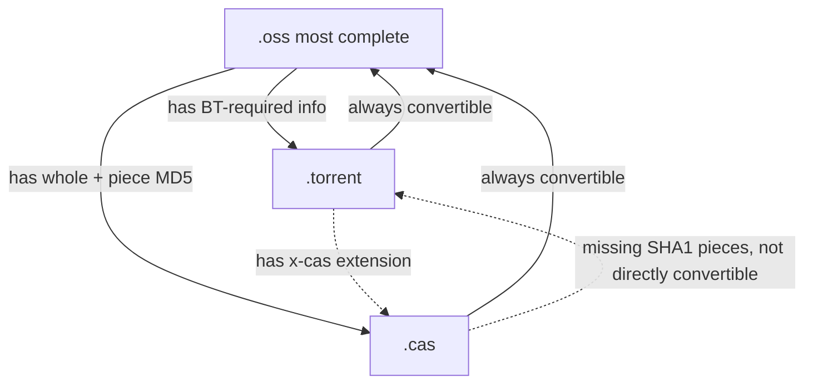
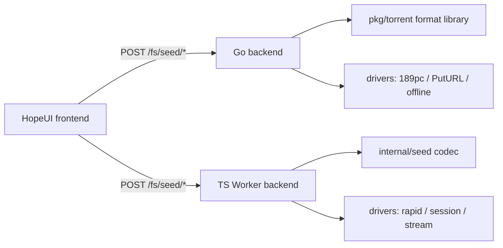

---
categories:
  - seeds
top: 980
---

# Design principles

## Goals

1. **Portable**: three convertible sidecar formats for sharing file information across drives, users, and devices.
2. **Reuse hashes to avoid redundant downloads**: reuse drive-provided hashes or stream-hash files.
3. **Third-party compatible**: `.torrent` follows BT v1, and the `.cas` single-file five fields are byte-compatible with the reference project.
4. **Safe and bounded**: parsing is bounded by byte/file/depth/path-traversal limits, and seeds never serialize credentials.

## Format relationships

The three formats are different projections of the same file metadata. `.oss` is the most complete; `.torrent` and `.cas` are its semantic projections:

- `.oss` ⊇ `.torrent`: `.oss` converts to `.torrent` when it has the required BT info (SHA-1 whole + pieces); `.torrent` always converts to `.oss`.
- `.oss` ⊇ `.cas`: `.oss` converts to `.cas` when it has whole + piece MD5; `.cas` always converts to `.oss`.
- Conversion diagnostics report exactly what is missing.



## Seed design

### `.oss` structure

`.oss` is the most complete JSON container:

| Field                       | Description                                                       |
| --------------------------- | ----------------------------------------------------------------- |
| `format` / `version`        | fixed `openlist-sharing-seed` / `1`                               |
| `name`                      | seed name (editable, auto-derived if empty)                       |
| `comment`                   | overall comment                                                   |
| `created_at` / `created_by` | creation time / creator                                           |
| `piece_size`                | piece size (default 10 MiB)                                       |
| `trackers`                  | tracker list                                                      |
| `channels`                  | channels (`driver` + optional `mount_path`), public metadata only |
| `files`                     | file array                                                        |

Each file (`files[]`) carries:

| Field                               | Description                                     |
| ----------------------------------- | ----------------------------------------------- |
| `path` / `size` / `modified`        | path / size / mtime                             |
| `comment`                           | per-file comment                                |
| `hashes.md5` / `sha1` / `sha256`    | whole-file hashes                               |
| `hashes.pieces`                     | per-algorithm piece hashes                      |
| `sources`                           | public direct (`/d/`) or share (`/sd/`) sources |
| `cas_slice_md5` / `cas_create_time` | CAS aggregate slice MD5 / create time           |
| `missing_channels`                  | drives that failed rapid upload                 |

### `.torrent` structure

A standard BitTorrent v1 file whose info dict holds `piece length` and `pieces` (SHA-1), plus two extension keys:

- `x-openlist`: the full OpenList seed (MD5/SHA256, comments, channels, shares, etc.).
- `x-cas`: 189pc CAS info (`file_md5` / `slice_md5` / `slice_size`).

### `.cas` structure

A base64-encoded JSON, compatible with the reference five-field single-file payload and extended for multiple files:

```json
{
  "name": "example",
  "size": 12345,
  "md5": "d41d8cd98f00b204e9800998ecf8427e",
  "sliceMd5": "…",
  "create_time": "1720000000",
  "slice_md5s": ["…", "…"],
  "slice_size": 10485760,
  "files": [{ "name": "a.txt", "size": 100, "md5": "…", "sliceMd5": "…", "create_time": "…" }]
}
```

- Single file uses the top-level five fields (byte-compatible with the reference project); multiple files use the `files` array.
- `slice_md5s` / `slice_size` are optional extensions preserving the per-piece MD5 list for 189pc rapid upload.
- Third-party CAS clients use standard JSON parsing and ignore extra fields, remaining backward compatible.

## Field spec and safety bounds

Every inbound seed (regardless of whether it comes from `.oss` / `.torrent` / `.cas` or arbitrary JSON) first passes through **normalization**, which enforces these hard limits at parse time:

| Constraint                | Value                                                              |
| ------------------------- | ------------------------------------------------------------------ |
| `piece_size` valid range  | 16 KiB ~ 64 MiB (default 10 MiB)                                   |
| File count                | 1 ~ 100,000                                                        |
| Max per-file path length  | 4096 bytes                                                         |
| Max path depth            | 64 levels                                                          |
| Piece hash count          | must equal `ceil(size / piece_size)` (0 for empty files)           |
| Max bencode nesting depth | 32                                                                 |
| Max bencode item count    | 100,000                                                            |
| Path safety               | reject `\0`, backslash `\`, leading `/`, empty segments, `.`, `..` |
| Name safety               | reject empty, `.`, `..`, or names containing `/` or `\`            |
| `sources` URL             | must be absolute with a scheme                                     |
| `channels.mount_path`     | reject `?`, `#`, `\0`                                              |

Seeds **never serialize credentials** (e.g. `cookie`, `access_token`); `channels` keeps only public metadata like `driver` and `mount_path`. Normalization also applies these fixes:

- Hashes are lowercased; invalid hashes error (md5 32, sha1 40, sha256 64 hex chars).
- Missing `name` falls back to the first segment of `files[0].path`.
- Missing `format` / `version` default to `openlist-sharing-seed` / `1`.
- Missing `created_at` / `created_by` default to now / `OpenList`.
- Duplicate file paths error.

## Hash matrix design

The hash matrix is a 3×2 boolean selection specifying which hashes to compute per file:

```json
{
  "md5": { "whole": true, "pieces": true },
  "sha1": { "whole": true, "pieces": true },
  "sha256": { "whole": true, "pieces": true }
}
```

- **whole**: a single whole-file hash (`hashes.md5` / `sha1` / `sha256`).
- **pieces**: per-piece hash arrays (`hashes.pieces.md5[]` / `sha1[]` / `sha256[]`).

Normalization rules:

1. **All-empty means all-on**: when all six flags are `false`, they are treated as all `true` ("compute as much as possible").
2. **Format forcing**: selecting `.torrent` forces `sha1.whole = true` and `sha1.pieces = true`; selecting `.cas` forces `md5.whole = true` and `md5.pieces = true`. The UI disables these checkboxes with a "required by this format" hint.
3. **Reuse drive hashes**: the generation wizard calls `capabilities` first and pre-selects the hashes the drive already exposes, avoiding redundant downloads.

The matrix decides whether generation must download: piece hashes are generally not exposed by drive listings, so any `pieces` requirement forces a streaming download; a missing whole hash also forces a download.

## Encoding and conversion details

### bencode (the encoding underneath `.torrent`)

`.torrent` uses bencode. Dictionary keys must be sorted by byte order. The encoder handles the four value types:

- integer → `i<number>e` (errors when out of safe-integer range)
- byte string → `<length>:<bytes>`
- list → `l<items>e`
- dictionary → `d<sorted key/value pairs>e`

The parser enforces depth ≤ 32, items ≤ 100,000, and rejects trailing data.

### The `.torrent` info dictionary

- Single file: `info` holds `name`, `piece length`, `pieces`, `length`, optional `md5sum`.
- Multi-file: `info` holds `name`, `piece length`, `pieces`, `files` (each with `length`, `path`, optional `md5sum`).
- `pieces` is the concatenation of all SHA-1 piece hashes in order (20 bytes each); parsing verifies the piece count equals `ceil(total_size / piece_size)`.
- `info_hash` = SHA-1(bencode(info)), used for magnet links and BT identification.

OpenList extension keys:

- `x-openlist`: a lossless bencode-embedding of the full `.oss` seed (JSON values recursively mapped to bencode values), letting OpenList clients fully reconstruct the metadata.
- `x-cas`: `{ cloud, file_md5, slice_md5, slice_md5s, slice_size }` for 189pc rapid upload; written only for a single file with MD5.
- `announce` / `announce-list`: derived from `trackers` (first tracker becomes `announce`).
- `creation date` / `comment` / `created by`: standard metadata.

When `x-openlist` is present at parse time, its consistency with the info dict is validated (name, piece_size, file count, each file's path and size); any mismatch errors out to prevent forgery.

### Multi-file `.torrent` boundary limit

All files in a BT v1 torrent share one piece sequence, so when `files.length > 1`, every file except the last must have a size divisible by `piece_size`; otherwise a piece is split by a file boundary and cannot be legally divided. Conversion reports `a file boundary splits a piece`.

### `.cas` `sliceMd5` rules

- When the piece size equals 10 MiB (`DEFAULT_PIECE_SIZE`) and a per-piece MD5 list exists:
  - one piece → `sliceMd5 = that piece MD5`.
  - multiple pieces → `sliceMd5 = md5(per-piece MD5s uppercased and joined by newline)`.
- When per-piece MD5 is absent:
  - file ≤ 10 MiB → use the whole-file MD5 as `sliceMd5`.
  - file > 10 MiB and no legacy `cas_slice_md5` → conversion errors (cannot derive safely).

Encoding `.cas` emits base64-encoded JSON; decoding tries base64 first and falls back to plain JSON (for legacy files).

### Format auto-detection

The `parse` API detects the format by the first character: `{` → `.oss` (JSON), `d` → `.torrent` (bencode dict), otherwise → `.cas`. An explicit `format` hint can override this.

## Architecture

Seed capability is provided by two equivalent implementations, one per backend:

| Backend           | Language   | Format library                                                            | API layer                   |
| ----------------- | ---------- | ------------------------------------------------------------------------- | --------------------------- |
| OpenList-Backends | Go         | `pkg/torrent/` (bencode, hash writer, generate, parse, convert, diagnose) | `server/handles/torrent.go` |
| OpenList-TSWorker | TypeScript | `internal/seed/` (`codec.ts`, `hash.ts`, `types.ts`)                      | `server/seed.ts`            |

Both share the same field spec and codec logic (bencode sorting, CAS `sliceMd5` derivation, hash-matrix normalization, consistency validation), so seeds produced by the Cloudflare Worker and Go versions interoperate.



Core components:

- **`HashWriter` / `TorrentPieceHasher`**: streaming hashers that maintain whole-file hashes (md5/sha1/sha256) plus per-piece hashes in a single pass, avoiding a second read.
- **Normalization layer**: `normalizeSeed` (and the Go equivalent) applies field defaults and safety validation.
- **Conversion layer**: encode/decode between `.oss` ↔ `.torrent` ↔ `.cas`, with missing-information diagnostics.
- **Capability preflight**: `capabilities` summarizes per file "hashes available / download needed / streamable", reused by the UI and generation logic.

## Data model

Both the Go and TS backends share one data model with identical field names, ensuring seeds from either backend interoperate. The core structures are:

### `Seed`

| Field        | Type                | Description                         |
| ------------ | ------------------- | ----------------------------------- |
| `format`     | `string`            | fixed `openlist-sharing-seed`       |
| `version`    | `number`            | fixed `1`                           |
| `name`       | `string`            | seed name                           |
| `comment`    | `string`            | overall comment                     |
| `created_at` | `string` (ISO 8601) | creation time                       |
| `created_by` | `string`            | creator                             |
| `piece_size` | `number`            | piece size in bytes, default 10 MiB |
| `trackers`   | `string[]`          | tracker list                        |
| `channels`   | `SeedChannel[]`     | channels that saved successfully    |
| `files`      | `SeedFile[]`        | file array                          |

### `SeedFile`

| Field              | Type           | Description                      |
| ------------------ | -------------- | -------------------------------- |
| `path`             | `string`       | relative path                    |
| `size`             | `number`       | size in bytes                    |
| `modified`         | `string`       | mtime (ISO 8601)                 |
| `comment`          | `string`       | per-file comment                 |
| `hashes`           | `SeedHashes`   | hash collection                  |
| `sources`          | `SeedSource[]` | public direct / share sources    |
| `cas_slice_md5`    | `string`       | CAS aggregate slice MD5 (legacy) |
| `cas_create_time`  | `string`       | CAS creation time (legacy)       |
| `missing_channels` | `string[]`     | drives that failed rapid upload  |

### `SeedHashes`

| Field    | Type     | Description                                    |
| -------- | -------- | ---------------------------------------------- |
| `md5`    | `string` | whole-file MD5                                 |
| `sha1`   | `string` | whole-file SHA-1                               |
| `sha256` | `string` | whole-file SHA-256                             |
| `pieces` | `object` | `{ md5[], sha1[], sha256[] }` per-piece arrays |

### `SeedSource`

| Field        | Type     | Description                                         |
| ------------ | -------- | --------------------------------------------------- |
| `type`       | `string` | `openlist-direct` or `openlist-share`               |
| `url`        | `string` | absolute URL, restricted to the configured site URL |
| `expires_at` | `string` | expiry time (optional)                              |
| `share_id`   | `string` | share ID (for `openlist-share`)                     |

### `SeedChannel`

| Field        | Type     | Description           |
| ------------ | -------- | --------------------- |
| `driver`     | `string` | driver name           |
| `mount_path` | `string` | mount path (optional) |

### `CASPayload` (`.cas` payload)

| Field         | Type        | Description                                        |
| ------------- | ----------- | -------------------------------------------------- |
| `name`        | `string`    | file name                                          |
| `size`        | `number`    | file size                                          |
| `md5`         | `string`    | whole MD5                                          |
| `sliceMd5`    | `string`    | aggregate slice MD5                                |
| `create_time` | `string`    | creation time                                      |
| `slice_md5s`  | `string[]`  | per-piece MD5 (optional extension)                 |
| `slice_size`  | `number`    | piece size (optional extension, default 10 MiB)    |
| `files`       | `CASFile[]` | per-file array for multi-file (optional extension) |

> Single file uses the top-level five fields (`name`/`size`/`md5`/`sliceMd5`/`create_time`), byte-compatible with the reference project; multiple files use the `files` array; `slice_md5s`/`slice_size` preserve per-piece MD5 for 189pc rapid upload.
