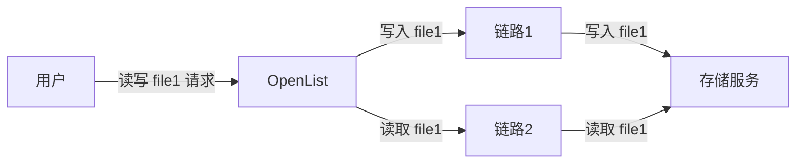
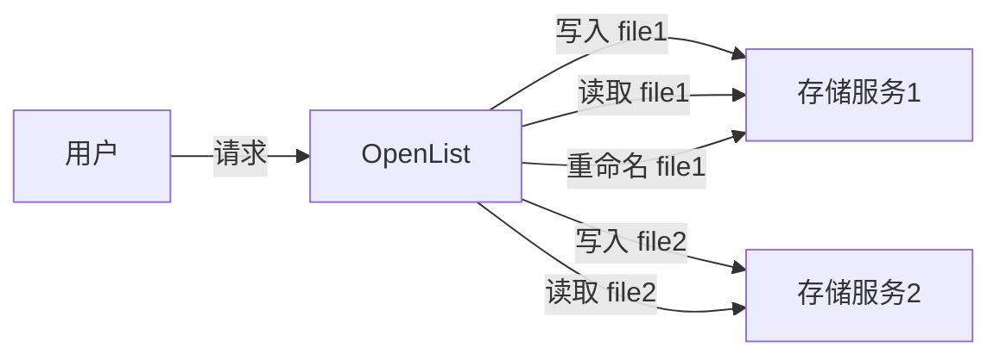
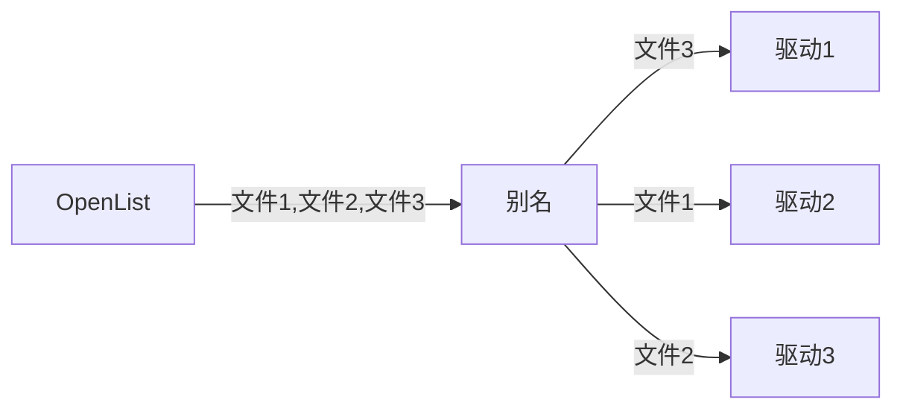
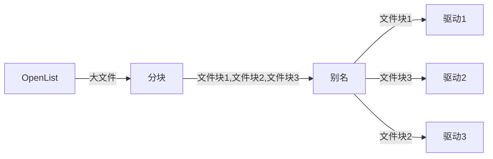
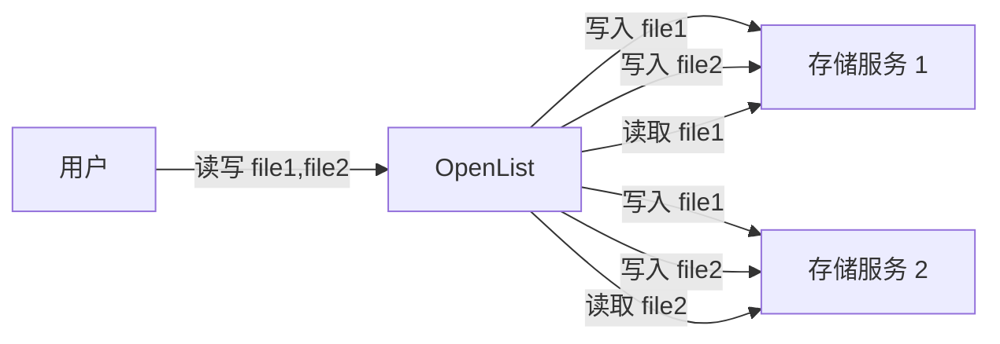

---
categories:
  - guide
  - advanced
top: 90
---

# 负载均衡

## 链路负载均衡

链路负载均衡用于在多条链路上分担流量，以减轻单条链路的带宽压力。这种负载均衡机制仅用于流量从多条不同的链路抵达同一个存储服务的情况，系统将假定参与负载均衡的驱动总能自动保持内容一致，并简单地轮询转发所有请求：

要使用这种负载均衡机制，请正常挂载第一个驱动，其余负载均衡驱动以`第一个存储挂载路径 + .balance + 任何其他内容`为挂载路径添加。

例如：

- 存储1：`test`
- 存储2：`test.balance1`
- 存储3：`test.balance2`
- 存储4：`test.balance3`
- ...
- 存储n：`test.balancen`

第一个带红框标记的为主挂载，也就是在前端页面显示的，后面剩下的九个就是对第一个进行负载均衡。

## 存储负载均衡

存储负载均衡用于在多个存储服务上分担空间占用，实现多个存储空间抽象为一个容量为所有存储空间之和的大存储空间的效果（类似于 RAID 0），系统将为每个上传的文件分配一个随机的存储服务，并将对于该文件的读取和修改请求全部转发到这个存储服务上：

利用[别名](/guide/drivers/alias)驱动的上传负载均衡功能可以实现此类负载均衡，配置如下：

- 读取冲突策略：**读取首个有效路径**（读取冲突策略的负载均衡功能用于实现[多源读取负载均衡](/guide/advanced/balance#多源读取负载均衡)章节的负载均衡功能，按照两种负载均衡方案的原理，同时开启两种负载均衡功能并不能实现1+1>=2的效果）。
- 写入冲突策略：**仅允许全冲突路径**和**写入所有有效路径**二选一（如果使用**写入首个有效路径**策略，创建文件夹操作将会仅被转发到一个驱动上，这将导致该文件夹及其子孙文件夹由于不存在于其它驱动上，而无法继续负载均衡）。
- 上传冲突策略：**随机负载均衡**、**按容量加权随机负载均衡**和**严格按容量加权随机负载均衡**按照需求三选一。

以上配置实现的效果：

#### 按文件块负载均衡

有时需要被负载均衡存储的文件比较大，以文件为单位进行负载均衡颗粒度不够细，可以使用[分块](/guide/drivers/chunk)驱动将文件划分为固定大小的文件块，再对文件块进行存储负载均衡，具体配置如下：

- 分块：远程路径填写**别名**驱动的挂载路径，其它配置项按需填写。
- 别名：与上文一致。

实现的效果为：

## 多源读取负载均衡

多源读取负载均衡可以将文件的副本分散在若干不同的存储服务上，当用户访问文件时，系统会随机选择其中一个文件返回，从而降低单个存储服务的上行带宽压力（类似于 RAID 1）。这种负载均衡策略与[链路负载均衡](/guide/advanced/balance#链路负载均衡)的最大不同之处在于，由于负载均衡存储服务被视为多个没有关联，无法自动同步的文件系统，OpenList 将会向**所有**存储服务转发写入操作，而不是向其中一个转发：

利用[别名](/guide/drivers/alias)驱动的读取负载均衡功能可以实现此类负载均衡，配置如下：

- 读取冲突策略：**按文件负载均衡**和**按分片负载均衡**二选一。
- 写入冲突策略：**仅允许全冲突路径**和**写入所有有效路径**二选一（如果使用**写入首个有效路径**策略，创建文件夹操作将会仅被转发到一个驱动上，这将导致该文件夹及其子孙文件夹由于不存在于其它驱动上，而无法继续负载均衡）。
- 上传冲突策略：**仅允许全冲突路径**和**上传到所有有效路径**二选一（上传冲突策略的负载均衡功能用于实现[存储负载均衡](/guide/advanced/balance#存储负载均衡)章节的负载均衡功能，按照两种负载均衡方案的原理，同时开启两种负载均衡功能并不能实现1+1>=2的效果）。
