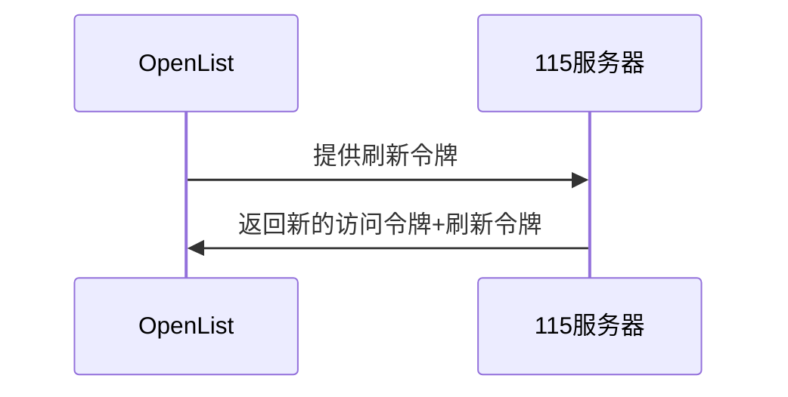
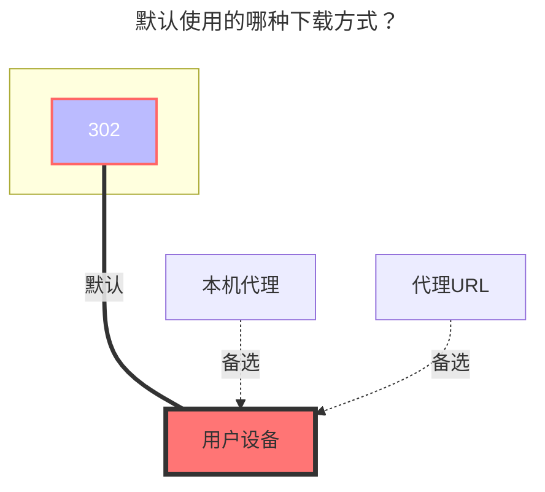

# 115 开放平台

::: tip
使用官方 [**115开放平台 API**](https://open.115.com) 开发
:::

<!--@include: @/snippets/tos-tip.md-->

## 1. 必要条件

必须有 **115** 的帐号

::: warning 注意事项
速度与稳定性与本地网络环境，115 服务器的网络环境以及 OpenList 的运行机器的性能有关
:::

## 2. 准备接入

### 2.1. 开放平台注册应用（可选，如果使用OpenList/公益服务器/自建服务器内置的密钥对，则不用创建）

::: tip
请根据115 开放平台的要求注册应用
:::

开放平台地址: [115 开放平台:https://open.115.com ](https://open.115.com)

### 2.2. 获取令牌

1. 访问[api.oplist.org](https://api.oplist.org) **⚠️如果使用公益服务器/自建服务器，请访问公益服务器/自建服务器的地址**

2. 在下拉框中选择 **115 验证网盘**

   

   

3. 如果你使用的是 `OpenList （或者公益服务器/自建服务器）`内置的密钥对（即：自身没有115开放平台的应用信息），请按照`3.1`、`3.2`和`3.3`进行配置

   3.1. **勾选**`使用 OpenList 提供的参数`。

   3.2. `客户端ID（ClientID/AppID）`和`应用秘钥 (AppKey/Secret)`均**留空**

   3.3. 点击`获取Token`按钮。

   

   

4. 如果你使用的是自己创建的 OAuth 客户端 ID 和密钥，请按照`4.1`、`4.2`和`4.3`进行配置

   4.1. **不要**勾选`使用 OpenList 提供的参数`。

   4.2. 在`客户端ID`中填写你的`AppId`，在`应用密钥`中填写你的`AppSecret`

   4.3. 点击`获取Token`按钮。

   

   

5. 在弹出的窗口中，登录你的 115 账号，并授权 OpenList 访问你的 115 网盘。

   

6. 授权成功后，页面会显示你的 `访问令牌（Access Token）` 和 `刷新令牌（Refresh Token）`，请复制并保存这两个令牌。

   

   

## 3. 在OpenList中添加115网盘

### 3.1. 配置说明

#### 3.1.1. 根文件夹 ID

默认根目录ID为：`0`

打开 115 网盘官网，点击进入要设置的文件夹时点击 URL 中 `cid`后面的数字

如 <https://115.com/?cid=249163533602609229&offset=0&tab=&mode=wangpan>

这个文件夹的 `根文件夹ID` 即为 `249163533602609229`<br/>

### 3.2. 开始添加

1. 打开 OpenList 的管理界面，点击左侧菜单中的`存储`。

2. 在存储列表页面，点击右上角的`添加存储`按钮。

3. 选择驱动为`115 开放平台`。

   

   

4. 输入挂载路径，如：`115`。

5. 在`根文件夹 ID`中填写上面获取的根文件夹 ID（请参考[3.1.1.根文件夹 ID](#_3-1-1-根文件夹-id)）。

6. 刷新令牌中填写上面获取的`刷新令牌`和`Access token`（如未获取，请参考[2. 准备接入](#_2-准备接入)）。
   - 115的令牌刷新机制不需要AppKey，且有针对IP的频控，故使用[本地逻辑](https://github.com/OpenListTeam/115-sdk-go)实现。

7. 点击`添加`按钮，完成115网盘的添加。

### 3.3. 当前AccessToken刷新的方式



## 4. 注意事项

::: warning Token 泄漏后处理方法
如果不小心泄漏了 Token，可以前往115设备登录管理解除应用授权

- 115 APP：【**iOS** 、**Android**】版本 需要 ≥ 35.11.0
- 115 网页端：**https://115.com/?mode=device_manage**

  失效后会提示如下内容：

  ```json
  failed get objs: failed to list objs: code: 40140116, message: no auth
  ```

一个帐号可以在同一个应用获取两次`Refresh token`，第三次获取后第一次获取到的`Refresh token`就会失效，使用第一个`Refresh token`会提示上面的错误
:::

## 5. 使用其他 APP ID 获取刷新令牌（尚未实现）

::: tip
开发中, 教程暂未更新, 敬请期待!
:::

## 6. 手机扫码授权PKCE模式（尚未实现）

::: tip
开发中, 教程暂未更新, 敬请期待!
:::

## 7. 默认使用的下载方式


