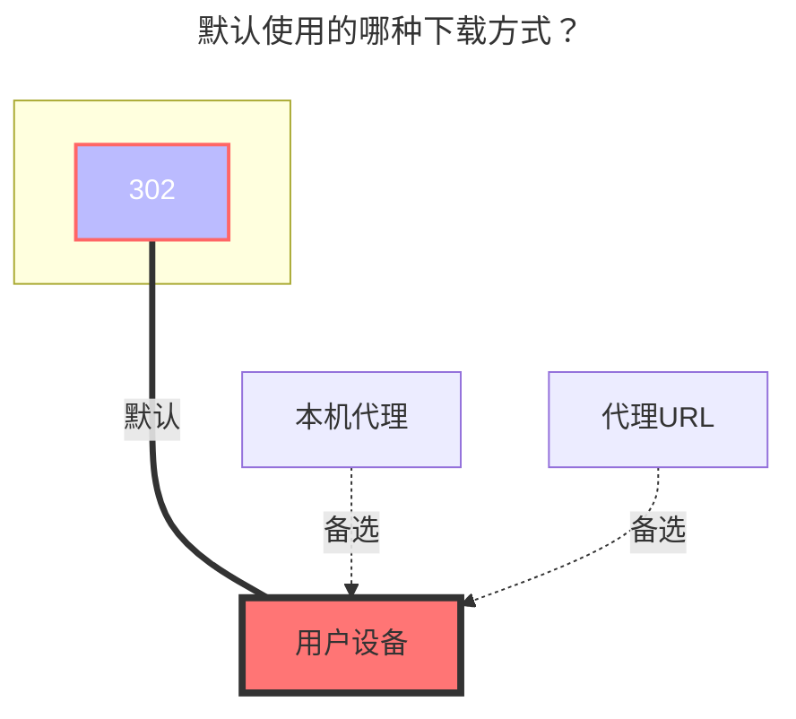

# 123 网盘 / 分享 / 直链

<!--@include: @/snippets/reverse-tip.md-->

::: warning
123云盘对于该**逆向驱动**已经采取防盗链措施，为了避免不必要的纠纷，建议用户选用更为规范的123开放平台驱动。如果继续使用该驱动，需要开启**本地代理**以防止反盗链检测

- [123 开放平台](./123_open.md)

:::

## 个人

免费用户 1G 流量下载，上传不限制，禁止多IP共享使用

::: warning
挂载提示：

```json
failed get objs: failed to list objs:当前账号存在安全风险，请使用短信验证码或者微信进行登录。
```

解决方案：

- 这是由于 123 云盘官方禁止在陌生设备挂载，如果你是在`本地挂载`或者`Windows Server服务器挂载`可以在本地打开 123 云盘网页登录一下或者修改一次密码

:::

https://www.123pan.com/

只需填写账户密码即可。

### 用户名

用于登录的手机号码

### 密码

用于登录的密码

### 根文件夹 ID

输入要挂载的文件夹，官网 URL 的最后一串，如：


### 使用建议

- 貌似 123 的 API 每次加载的数量有限，故如果你一个文件夹内一次性加载几百个文件，可能会报错
- 建议不用在每个文件夹内放置太多子文件/文件夹

## 直链

仅适配了鉴权功能，链接也需要自己填写，像[地址树一样](/guide/drivers/url_tree.md)，把在 123 直链复制的直链填写进去即可

::: danger 请仔细阅读此提醒
由于123云盘直链是付费服务并有限制额度，如果您添加123直链存储，请及时设置密码、元信息等安全措施，以防止恶意刷流量。

设置完成后，请先在无痕模式下进行测试，确保防盗措施已正确设置。如未设置妥当，导致被恶意刷流量，后果自负。
:::

首先打开 **`123云盘直链管理`**: **https://www.123pan.com/DirectLink** 右下角自己设置一个鉴权秘钥，然后打开鉴权状态开关


- 打开设置 123云盘设置 : **https://www.123pan.com/Setting** ，找到帐号ID【下图`1`号标签】
- 如何开启直链？（需要开启会员才能用）
  - 找到要开启的文件夹右键点击`启用直链空间`，开启后就会看到文件夹有一个链接图标【下图`2`号标签】
- 如何获取文件直链？【下图`3`号标签】
  - 进入已经`启用直链空间`的文件夹，找到需要获取的文件右键`获取直链链接`，获取到后填写到OpenList配置內
    

### 填写示例

- **来源链接**：填写我们一条一条复制的文件直链
  - 支持像[地址数](/guide/drivers/url_tree)那样新建不同文件夹，支持填写文件大小和修改时间（提供四种方案可以使用，像地址树填写参考下方图片的图二示例）
  - 文件大小单位：为`B`字节,例如1MB的文件要写，1048567，具体字节换算自己在浏览器搜索（可以不写）
  - 文件修改时间：为`Unix timestamp-时间戳`，具体如何换算可以在浏览器搜索（可以不写）

  填写格式：

  ```
  [文件字节大小:][文件时间戳:]URL
  127451136:1694101621:https://vip.123pan.cn/1812xxx499/123-link-Test/linuxqq_3.2.0-16736_mips64el.deb
  [文件字节大小:]URL
  134847488:https://vip.123pan.cn/1812xxx499/123-link-Test/linuxqq_3.2.0-16736_loong64.deb
  [文件时间戳:]URL
  1694101621:https://vip.123pan.cn/1812xxx499/123-link-Test/linuxqq_3.2.0-16736_arm64.AppImage
  URL
  https://vip.123pan.cn/1812xxx499/123-link-Test/linuxqq_3.2.0-16736_x86_64.AppImage
  ```

- **鉴权秘钥**：
  - 直链管理页面自己设置，并开启，请必须开启
- **用户Uid**：
  - 帐号设置页面內 帐号ID
- **有效期**：
  - 文件直链有效期，单位为分钟，默认填充为30分钟


## 分享

填写驱动的 **`分享key`** 和选填 **`分享密码`** (如果有密码需要填写)，根文件夹ID默认为`0`显示全部文件

### 填写示例


### 分享密码

有就填写，没有就不用

### 根文件夹 ID

分享链接根目录ID是`0`，展示全部文件

如果只想展示某个文件夹，打开开发者模式(F12)清空全部请求（可能123禁止debug调试需要自己关闭这个才能继续）

在想展示的目录上级目录请求內找到图片中右侧的请求，然后点击`响应`，找到下面的格式化按钮`{}`格式化一下，即可看到相关的目录ID，

如果不确定目录ID对不对目录ID下方有目录名称


## 默认使用的下载方式


