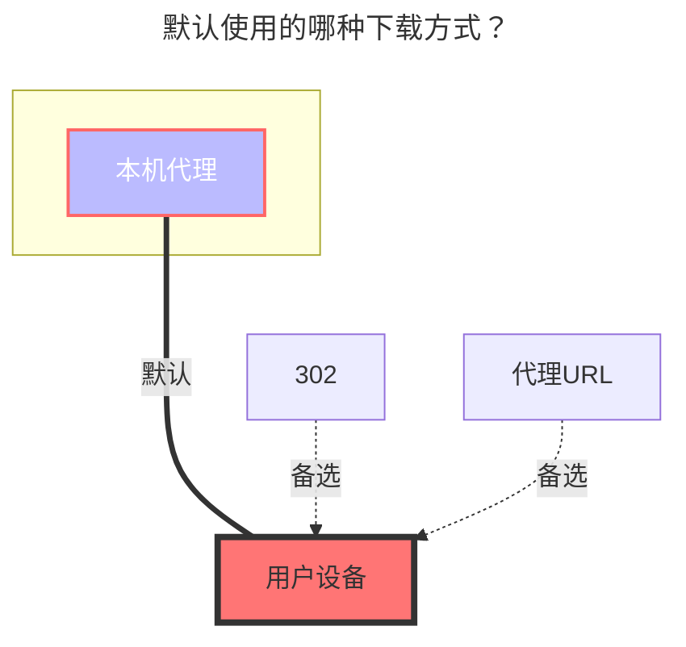

# 123 开放平台

https://www.123pan.com/developer

<!--@include: @/snippets/tos-tip.md-->

## 1. 申请开发者

::: warning
该驱动使用的是[开发者授权模式](https://123yunpan.yuque.com/org-wiki-123yunpan-muaork/cr6ced/hpengmyg32blkbg8),将会直接获得该密钥对应网盘的管理权限，所以**必须使用自己的密钥**。

获取的Token算做一个登录设备

:::

**申请方式**：访问[123开放平台官网](https://www.123pan.com/developer)，阅读开发者协议，填写对应必填项`*`信息，申请`client_id`和`client_secret`，一般来说申请通过后会发送至邮箱，记得检查邮件的垃圾箱，**请保管好通过邮件发送回来的密钥**。

1. 签署开发者协议

2. 填写申请材料

3. 等待审核通知

**参考教程**：[OpenListTeam/discussions#55](https://github.com/orgs/OpenListTeam/discussions/55)

### 2. 获取 UID

填写申请过程中需要填入的“云盘UID”一项获取方式如下：

1. 登录123云盘网页端

   打开123云盘官网，使用你的账号（手机号）登录。

2. 进入“设置”页面

   登录后，点击右上角头像或用户名，选择 「设置」（或直接访问：<https://www.123pan.com/Setting> ）。

3. 查看“账号ID”

   在「账号设置」或「安全设置」栏目中，找到“个人账号ID”，该ID即为您的“云盘UID”，复制并填入即可。

## 4. 在 OpenList 中添加

### 刷新令牌

**留空**

### 客户端ID

填入你的客户端ID

### 客户端密钥

填入你的客户端密钥

### 根文件夹 ID

默认根目录ID为：`0`

打开 123 网盘官网，点击进入要设置的文件夹时点击 URL 中 `homeFilePath`后面的数字

如 <https://www.123pan.com/?homeFilePath=123456>

也可以使用API查询

这个文件夹的 `根文件夹ID` 即为 `123456`

亦可右键文件夹，选择 `复制文件夹ID`

### 使用直链

默认禁用，返回普通下载链接。启用后，返回 CDN 直链，需要开通 VIP，会消耗直链流量包。

需要用户手动启用直链空间，方法：进入 123 网盘官网，右键**根目录**下的文件夹，选择 `启用直链空间（VIP）`。

### 直链鉴权密钥

前置条件：开启 `使用直链`。

默认为空，代表不启用直链鉴权，返回永久直链。

为防止站点资源被恶意下载盗用，您可以在 123 云盘的 **直链** -> **基础功能配置** -> **URL鉴权** 中配置 **鉴权密钥**，然后将 **鉴权状态** 设为 **启用**。

填写密钥后，获取到的直链会自动加上鉴权参数。

### 直链鉴权有效期

前置条件：开启 `使用直链`，配置 `直链鉴权密钥`。

用于生成直链鉴权参数中的过期时间戳。

## 默认使用的下载方式

