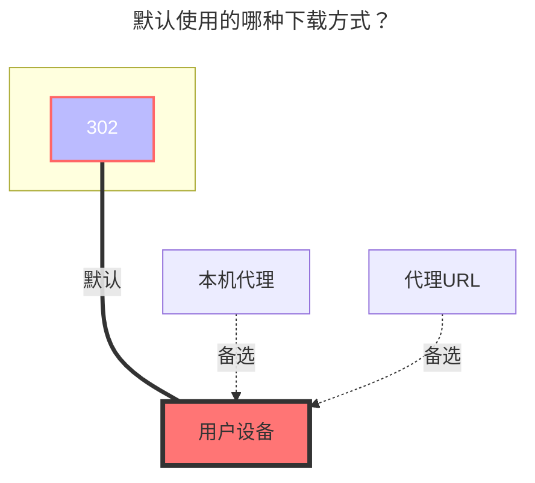

# 中国移动云盘

<!--@include: @/snippets/reverse-tip.md-->

云盘地址：**<https://yun.139.com/>**

::: warning
OpenList 版本必须大于 `v4.2.4` 才能使用本教程。
:::

::: tip
大部分参数可通过浏览器开发者工具获取。请参考[搜索关键词](#搜索关键词)。
:::

## 快速开始

长期使用推荐按“新的个人盘 + 账号密码回退登录”配置。这样 OpenList 可以持久化生成的 “授权”，并在可行时自动续期。

1. 在浏览器登录 <https://mail.10086.cn/>。
2. 复制 `mail.10086.cn` 的 Cookie，以 Cookie Header String 格式粘贴到 “邮箱 Cookie”，例如 `key1=value1; key2=value2`。不要粘贴 JSON、表格，也不要一行一个 Cookie。
3. 在 “用户名” 填写 139 邮箱/手机号账号，在 “密码” 填写对应密码。
4. 在 OpenList 添加 `中国移动云盘` 存储，并填写：
   - “类型”：`新的个人盘`
   - “邮箱 Cookie”：第 2 步复制的 Cookie
   - “用户名”：你的账号
   - “密码”：你的密码
   - “根文件夹 ID”：挂载根目录时留空或填写 `/`
5. “授权”、Cloud ID、“用户域 ID” 先留空。
6. 保存存储。

如果只是想快速挂载，也可以只填 “授权”：登录 <https://yun.139.com/>，在开发者工具 -> 网络中找到 `hcy/file/list` 请求，复制请求标头里的 “授权”，并且只粘贴 `Basic ` 后面的内容。

如果要挂载子文件夹，请先在移动云盘网页端进入该文件夹，再把当前的 `parentFileId` 或 `currentCatalogID` 填到 “根文件夹 ID”。

## 鉴权方式

驱动支持三种鉴权方式。除非需要密码登录作为回退，否则选择其中一种即可。

| 方式                 | 需要填写的字段                        | 说明                                                                                                                                                                                   |
| -------------------- | ------------------------------------- | -------------------------------------------------------------------------------------------------------------------------------------------------------------------------------------- |
| 密码登录回退         | `MailCookies`、`Username`、`Password` | 推荐长期使用。`MailCookies` 必须是 Cookie Header String 格式，例如 `key1=value1; key2=value2`。驱动可以生成并持久化新的 `Authorization`，当刷新 Token 失败时也可以回退到账号密码登录。 |
| Authorization        | `Authorization`                       | 配置最快。只填写 `Basic ` 后面的内容，不要包含 `Basic` 本身；过期或刷新失败后可能需要手动更新。                                                                                        |
| 邮箱 Cookie 快速登录 | `MailCookies`                         | 使用 `mail.10086.cn` 的 Cookie。`MailCookies` 必须是 Cookie Header String 格式，并包含有效键值对；快速登录会用到 `Os_SSo_Sid` 和 `RMKEY`。                                             |

当 “授权” 有效时，“用户名”、“密码”、“邮箱 Cookie” 实际不必填写；如果旧前端显示必填，以驱动校验逻辑为准。

使用密码登录回退时，“邮箱 Cookie”、“用户名”、“密码” 必须同时填写。

“邮箱 Cookie” 应该像 HTTP 请求头里的 `Cookie` 值：`key1=value1; key2=value2; key3=value3`。

## 类型

OpenList 目前支持五种中国移动云盘类型，默认类型是 `personal_new`（新的个人盘）。

| 类型                         | 适用场景   | 根文件夹 ID 为空时                             | Cloud ID | 说明                                                                  |
| ---------------------------- | ---------- | ---------------------------------------------- | -------- | --------------------------------------------------------------------- |
| `personal_new`（新的个人盘） | 新的个人盘 | `/`                                            | 不需要   | 新 API，使用 EOS 直连分片上传。                                       |
| `family`（家庭云）           | 家庭云     | 自动尝试保存去掉 `root:/` 前缀后的 `data.path` | 必填     | 使用家庭云接口。自动获取失败时需要手动填写文件夹 ID。                 |
| `group`（共享群）            | 共享群     | 使用 `Cloud ID`                                | 必填     | 如果挂载别人创建的共享群，建议手动填写文件夹 ID，避免一级文件夹循环。 |
| `personal`（个人云）         | 个人云     | `root`                                         | 不需要   | 个人云。多数账号已经迁移到 `personal_new`（新的个人盘）。             |
| `share`（分享挂载）          | 分享挂载   | 使用 `LinkID` 中的分享链接 ID                  | 不需要   | 挂载他人分享的内容。通过 `LinkID` 指定一个或多个分享链接。            |

::: warning
更改 `Type` 后，请清空或重新填写 `Root folder ID`，再保存存储。
:::

## 根文件夹 ID

“根文件夹 ID” 用于指定要挂载的目录。

- `personal_new`（新的个人盘）：根目录填写 `/`。挂载子文件夹时，使用 `parentFileId` 或 `currentCatalogID` 中的文件夹 ID。
- `family`（家庭云）：留空时 OpenList 会尝试自动读取 `data.path`。手动填写时，需要去掉 `root:/` 或 `root:` 前缀。
- `group`（共享群）：只有挂载自己共享群根目录时适合留空。挂载子文件夹或别人创建的共享群时，建议手动填写文件夹 ID。
- `personal`（个人云）：个人云根目录使用 `root`。
- `share`（分享挂载）：不使用此字段。挂载内容由 `LinkID` 中的分享链接 ID 决定。

手动填写子文件夹 ID 时不要额外添加 `/`。例如填写 `abc123`，不要填写 `/abc123`。

## Cloud ID

Cloud ID 只在 `family`（家庭云） 和 `group`（共享群） 类型下需要填写。

- `family`（家庭云）：家庭云 ID。
- `group`（共享群）：群组 ID。
- `personal_new`（新的个人盘） 和 `personal`（个人云）：留空。
- `share`（分享挂载）：留空。

## 用户域 ID

“用户域 ID” 是 Cookie 中的 `ud_id`。它不是挂载必填项，主要用于在存储详情中显示容量统计。留空时仍可列目录和下载，但无法显示容量信息。

## 高级选项

- 自定义上传分片大小：上传分片大小，单位为字节。`0` 表示自动。驱动默认使用 `100 MB`，文件大于 `30 GB` 时会自动使用 `512 MB`。
- 报告真实大小：默认开启。个人云、家庭云、共享群上传时，会向上游接口上报真实文件大小。
- 使用大缩略图：默认关闭。开启后，新的个人盘接口返回大图缩略图时会优先使用大图。
- 使用旧版流式上传：默认关闭。开启后，家庭云和共享群使用旧版流式上传方式。新版上传支持秒传（服务端去重）但不支持流式；旧版上传不支持秒传。

## 代理 Range

驱动默认开启 `代理 Range`，但它需要配合 `Web 代理` 或 `WebDAV 本地代理` 才会生效。

当播放器或下载器不能正确处理上游 302 链接时，建议开启代理模式，例如视频无法播放、拖动进度失败或不支持断点续传。

## 搜索关键词

使用浏览器开发者工具查找以下字段。

| 需要获取            | 查找位置                               | 字段                                                 |
| ------------------- | -------------------------------------- | ---------------------------------------------------- |
| `Authorization`     | `yun.139.com` 的网络请求标头           | `Authorization: Basic ...`；只复制 `Basic ` 后面的值 |
| 新的个人盘文件夹 ID | `hcy/file/list` 请求，或浏览器存储     | `parentFileId` 或 `currentCatalogID`                 |
| 家庭云 ID           | `queryContentList` 请求载荷            | `cloudID`                                            |
| 家庭云文件夹 ID     | `queryContentList` 响应                | `data.path`；手动填写时去掉 `root:/` 或 `root:`      |
| 共享群 ID           | `queryGroupContentList` 请求载荷       | `groupID`                                            |
| 共享群文件夹 ID     | `queryGroupContentList` 请求载荷或响应 | `path` 或文件夹 ID                                   |
| 旧个人云文件夹 ID   | `getDisk` 请求或响应                   | `catalogID`                                          |
| `UserDomainID`      | 浏览器 Cookie                          | `ud_id`                                              |
| 分享链接 ID         | `yun.139.com` 分享页面 URL             | 分享链接 `/share/` 后的路径段                        |

Firefox 中可以在开发者工具 -> 存储中查看 Cookie 和本地存储，通常更容易找到 `Authorization`、`ud_id` 和 `currentCatalogID`。

### 新的个人盘

以下方法可用于查找 “授权” 和文件夹 ID。

如果要查看子文件夹 ID，请先进入该子文件夹，再查看新的请求或存储值，否则看到的可能仍是之前的文件夹 ID。

### 个人云

### 家庭云

::: details 详细教学视频
虽然视频是 V2 版本，但获取目录 ID 和 Cloud ID 的方式仍然类似。

**<https://www.bilibili.com/video/BV1US4y1w79a>**
:::

### OpenList 挂载填写示例

- “授权”：只填写 `Basic ` 后面的内容。
- 新的个人盘文件夹 ID：先进入目标文件夹，再使用当前的 `currentCatalogID`。

## 分享挂载

`share`（分享挂载）类型允许你挂载其他移动云盘用户分享的内容。访问下载接口仍需要有效的鉴权。

### LinkID format

### LinkID 格式

`LinkID`（分享链接 ID）支持以下格式：

- 单个分享：直接填写分享链接 ID
- 加密分享：`link_id#password`（链接 ID 后加 `#` 和密码）
- 多个分享：多个分享用逗号或换行分隔，例如：`share_a,share_b,share_c` 或 `share_a#密码1,share_b`

### 获取分享链接 ID

1. 在浏览器中打开分享链接，例如 `https://yun.139.com/w/#/share/xxxxx`
2. 链接中 `/share/` 后面的路径段就是分享链接 ID（如上例中的 `xxxxx`）
3. 如果分享有密码保护，在链接 ID 后加 `#密码`

### 配置说明

- **类型**：`share`（分享挂载）
- **LinkID**：一个或多个分享链接 ID（格式见上方）
- **授权** 或 **邮箱 Cookie + 用户名 + 密码**：需要填写以完成鉴权（与其他类型相同）
- **根文件夹 ID**：分享挂载不使用此字段，挂载内容由 `LinkID` 决定
- **Cloud ID**：留空

注意事项：

- 分享挂载类型不支持上传操作。
- 挂载多个分享时，根目录会以文件夹形式展示每个分享的内容。
- path 相关操作会以分享根目录作为 `${data_path}`。

## 下载方式

默认下载方式是 302 跳转。如果 PotPlayer 等播放器无法通过 302 播放，可以将该挂载切换为代理模式，或通过启用 `WebDAV 本地代理` 的 WebDAV 挂载播放。

