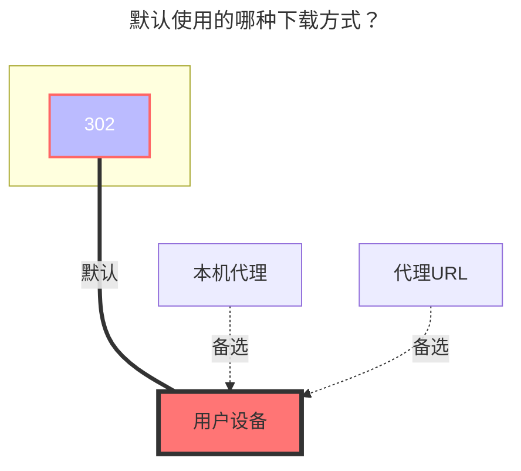

# 电信天翼云盘

<!--@include: @/snippets/reverse-tip.md-->

::: tip
Web 端登录已更换为滑动验证码，**不再支持 OCR 与手动输入**，若需要验证码请使用 `添加 Cookie 进行登录` 或使用 `天翼云盘客户端` 驱动

如遇 **设备 ID 不存在，需要二次设备校验**，打开天翼账号网站 <https://e.dlife.cn/index.do>，登陆后关掉设备锁即可
:::

## 189CloudTV

使用天翼网盘的TV接口，挂载步骤最少。

(部分用户反馈存在限速问题,如果播放视频卡顿黑屏等无法加载的现象请改用天翼网盘客户端)

1. 挂载时选择189CloudTV（当前未确定正式翻译），登录相关的参数留空，如果你不确定，**只填写挂载路径即可**。

2. 点击保存后只需要返回存储管理界面，可以自行选择扫码登录或者点击链接转跳登录（对于链接登录，如果你不确定，建议**右键链接选择新窗口打开**）。

3. 进入后选择短信登录，登录完成后返回存储管理界面，禁用再启用该存储后即可正常使用（可能需要刷新网页）。

## 个人云

### 用户名

用于登录的电话号码

### 密码

登录密码

### 根文件夹ID

官网 URL 末尾的字符串，如：

- https://cloud.189.cn/web/main/file/folder/-11 -> `-11`
- https://cloud.189.cn/web/main/file/folder/71398114617385472 -> `71398114617385472`

  

### 家庭云中转

为天翼云盘增加个人云使用`家庭云中转选项`，方便不开会员且家庭云空间小情况下大量上传。

- 注：旧的上传接口家庭云依然会限制上传量，所以`秒传选项`和`旧的上传方式`不生效

## 家庭云

（天翼云盘客户端驱动专用）使用电脑浏览器，打开开发者工具（F12），切换仿真设备选择手机设备

打开https://h5.cloud.189.cn/main.html#/family ，进入你想挂载的文件夹，可在网络中看到请求，然后找到所需参数：

### OpenList挂载填写示例：

#### 天翼云盘

填写帐号1和密码2，然后在请求中随便点击一个请求随意点击一个携带`Cookie`3的参数复制填写，Cookie有效期未知。

#### 天翼云盘客户端

视频参考：**https://www.bilibili.com/video/BV16A4y197De**

## 建议

建议首选使用天翼云盘客户端，[**注意事项点击查看**](../../faq/howto.md#添加-天翼云盘-云存储时-设备-id-不存在-需要二次设备验证)

### 默认使用的下载方式

