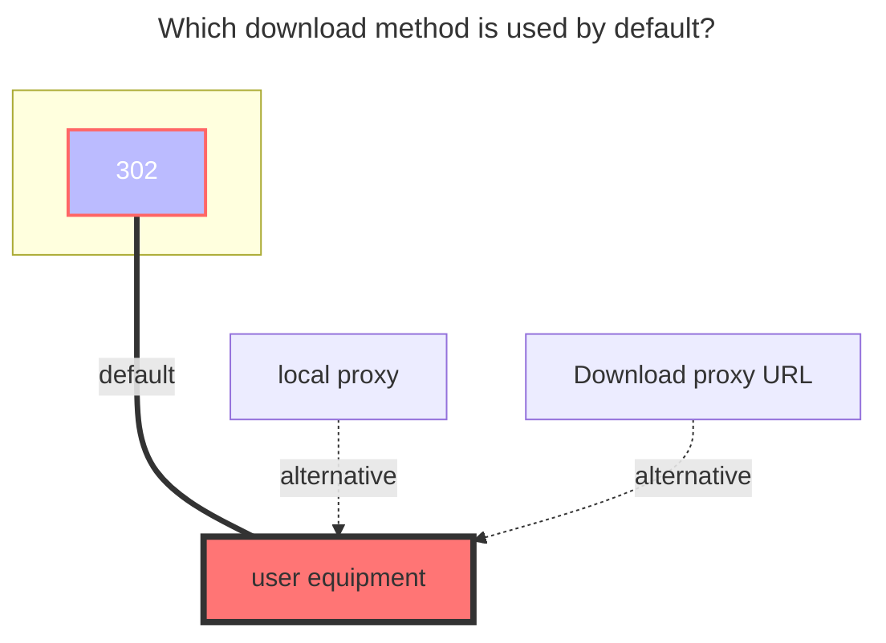
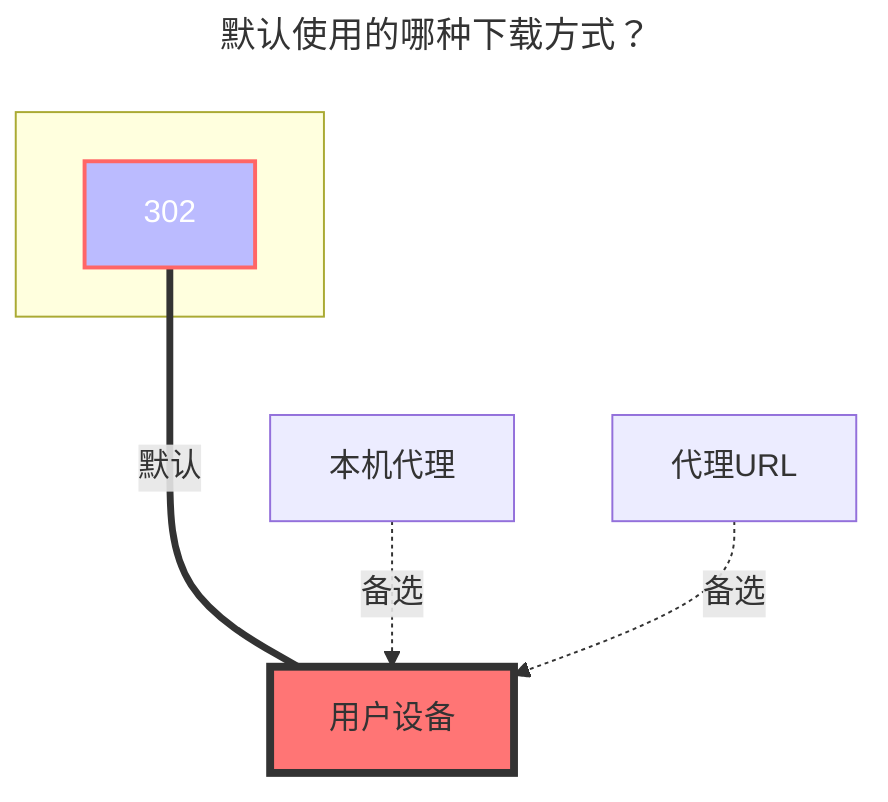

---
title:
  en: 189Cloud
  zh-CN: 电信天翼云盘
icon: iconfont icon-state
# This control sidebar order
top: 694
# A page can have multiple categories
categories:
  - guide
  - drivers
# A page can have multiple tags
tag:
  - Storage
  - Guide
  - '302'
# this page is sticky in article list
sticky: true
# this page will appear in starred articles
star: true
---

<!--@include: @/snippets/reverse-tip.md-->

::: en
::: tip
The web -side login has been replaced with sliding verification code, **no longer supports OCR or manual input**. If the verification code needs to be used, please use the add `Cookie` to log in

If the login asks for **secondary device verification**, an SMS code is sent to your bound phone number automatically. Fill it into the `SMS code` (`sms_code`) field and save again to finish the verification. The driver keeps the DEVICEID issued by the server, so you will not be asked again.
:::

::: zh-CN
::: tip
Web 端登录已更换为滑动验证码，**不再支持 OCR 与手动输入**，若需要验证码请使用 `添加 Cookie 进行登录` 或使用 `天翼云盘客户端` 驱动

如遇 **需要二次设备校验**，驱动会自动向你绑定的手机号发送短信验证码，把验证码填入 `短信验证码（sms_code）` 字段并再次保存即可完成校验。驱动会保存服务端下发的 DEVICEID，之后不会再触发校验。
:::

## 189CloudTV { lang="zh-CN" }

::: zh-CN
使用天翼网盘的TV接口，挂载步骤最少。

(部分用户反馈存在限速问题,如果播放视频卡顿黑屏等无法加载的现象请改用天翼网盘客户端)

1. 挂载时选择189CloudTV（当前未确定正式翻译），登录相关的参数留空，如果你不确定，**只填写挂载路径即可**。

2. 点击保存后只需要返回存储管理界面，可以自行选择扫码登录或者点击链接转跳登录（对于链接登录，如果你不确定，建议**右键链接选择新窗口打开**）。

3. 进入后选择短信登录，登录完成后返回存储管理界面，禁用再启用该存储后即可正常使用（可能需要刷新网页）。

:::

## 189CloudTV { lang="en" }

::: en
Uses the TV interface of 189 Cloud Drive, with the fewest mounting steps.

(Some users have reported throttling issues. If you experience video playback stuttering, black screens, or failure to load, please switch to the 189 Cloud PC client.)

1. When mounting, select 189CloudTV. Leave the login parameters blank. If you are unsure, **just fill in the mount path**.

2. After clicking save, simply return to the storage management page. You can choose to log in by scanning a QR code or click the link to log in (for link login, if you are unsure, it is recommended to **right-click the link and open it in a new window**).

   

3. After entering, select SMS login. Once logged in, return to the storage management page. Disable and re-enable the storage to use it normally (you may need to refresh the page).

   

:::

## 个人云 { lang="zh-CN" }

## Personal Cloud { lang="en" }

### Username { lang="en" }

### 用户名 { lang="zh-CN" }

::: en
The phone number used to log in. Not required when login with tokens directly.
:::
::: zh-CN
用于登录的电话号码。直接使用令牌登录时可留空。
:::

### 密码 { lang="zh-CN" }

### Password { lang="en" }

::: en
Password for login. Not required when login with tokens directly.
:::

::: zh-CN
登录密码。直接使用令牌登录时可留空。
:::

### 登录方式 { lang="zh-CN" }

### Login method { lang="en" }

::: en
- `password` (default): sign in with the account and password; may trigger the SMS secondary device verification.
- `qrcode`: sign in by scanning a QR code with the 189 Cloud app. The driver polls the scan state automatically (up to about 20 seconds) and continues by itself once you confirm on the phone, so you do not need to save the settings repeatedly.

:::

::: zh-CN
- `password`（默认）：使用账号密码登录，可能触发短信二次设备校验。
- `qrcode`：使用天翼云盘 APP 扫码登录。驱动会自动轮询扫码状态（最长约 20 秒），手机上确认后自动继续，无需反复保存设置。

:::

### 短信验证码 { lang="zh-CN" }

### SMS code { lang="en" }

::: en
Only used when the login asks for secondary device verification. The driver sends an SMS to the bound phone number automatically; fill the code in and save again to finish the verification.
:::

::: zh-CN
仅在登录提示需要二次设备校验时使用。驱动会自动向绑定的手机号发送短信验证码，填入后再次保存即可完成校验。
:::

### 访问令牌 { lang="zh-CN" }

### Access token { lang="en" }

::: en
Can be filled in alone to mount the storage without an account and password.
:::

::: zh-CN
可单独填写用于免账号密码挂载。
:::

### 刷新令牌 { lang="zh-CN" }

### Refresh token { lang="en" }

::: en
Used to refresh the access token. To switch accounts, please clear this field. When the token becomes invalid the driver clears it automatically and reports the real error.
:::

::: zh-CN
用于刷新访问令牌。要切换账号，请清空此字段。令牌失效时驱动会自动清空该字段并返回真实错误。
:::

### 设备ID { lang="zh-CN" }

### Device ID { lang="en" }

::: en
The DEVICEID cookie issued by the server after the secondary device verification. Keep it and the verification will not be triggered again. It is written and saved by the driver automatically, so you usually do not need to modify it.
:::

::: zh-CN
二次设备校验通过后服务端下发的 DEVICEID Cookie。保留该值后不会再触发二次校验。该字段由驱动自动写入并保存，通常无需手动修改。
:::

### 其他登录参数 { lang="zh-CN" }

### Other login parameters { lang="en" }

::: en
- `client_sn`: Device serial number captured from the official client. Optional, and not reported when empty.
- `jg_open_id`: Push id reported by the official client. Optional.
- `user_finger`: Device fingerprint sent with login requests. Generated and kept automatically when empty.

:::

::: zh-CN
- `client_sn`：从官方客户端抓取的设备序列号，选填，留空则不上报。
- `jg_open_id`：官方客户端上报的推送 ID，选填。
- `user_finger`：登录请求携带的设备指纹，留空时自动生成并保存。

:::

### 根文件夹ID { lang="zh-CN" }

### Root folder ID { lang="en" }

::: en
The string at the end of the official website url, such as:

- https://cloud.189.cn/web/main/file/folder/-11 -> `-11`
- https://cloud.189.cn/web/main/file/folder/71398114617385472 -> `71398114617385472`

  

:::

::: zh-CN
官网 URL 末尾的字符串，如：

- https://cloud.189.cn/web/main/file/folder/-11 -> `-11`
- https://cloud.189.cn/web/main/file/folder/71398114617385472 -> `71398114617385472`

  

:::

### 家庭云中转 { lang="zh-CN" }

### Family transfer { lang="en" }

::: en
Give 189 Cloud adds Personal's `Family Transfer option`, which is convenient for users without VIP, and a large number of family cloud spaces upload.

- Note: The old upload interface family cloud will still limit the upload quantity, so `Rapid upload` and ` Old Upload` will not take effect

:::
::: zh-CN
为天翼云盘增加个人云使用`家庭云中转选项`，方便不开会员且家庭云空间小情况下大量上传。

- 注：旧的上传接口家庭云依然会限制上传量，所以`秒传选项`和`旧的上传方式`不生效

:::

## 家庭云 { lang="zh-CN" }

## Family Cloud { lang="en" }

::: en
(189 Cloud PC Driver Only) Use a computer browser, open the developer tool (F12), switch the emulation device and select the mobile device

Open https://h5.cloud.189.cn/main.html#/family, enter the folder you want to mount, you can see the request in the network, and then find the required parameters:
:::

::: zh-CN
（天翼云盘客户端驱动专用）使用电脑浏览器，打开开发者工具（F12），切换仿真设备选择手机设备

打开https://h5.cloud.189.cn/main.html#/family ，进入你想挂载的文件夹，可在网络中看到请求，然后找到所需参数：
:::

### OpenList挂载填写示例： { lang="zh-CN" }

### OpenList fill in examples： { lang="en" }

#### 天翼云盘 { lang="zh-CN" }

#### 189 Cloud { lang="en" }

::: en
Fill in the account1and password2,Then click one request in the request, just bring `Cookies`3, click on one at will Then fill in,Cookie expires time is unknown
:::

::: zh-CN
填写帐号1和密码2，然后在请求中随便点击一个请求随意点击一个携带`Cookie`3的参数复制填写，Cookie有效期未知。
:::

#### 天翼云盘客户端 { lang="zh-CN" }

#### 189 CloudPC { lang="en" }

::: en
Video reference: **https://www.bilibili.com/video/BV16A4y197De**
:::
::: zh-CN
视频参考：**https://www.bilibili.com/video/BV16A4y197De**
:::

## 建议 { lang="zh-CN" }

## suggestion { lang="en" }

::: en
It is recommended to use the 189 Cloud PC first, [**Notes click to view.**](../../faq/howto.md#when-adding-a-189-cloud-storage-the-device-id-does-not-exist-and-a-secondary-device-verification-is-required)
:::
::: zh-CN
建议首选使用天翼云盘客户端，[**注意事项点击查看**](../../faq/howto.md#添加-天翼云盘-云存储时-设备-id-不存在-需要二次设备验证)
:::

### 默认使用的下载方式 { lang="zh-CN" }

### The default download method used { lang="en" }

::: en

:::

::: zh-CN

:::
