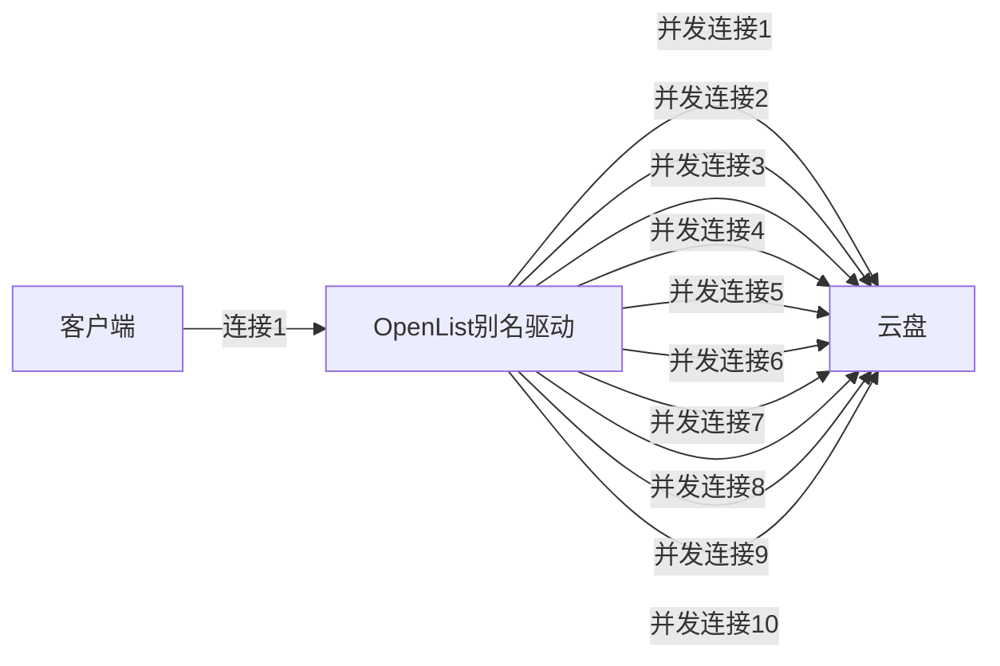

**别名（Alias）** 是一种将多个不同云盘或存储路径合并为一个统一目录的功能。通过路径合并，来自不同云盘或文件夹的内容可以在同一界面中展示，从而简化访问和管理。

例如：云盘账号1和云盘账号2中都包含一个名为`电影`的文件夹，但两者的内容未必完全相同。

- **`以前（虚拟路径）`**：

  在此模式下，您只能将文件夹分别挂载在不同的路径上，例如：
  - `云盘1/电影`、`云盘2/电影`
  - `电影/云盘1`、`电影/云盘2`

- **`现在（别名）`**：

  现在通过**别名**，可以创建一个聚合的文件夹（如`电影`），其中同时包含来自云盘1和云盘2的内容。

同名的文件夹或文件会自动合并为一个。文件夹的内容为所有同名文件夹内容的总和，关于本驱动如何处理同名文件，请参考后文[路径冲突策略](/guide/drivers/alias#路径冲突策略)章节。

例如：


在图中，两个不同的文件夹被合并为一个文件夹。同名的文件和文件夹会自动合并，而独有的文件则单独展示。

**示例说明：**

- **例1**：`riluo.jpg` 仅存在于云盘1中，因此显示为独有文件。
- **例2**：两个文件夹都有一个名为`video`的子文件夹。合并后，两个`video`文件夹的内容会合并展示。若其中有同名文件（例如`movie.mp4`），合并后最终展示3个视频文件。

## 路径填写方式

填写方式有两种：

1. 第一种是只可以填写子文件夹路径并且最后结尾时必须同名文件夹才可以，不推荐使用 :x:
   - `路径`填写示例：
     ```
     /目录1/目录a
     /目录2/目录b
     ```
2. 第二种是可以直接挂载根文件夹ID，利用`重命名`的方式，强烈推荐使用 :heavy_check_mark:
   - `路径`填写示例：

     ```
     #示例1 直接写根文件夹
     合并显示:/目录1
     合并显示:/目录2

     #示例2 挂载不同路径文件夹进行合并
     合并显示:/目录1/本地测试233
     合并显示:/目录2/视频/电视剧
     合并显示:/目录2/电视/国产电视剧/某某台
     ```

根据第二种这样我们可以将不同的文件夹进行合并显示，方便快捷。

## 路径冲突策略

**读取冲突策略**、**写入冲突策略**和**上传冲突策略**三个配置项确定了别名驱动如何处理后端驱动中路径相同的同名文件或文件夹，其值与对应的行为如下：

### 读取冲突策略

影响下载、复制（作为源文件）、解压（作为源文件）（没有移动）同名文件的方式。

- 读取首个有效路径：选择填写的所有路径中从上到下第一个存在该文件的路径中的同名文件。
- 按文件负载均衡：随机选择一个同名文件。
- 按分片负载均衡：
  - 当 302 下载、复制、解压时，降级为**按文件负载均衡**策略。
  - 当本地代理下载时，传输的每个分片随机选择一个同名文件，要求后端驱动支持 Range 请求。设置分片的大小见章节[下载并发、下载分片大小](/guide/drivers/alias#下载并发、下载分片大小)。
  - 本策略实现的实际效果如图所示。需要注意的是，本图只是为了方便地展示本策略的运行效果，“参与负载均衡的同名文件具有不同的内容”**不是**本驱动的正确用法，OpenList 不保证这种情况下程序会产生稳定、正确的结果，也不会解决这种使用场景下出现的任何问题。此外，实际文件分片的最小大小为 1 KiB 而非 1 字节，因此图中这种效果在稳定版本中是不会出现的。

    

::: tip
复制操作存在多个源路径和目标路径时，会优先选择驱动相同的源路径与目标路径为一组进行复制，仅对未获得匹配的目标路径采用**读取冲突策略**给出的方案选择源路径。

例如将

- 驱动A/source/file.txt
- 驱动B/source/file.txt

复制到

- 驱动B/target/
- 驱动A/target/
- 驱动C/target/

则别名会执行以下操作：

1. 由于均位于驱动 A，复制`驱动A/source/file.txt`到`驱动A/target/`。
2. 由于均位于驱动 B，复制`驱动B/source/file.txt`到`驱动B/target/`。
3. 按照**读取冲突策略**给出的方案选择驱动 A 或 B 中的`file.txt`，通过上传的方式（创建复制任务）复制到`驱动C/target/`。

:::

::: tip
移动操作存在与复制操作类似的匹配过程，对于未获得匹配的目标路径，随机选择同样未被匹配的源路径进行匹配（**一一对应**），源路径数量超过目标路径时，未得到匹配的源路径会被删除，源路径数量少于目标路径时，移动操作会失败。移动操作的匹配行为不会受到**读取冲突策略**的影响。

例如，对于复制操作给出的案例，由于不存在与`驱动C/target/`对应的源路径，移动操作将失败。

再例如，将

- 驱动A/source/file.txt
- 驱动B/source/file.txt
- 驱动D/source/file.txt
- 驱动E/source/file.txt
- 驱动G/source/file.txt

移动到

- 驱动A/target/
- 驱动B/target/
- 驱动C/target/
- 驱动F/target/

则别名会执行以下操作：

1. 移动`驱动A/source/file.txt`到`驱动A/target/`。
2. 移动`驱动B/source/file.txt`到`驱动B/target/`。
3. 随机选择驱动 D、E、G 中的一个，移动到`驱动C/target/`（创建移动任务，事实上是先上传后删除），假设选中 E。
4. 随机选择驱动 D、G 中的一个，移动到`驱动F/target/`，假设选中 G。
5. 删除`驱动D/source/file.txt`。

:::

### 写入冲突策略

影响重命名、删除同名文件或文件夹，在同名文件夹下创建文件夹的方式。

- 禁用：禁止重命名、删除和创建文件夹操作。
- 写入首个有效路径：操作填写的所有路径中从上到下第一个存在操作路径的驱动。
- 仅允许不冲突路径：如果操作路径唯一，执行操作，否则禁止执行操作。
- 仅允许全冲突路径：如果操作路径在填写的所有后端路径中都存在，在所有路径中执行操作，否则禁止执行操作。
- 允许不冲突路径和全冲突路径：允许操作路径唯一和操作路径在所有后端路径中都存在的情况执行操作。
- 写入所有有效路径：向所有有效路径转发操作。

::: tip
如果看不懂以上内容，可以参考以下案例。

- 驱动 A 中存在：`file1.txt`
- 驱动 B 中存在：`file1.txt`、`file2.txt`、`file3.txt`
- 驱动 C 中存在：`file1.txt`、`file3.txt`

填写后端路径：

```
test:驱动A
test:驱动B
test:驱动C
```

则：

- 由于填写的所有路径（`驱动A/`、`驱动B/`、`驱动C/`）中，子路径`/file1.txt`均有效，因此称`/file1.txt`为**全冲突路径**。
- 由于子路径`/file2.txt`只在`驱动B/`这唯一一个后端路径下有效，称`/file2.txt`为**不冲突路径**。
- 由于子路径`/file3.txt`在`驱动B/`和`驱动C/`下存在，存在的后端路径数量既不为 1，也不为最大（3），因此`/file3.txt`既不是不冲突路径，也不是全冲突路径。

重命名任意文件为`file4.txt`时，以下驱动中的对应文件会被重命名：

| 写入冲突策略               | file1.txt           | file2.txt | file3.txt    |
| -------------------------- | ------------------- | --------- | ------------ |
| 禁用                       | 操作失败            | 操作失败  | 操作失败     |
| 写入首个有效路径           | 驱动A               | 驱动B     | 驱动B        |
| 仅允许不冲突路径           | 操作失败            | 驱动B     | 操作失败     |
| 仅允许全冲突路径           | 驱动A、驱动B、驱动C | 操作失败  | 操作失败     |
| 允许不冲突路径和全冲突路径 | 驱动A、驱动B、驱动C | 驱动B     | 操作失败     |
| 写入所有有效路径           | 驱动A、驱动B、驱动C | 驱动B     | 驱动B、驱动C |

:::

### 上传冲突策略

影响上传到、复制到、移动到、解压到同名文件夹的方式。

- 禁用、上传到首个有效路径、只允许不冲突路径、只允许全冲突路径、允许不冲突路径和全冲突路径、上传到所有有效路径：与**写入冲突策略**中的对应选项相同。
- 随机负载均衡：随机选择一个有效路径上传。
- 按容量加权随机负载均衡：获取所有有效路径的剩余空间大小，跳过未成功获取剩余空间，或剩余空间不足以容纳被上传文件的路径，剩余有效路径以剩余空间大小为权重随机选择。如果所有成功获取剩余空间的有效路径都没有足够的空间以容纳上传中的文件，**在未成功获取容量的有效路径中随机选择一个上传**。
- 严格按容量加权随机负载均衡：获取所有有效路径的剩余空间大小，跳过未成功获取剩余空间，或剩余空间不足以容纳被上传文件的路径，剩余有效路径以剩余空间大小为权重随机选择。如果所有成功获取剩余空间的有效路径都没有足够的空间以容纳上传中的文件，**直接返回错误信息**。

::: tip
**读取冲突策略**和**上传冲突策略**中的负载均衡是两个没什么关系的功能，不严谨的讲，**读取冲突策略**的负载均衡类似 RAID 1，**上传冲突策略**的负载均衡类似 RAID 0。关于二者的具体使用案例见[高级设置/负载均衡](/guide/advanced/balance)。

一旦理解了上述原理，你就会明白同时开启**读取负载均衡**和**上传负载均衡**并不能让你负载得均均又衡衡，这种配置产生的效果和仅开启**上传负载均衡**没有什么太大的区别。

:::

::: tip
旧版别名驱动使用**可写**、**保护同名**和**并行写入**三个布尔配置项实现路径冲突策略功能，旧版配置与新版配置的对应关系如下：

- 在旧版配置中，**读取冲突策略**总为**读取首个有效路径**。
- 在旧版配置中，当**可写**关闭时，**写入冲突策略**与**上传冲突策略**均为**禁用**。
- 当**可写**开启时，**写入冲突策略**与**上传冲突策略**均为
  |              | 关闭并行写入            | 开启并行写入               |
  | ------------ | ----------------------- | -------------------------- |
  | 开启保护同名 | 仅允许不冲突路径        | 允许不冲突路径和全冲突路径 |
  | 关闭保护同名 | 写入/上传到首个有效路径 | 写入/上传到所有有效路径    |

:::

## 文件一致性校验

开启时，驱动在收集有效路径的过程中，会过滤掉那些**大小或哈希值**与其它副本不同的路径，是一种安全措施，开启与否影响不太大，推荐使用**按分片负载均衡**读取策略时打开。

无论是否启用该选项，别名都不会主动计算文件的哈希值，而是使用后端驱动返回的哈希值做尽力而为的匹配。

后端驱动返回不同种类的哈希值不会导致误判。例如驱动 1 返回了文件的 MD5，驱动 2 返回了文件的 SHA1，即便开启本选项，别名也不会因为文件的 MD5 与 SHA1 不相等而判定驱动 1 或 2 中的任何一个路径无效。

## 使用的下载方式

添加 **`别名-alias`** 时 `Web代理` 和 `Webdav策略` 默认不修改的情况下 Paths路径填写的存储路径可以 `302`，`本地代理`，`下载代理URL`，三种模式混合播放可以进行混合播放。

如果你勾选了`Web代理` ，Paths路径填写的存储 如果有302模式播放的 到时候都会进行中转(本地代理模式)播放，变成代理模式，Webdav策略如果也进行了改动也会进行变化。

当然，是否选择更换模式您自己进选择。

### 如果你不知道你添加的云盘是什么方式怎么办?

1. 可以前往文档的相对应的文档最底部查看，有一份流程图说明
   - 如果有302的就是默认使用302方式，如果只有本地代理和下载代理URL默认的就是使用本地代理，前提是你没有进行手动选择
2. 可以前往添加存储时进行查看，选择对应的存储进行查看，例如我们查看一下阿里云和115分别是什么方式
   - 从下图中看到，阿里云盘有 `web代理`选择，`webdav策略`默认是302，可以判断出阿里云盘默认使用的是302方式
   - 从下图中看到，115网盘没有 `web代理`选择，`webdav策略`默认是本地代理，可以判断出115网盘默认使用的是本地代理方式
     

## 代理 Range

需要先启用 `Web代理` 或者 `Webdav本地代理` 才会生效。目前仅适用于：`别名`、`中国移动云盘`、`OpenList V3`。

- `139Yun` 驱动开启这个选项后，可解决即使开启代理但下载链接没有返回正确的http状态码导致的一些问题，例如视频无法播放、不支持断点续传等
- `Alias` 驱动添加是为了满足某些场景，例如 `139Yun` 走302， 然后通过 开启代理的 `Alias` 后，下载用 `139Yun` 走302，播放视频用 开启代理的 `Alias`，减少不必要的负载
- `OpenList` 驱动添加是为了 服务器的 OpenList 挂载 `139Yun` 走302，然后本地的 OpenList 通过 开启代理的 `OpenList` 挂载 服务器的 OpenList 播放视频等，达到不消化服务器流量的目的，移动卡还能免流

## 下载并发、下载分片大小

**存储设置：**

- 别名 (Alias) 驱动
- 本地代理
- 路径：/云盘挂载路径
- 下载并发数：10
- 下载分片大小：1024

**效果：**

- 客户端 → OpenList 别名驱动：使用1个连接
- OpenList 别名驱动 → 云盘：支持10个并发连接，实际并发数受云盘限制



- 单线程速度较慢，但支持并发：通过别名驱动可实现并发下载，显著提升速度
- 视频观看、下载加速：通过并发连接提升体验
- 从别名驱动复制到其他驱动：同样能够加速文件传输

**温馨提示**：请勿滥用该功能，过度使用可能导致云盘账号异常，后果自负。

**配置选项：**

- `max_concurrency`：设置本地代理的最大并发数，默认为 64，设置为 0 表示不限制并发数。

## 其他说明

如果你是使用的`Windows`，会出现如下情况，有大小写不同的文件夹也会进行二次生成。

例如本地1，本地2 分别有 `video` 小写的v ，文件夹 OneDrive 有一个大写的 V `Video` 文件夹。

然后会生成一个小写的 `video` 文件夹里面只有 `本地1，本地2` 两个的文件夹所合并的文件。

同时大写的 `Video` 里面 会集合三个文件夹的文件

这是因为 Windows 大小写不敏感，video和Video会被认为是同一个文件夹，你换成 Linux 或者 Mac 就不会有这个问题了
