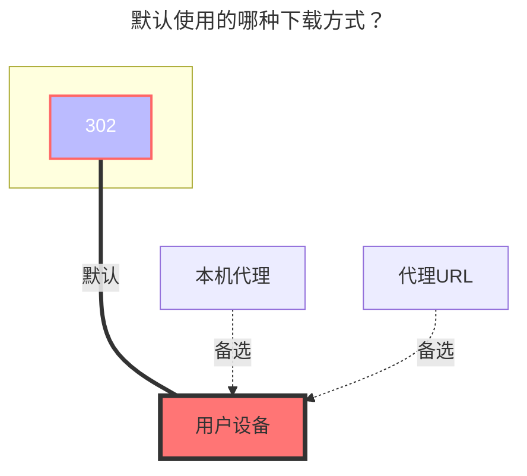

# CloudFlare 图床

<!--@include: @/snippets/tos-tip.md-->

## 免责声明

::: warning
本驱动仅提供与 CloudFlare-ImgBed 后端交互的接口，不对该图床程序本身及其存储渠道的可用性、稳定性负责。
用户需自行决定并配置所使用的存储渠道（如 Cloudflare R2、HuggingFace、S3、Telegram 等），并应严格遵守相关平台及服务提供商的服务条款与使用政策。请勿利用此驱动进行任何违反法律法规、侵犯他人权益或滥用平台资源（如大量消耗免费额度、违规存储分发受版权保护的内容等）的行为。
因用户配置不当、违反平台政策或滥用服务而导致的一切后果（包括但不限于账号封禁、数据丢失、服务中断等），均由用户自行承担，与 OpenList 及其开发者无关。
:::

## 1. 准备工作

配置该驱动前，需要先部署你自己的 CloudFlare-ImgBed 后端。
项目地址：[MarSeventh/CloudFlare-ImgBed](https://github.com/MarSeventh/CloudFlare-ImgBed)
部署完成后，登录后端管理面板（`https://你的域名/dashboard`），并在系统设置中确保至少配置了一个存储渠道（如 HuggingFace、Cloudflare R2、S3、Telegram 等）。

## 2. 在 OpenList 中添加

### 挂载路径

填入你希望挂载到的路径，例如 `/imgbed`。

### 根目录路径

默认为 `/`，留空即可。

### 后端 API 地址

填入你部署的图床服务地址，例如 `https://img.example.com`。无需在末尾添加 `/`。

### 认证令牌

填入图床后端系统设置中生成的 API Token。

### 普通文件渠道名称

通常用于上传小于 20MB 的文件。填入你在图床后端配置的渠道名称（如 `my cfr2`、`my telegram` 等）。

### 大文件渠道名称

用于上传大于 20MB 的文件。建议配置支持大文件的渠道（如 `huggingface`）。留空则大文件会回退到普通渠道上传。

### 大文件渠道类型

根据大文件渠道选择对应的类型：

- `huggingface`：使用 HuggingFace LFS 直传（支持秒传和分片）
- `telegram` / `cfr2` / `s3` / `discord`：使用图床后端的分片上传接口

### 上传线程数

HuggingFace 分片直传的并发线程数，默认为 `3`，最大为 `32`。网络条件好时可适当增大。

## 默认使用的下载方式

