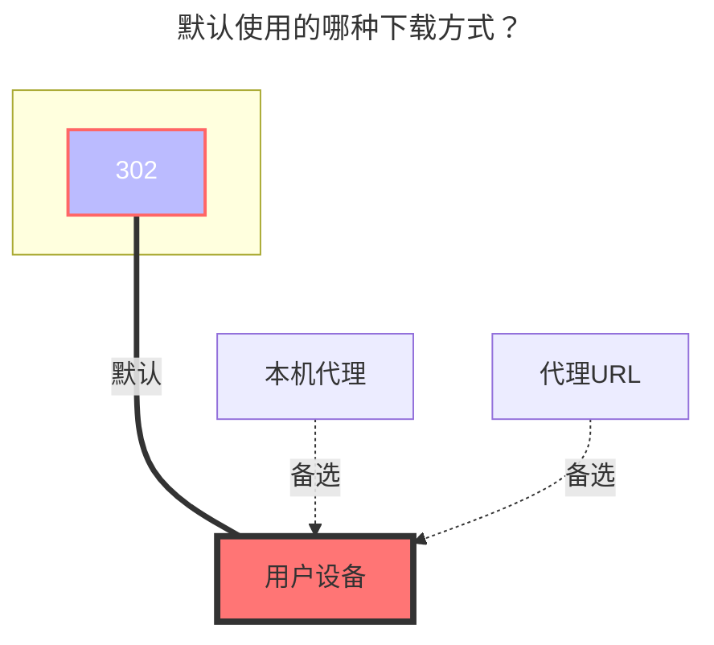

---
categories:
  - guide
  - drivers
top: 397
---

# CNB 发行版

https://cnb.cool/

## 已知问题

CNB 发行版非正常文件系统，存在一些无法解决的问题，请勿反馈。

1. 空仓库需要先初始化
2. Tag / Release 目录下不支持子目录
3. OpenAPI 上传返回 `expires_in_sec` 仅为10秒，上传大文件会超时，超时后仍会继续上传然后返回 `token 无效`，因此增加了本地超时机制，达到上传接口返回的设定时间时自动停止上传，避免上传失败、浪费流量
4. 不支持 `移动`、`复制`、`重命名` 操作
5. 仅支持在关闭 `使用Tag名称` 时，通过修改 Release 的名称进行重命名

## 参数

### 仓库

仅支持填写一个仓库。如需复用 Token，请使用 [引用](common.md#引用) 功能。

### 访问令牌

访问令牌。无需填写 `Bearer`。支持 [引用](common.md#引用) 功能。

获取方法：登录后，进入 `个人设置` - [访问令牌](https://cnb.cool/profile/token) -> `添加访问令牌`。

对于获取列表，需授予 `repo-code:r` 权限。对于修改，需授予 `repo-code:rw` 权限。

### 使用Tag名称

使用原始的 Tag 名称而不是 Release 名称。

默认关闭，使用 Release 名称，支持重命名。Tag 名称创建后无法更改。首次新建文件夹，会发布名为文件夹名称的 Tag，重命名已经存在的 Release，会修改 Release 的名称。

## 默认使用的下载方式

