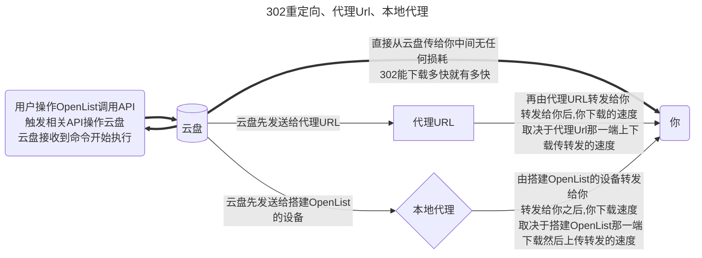

# 通用项

## 挂载路径

挂载项的唯一标识，对外展示的名称，要挂载到的位置。如果要挂载到根目录，请填写 `/`。


::: danger
不能使用重复的挂载路径名称，否则会报错：

```json
Failed create storage in database: UNIQUE constraint failed: x_storages.mount_path
```

解决方法：使用 [别名](./alias.md) 对多个挂载项目进行聚合。
:::

::: danger
挂载路径名称是必填项，不能为空，否则会报错：

```json
Key: 'Storage.MountPath' Error:Field validation for 'MountPath' failed on the 'required' tag
```

解决方案：如果要挂载到根目录，请填写 `/`。
:::

## 序号

当挂载多个驱动时，用于排序。越小越靠前。可以填写负数。

## 备注

您可以添加备注，以方便管理。

### 引用

从 `已挂载的存储` 中引用认证、令牌等，实现同一个 Token 多个网盘使用。

目前支持如下网盘：

- 中国移动云盘
- 阿里云盘Open
- 天翼云盘客户端
- 123云盘分享（引用123云盘）
- Cloudreve V3 / V4

**使用方法**：在存储设置中将`备注(Remark)`的第一行设置为：**ref:/挂载路径**

**注意事项**：`ref:/` 为小写英文和符号


## 启用签名

对文件进行签名加密(不会需要密码)，仅对本驱动生效，如果别的没启用签名也没设置`签名全部`和`元信息加密`其他的不会进行签名。

使用场景：不想开启全部签名，也不想设置元信息加密，只想对某驱动进行签名加密防止被扫。

影响范围：`设置-->全局-->签名所有` > `元信息目录加密` > `单驱动签名`

## 禁用索引

允许用户禁用存储索引。

- 例如索引选项中的`忽略索引`，启用`禁用索引`后不需要再去配置了，这样也更方便一些

## 缓存过期

目录结构的缓存时间。

## 自定义缓存策略

目录路径缓存时间（单位：分钟）。

可以通过模式匹配来自定义某些文件路径的缓存时间。配置支持通配符：

- `*` 匹配单层目录。
- `**` 匹配多层目录。

示例配置：

```txt
/剧集/已完结/*:60
/剧集/更新中/*/**:10
/剧集/归档/**:30
```

说明：

- `*` 仅匹配单层目录，因此 `/剧集/已完结` 下**直接**包含的项将被缓存 60 分钟。由于是单层匹配，不包括更深层的子目录，例如 `/剧集/已完结/A/B` 将不会匹配该规则。
- `**` 匹配多层目录，因此 `/剧集/更新中` 下级目录的内容会被缓存 10 分钟。例如 `/剧集/更新中/A/B` 和 `/剧集/更新中/C/D` 都会符合该规则。
- 由于 `/剧集/更新中/*/**` 严格设置了模糊匹配单层目录，所以直属于 `/剧集/更新中` 下都目录将不会命中规则。
- `/剧集/归档` 下的内容（包括任意层级的子目录）都会被缓存 30 分钟。

## Web 代理

网页预览、下载和直接链接是否通过中转。如果你打开此项，建议你设置[site_url](../../configuration/configuration.md#site-url)，以帮助OpenList更好的工作。

::: tip

- **Web代理**：是使用网页时候的策略，默认为本地代理，如果填写了代理URL并且启用了Web代理使用的是代理URL
- **WebDAV策略**：是在使用WebDAV功能时候的选项，
  - 如果有302选项默认为302，如果没有302选项默认为本地代理，如果要使用代理URL请填写并且手动切换到代理URL策略

两者是不同的配置。

:::

## WebDAV 策略

- **302 重定向**：重定向到真实链接
  - 虽然不会消耗流量，但是不建议共享使用，有封禁账户的风险
- **使用代理 URL**：重定向到代理 URL
  - 会消耗搭建代理URL的流量
- **本机代理**：直接通过本地中转返回数据（最佳兼容性）
  - 会消耗搭建OpenList设备的流量

### 三种模式说明



## 下载代理 URL

开启代理时不填写此字段，默认使用本机进行传输。

### 1. Cloudflare Workers

可以使用 Cloudflare Workers 做代理，这里填写您的 Cloudflare Workers 地址即可。

搭建 Workers 代码可以在 https://github.com/OpenListTeam/OpenList-Proxy/blob/main/openlist-proxy.js 找到，实际使用时需要配置环境变量：

在 OpenList 后台挂载配置时 填写 **下载代理URL** 时候的 链接结尾 不可以带 `/`

更多内容请参考[OpenList Proxy](../../ecosystem/official_proxy)

来自安稳的详细文字教程：<https://anwen-anyi.github.io/index/11-durl.html>

### 2. 通用二进制

您可以使用另一台机器进行代理，在 https://github.com/OpenListTeam/OpenList-Proxy/releases 下载程序并通过 `./openlist-proxy -help` 查看使用方法。

更多内容请参考[OpenList Proxy](../../ecosystem/official_proxy)

来自安稳的详细文字教程：<https://anwen-anyi.github.io/index/11-durl.html>

### 3. 自行开发

你可以开发自己的代理程序，一般步骤是：

- 下载时会请求 `PROXY_URL/path?sign=sign_value`
- 在代理程序中验证 `sign`，`sign` 的计算方法为：

```js
const to_sign = `${path}:${expireTimeStamp}`
const _sign = safeBase64(hmac_sha256(to_sign, TOKEN))
const sign = `${_sign}:${expireTimeStamp}`
```

`TOKEN` 即管理员账户的 [Token](../../configuration/other.md#token)，可在 OpenList 管理页面中进入“其他设置”得到。

- 验证签名正确后，请求 `HOST/api/fs/link`，可以得到文件的 URL 和要携带的请求头
- 使用信息请求和返回

## 排序相关

- **排序方式**：按什么排序
- **排序方向**：排序方向是升序还是降序

::: info
有些驱动器使用自己的排序方法，可能会有所不同。
:::

## 提取文件夹

- **提取到前面**：排序时将所有文件夹放在前面
- **提取到后面**：排序时将所有文件夹放在后面
